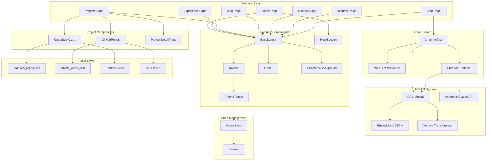
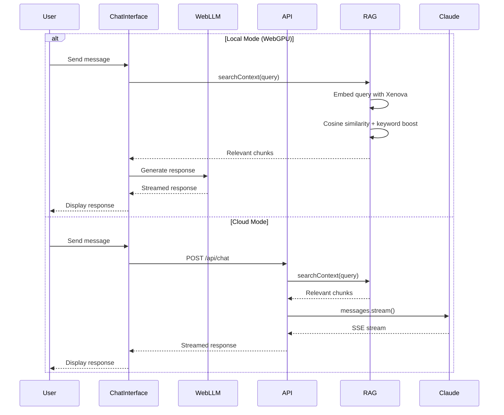

# Architecture

## System Overview



## Data Flow



## Key Architecture Decisions

### 1. Hybrid AI Chat System

I implemented a dual-mode chat system that can run either locally in the browser or via cloud API:

- **Local Mode**: Uses WebLLM with SmolLM2-1.7B model running on WebGPU. The model is preloaded in the background when the user hovers over navigation links, reducing perceived latency.
- **Cloud Mode**: Falls back to Anthropic's Claude 3 Haiku for devices without WebGPU support or when the user prefers faster responses.

The mode toggle is only shown when WebGPU is detected, otherwise cloud mode is used automatically.

### 2. RAG (Retrieval-Augmented Generation)

Rather than fine-tuning a model or stuffing all project information into the system prompt, I implemented semantic search over pre-computed embeddings:

- **Build-time**: `generate-embeddings.ts` processes portfolio markdown files, chunks them, and generates embeddings using Xenova transformers (MiniLM-L6-v2)
- **Runtime**: User queries are embedded with the same model, then compared via cosine similarity + keyword boosting
- **Hybrid Search**: Pure semantic search missed exact project names, so I added keyword boosting for terms that appear verbatim in the content

This approach keeps the LLM context small while providing accurate, grounded answers.

### 3. Static Site with Dynamic Islands

I chose Astro for its island architecture:

- **Static pages**: Most pages are pre-rendered at build time for fast loads and SEO
- **React islands**: Interactive components (chat, theme toggle, project cards) hydrate on the client
- **Partial hydration**: Using `client:load` or `client:only="react"` minimizes JavaScript sent to the browser

### 4. Theme System

The theme implementation handles several edge cases:

- **No flash**: An inline script in `<head>` reads localStorage before paint
- **System preference**: Respects `prefers-color-scheme` on first visit
- **React sync**: Zustand store syncs with DOM state on mount to avoid hydration mismatch
- **Persistence**: Theme preference persists via Zustand's persist middleware

### 5. GitHub Integration

Project data comes from multiple sources:

- **Public repos**: Fetched from GitHub API at build time
- **Private repos**: Manually curated in `private_repos.json` with metadata
- **Featured projects**: Subset with rich portfolio documentation
- **Portfolio files**: Markdown docs in `.portfolio/` directories provide architecture/stack/Q&A content

### 6. Rate Limiting & Security

The chat API implements defensive measures:

- **IP-based rate limiting**: 20 requests per minute per IP
- **Memory bounds**: Map size limited to prevent DoS via memory exhaustion
- **Input validation**: Message length, count, and total conversation size limits
- **Error sanitization**: Internal errors are logged but generic messages returned to clients

### 7. Component Organization

```
src/
├── components/
│   ├── chat/         # ChatInterface - AI chat functionality
│   ├── global/       # Shared components (Navbar, Footer, ThemeToggle)
│   ├── hero/         # Landing page hero section
│   └── projects/     # Project cards and GitHub repos display
├── layouts/          # BaseLayout wraps all pages
├── lib/              # Utilities (github.ts, rag.ts, rag-server.ts)
├── pages/            # Astro pages and API routes
├── stores/           # Zustand state management
└── styles/           # Global CSS with theme variables
```

### 8. Build Pipeline

The build process generates embeddings before Astro builds:

```bash
npm run build
# 1. tsx scripts/generate-embeddings.ts → public/data/rag/embeddings.json
# 2. astro build → static site with prerendered pages
```

This ensures RAG data is always fresh when deployed.
