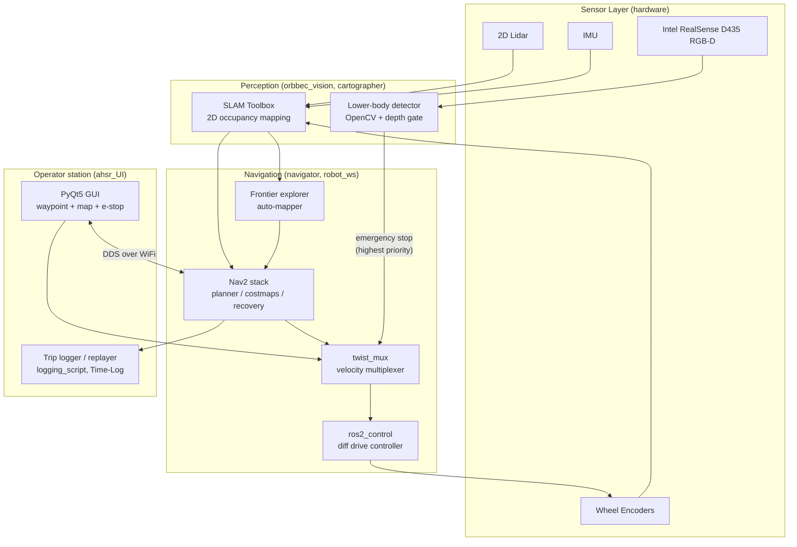

# Architecture

The Autonomous Hospital Stretcher Robot (AHSR) is a 2-year senior design project at the University of Florida built on ROS2 Humble. It integrates 2D lidar, an RGB-D camera, IMU, and wheel encoders into a single mobile robot with autonomous navigation and a real-time computer-vision safety override. This archive subtree-merges 21 sub-repos from the CD1-ARHS team with full git history preserved.

## System Diagram

## Component Descriptions

### Perception: SLAM
- **Purpose**: Build and maintain a 2D occupancy map of the robot's environment, and localize the robot within it
- **Location**: Config and launch files in `cartographer/`; SLAM Toolbox is invoked from `robot_ws/`
- **Key responsibilities**: Lidar scan registration, loop closure, pose estimation; publishes `/map` and `/tf` (`odom` → `base_link`) at ~10Hz

### Perception: Lower-body safety detector
- **Purpose**: Detect feet/legs in the robot's danger cone and emit an immediate stop
- **Location**: `orbbec_vision/`
- **Key responsibilities**: Subscribes to aligned RGB + depth frames from the RealSense, runs an OpenCV lower-body classifier, gates positives by depth (~1.5m stop threshold), publishes a velocity-zero command on the safety topic for `twist_mux`

### Navigation: Nav2 + frontier exploration
- **Purpose**: Plan and execute paths from the robot's current pose to a goal waypoint; explore unmapped areas to grow the map
- **Location**: `navigator/` (mission logic and goal handling), `auto-mapper/` (frontier exploration), `robot_ws/` (launch + params)
- **Key responsibilities**: Global path planning (A*), local trajectory generation (DWB), recovery behaviors (rotate/backup), frontier-based map expansion on first deployment

### Navigation: Velocity multiplexer
- **Purpose**: Arbitrate between competing velocity sources (Nav2, GUI, safety stop) so the highest-priority source always wins
- **Location**: Config in `robot_ws/`
- **Key responsibilities**: Subscribes to multiple `cmd_vel_*` topics with explicit priorities; publishes the winning command to the diff-drive controller. Safety stop is set as the highest priority so it always overrides Nav2.

### Navigation: Diff-drive controller
- **Purpose**: Convert geometric velocity commands into wheel angular velocities and drive the motor controllers
- **Location**: `ros2_control/`, `ros2_controllers/`, `ros2_control_demos/` (upstream forks, marked `linguist-vendored`); launched from `robot_ws/`
- **Key responsibilities**: Closes the wheel-velocity loop using encoder feedback; publishes wheel odometry back to SLAM

### Operator: PyQt5 GUI
- **Purpose**: Allow a human operator to set goals, watch the robot's map and pose, and trigger emergency stop
- **Location**: `ahsr_UI/`
- **Key responsibilities**: `rclpy` subscribed to `/map`, `/tf`, and robot status topics; publishes goal poses and the safety override. Renders the live occupancy map and robot footprint.

### Operator: Trip logger and replayer
- **Purpose**: Record every commanded waypoint, robot pose, and safety event with timestamps for post-hoc debugging
- **Location**: `logging_script/`, `Time-Log/`
- **Key responsibilities**: Subscribes to relevant ROS2 topics and serializes events; a replay tool reconstructs trips on the same map for analysis

### Simulation environment
- **Purpose**: Provide a Gazebo simulation of a hospital corridor for iterating on navigation and safety logic without hardware
- **Location**: `sim_ws/` (worlds, launch files, robot spawning)
- **Key responsibilities**: Hosts the same `ahsr_bot_description` URDF used on hardware so the same code runs in sim and on the real robot with one launch-arg difference (`use_sim_time:=true`)

## Data Flow

1. The 2D lidar, IMU, and wheel encoders publish raw measurements at their native rates.
2. SLAM Toolbox (`cartographer/`) registers each scan, updates the occupancy map, and publishes the robot's pose via `/tf`.
3. In parallel, the RealSense camera (`orbbec_vision/`) publishes aligned RGB + depth frames; the safety detector runs lower-body classification and decides whether to emit an emergency stop.
4. The operator clicks a goal point on the PyQt5 GUI (`ahsr_UI/`); `nav2_msgs/NavigateToPose` is published.
5. Nav2 (`navigator/`) plans a global path, generates local trajectories, and publishes velocity commands on `/cmd_vel_nav`.
6. `twist_mux` arbitrates between `/cmd_vel_nav` (Nav2), `/cmd_vel_gui` (operator joystick), and `/cmd_vel_safety` (override) by priority. The winning command is forwarded to the diff-drive controller.
7. `ros2_control` translates the linear/angular velocity into wheel commands, the motors execute, and encoder feedback closes the loop.
8. The trip logger (`logging_script/`) captures the full sequence for replay.

## External Integrations

| Component | Purpose | Notes |
|---|---|---|
| ROS2 Humble | Middleware (DDS pub/sub) | Standard topic graph; DDS configured for wireless operation |
| SLAM Toolbox | 2D lidar SLAM | Configured for online async mapping |
| Nav2 | Navigation stack | Default planner (NavfnPlanner), DWB local controller |
| OpenCV | Lower-body person detection | Pre-trained HOG cascade + depth gating |
| Intel RealSense SDK | RGB-D camera driver | `OrbbecSDK_ROS2` fork in the archive; vendored upstream |
| Gazebo | Simulation | Hospital corridor world in `sim_ws/` |
| PyQt5 | Operator GUI | Runs on a laptop, talks to robot via DDS over WiFi |

## Key Architectural Decisions

### Safety stop is a separate publisher, not a behavior tree node
- **Context**: Nav2's behavior tree can deadlock or enter recovery loops where it stops emitting velocity. If safety stop were a Nav2 behavior, that deadlock would also block the stop.
- **Decision**: Run the safety detector as an independent ROS2 node and publish stop commands directly to `twist_mux` at the highest priority.
- **Rationale**: Decouples the stop guarantee from Nav2's state. The mux winning order is deterministic regardless of what the planner is doing. Trade-off: we duplicate a small amount of plumbing (separate topic, separate node) instead of reusing Nav2's behavior infrastructure. Worth it for safety.

### RGB-D camera with depth gating instead of pure lidar for safety
- **Context**: The 2D lidar is mounted low and blind to overhead obstacles (a person leaning over the stretcher, an outstretched arm). It also can't distinguish a person from a wheeled cart.
- **Decision**: Use an Intel RealSense D435 RGB-D camera with an OpenCV lower-body classifier; gate positive detections by aligned depth so distant people don't trigger false stops.
- **Rationale**: One sensor gives both obstacle and human-classification data. The depth gate cuts the false-positive rate of a pure-RGB detector by an order of magnitude. Trade-off: a person *sprinting* from outside the depth gate might not be flagged in time, which is mitigated by capping the robot's max velocity so the stopping distance fits inside the safety cone.

### Frontier exploration instead of pre-loaded floor plans
- **Context**: Hospital floor plans are often outdated, and even when current, beds and equipment shift weekly. Pre-loading a stale map causes localization failures.
- **Decision**: Use frontier-based exploration on first deployment (`auto-mapper/`) to let SLAM Toolbox build the map from scratch; re-run when the environment changes meaningfully.
- **Rationale**: A 5-minute exploration produces a more accurate map than a CAD drawing. Re-mapping is cheap and incremental. Trade-off: requires an open exploration period before the robot can be put to use, which is acceptable for a system deployed per-floor.

### Sim-and-hardware-share-URDF instead of two separate descriptions
- **Context**: We needed to iterate on navigation logic without burning battery time on the physical robot, but maintaining two robot descriptions diverges quickly.
- **Decision**: Keep one URDF in `ahsr_bot_description/` that's loaded by both the Gazebo sim launch files (`sim_ws/`) and the hardware launch files (`robot_ws/`). Switch with `use_sim_time:=true`.
- **Rationale**: Every navigation feature was developed and validated in sim first, then deployed to hardware with confidence that the geometry, frames, and joint limits are identical. The cost is a small amount of additional URDF complexity to support both Gazebo physics and `ros2_control` hardware interfaces.

### Archive the upstream forks instead of submodule-linking them
- **Context**: The team used pinned versions of `ros2_control`, `ros2_controllers`, `OrbbecSDK_ROS2`, and a few others. Submoduling them would mean the archive breaks if upstream tags/branches change.
- **Decision**: Subtree-merge all 21 sub-repos (including the 6 upstream forks) into the archive with full history. Mark the upstream-fork directories `linguist-vendored=true` in `.gitattributes` so they don't pollute language statistics.
- **Rationale**: The archive is fully self-contained — it works in 5 years even if the upstream repos disappear. The vendored tags keep GitHub's language detection focused on team-written code.
