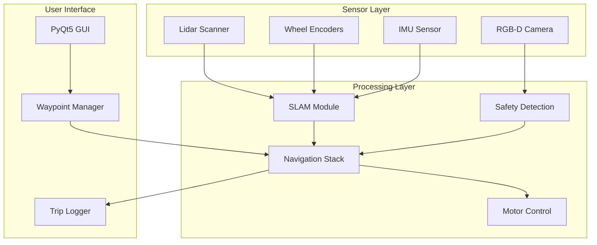

# AHSR System Architecture

The Autonomous Hospital Stretcher Robot (AHSR) is designed for safe, autonomous navigation in hospital environments. The system integrates multiple sensors and software modules to enable reliable patient transport.

## System Overview

## Core Components

### 1. Perception System
- **Lidar Mapping**: Custom Lidar mapping script for frontier-based exploration
- **RGB-D Camera**: Intel RealSense for depth perception and obstacle detection
- **Lower-body Detection**: OpenCV-based pretrained model for human safety override

### 2. Navigation Stack
- **SLAM**: Simultaneous Localization and Mapping using sensor fusion
- **Frontier Exploration**: Autonomous environment mapping
- **Waypoint Navigation**: Dynamic waypoint creation and trip replay functionality

### 3. Control System
- **ROS2 Integration**: Modular architecture using ROS2 topics and services
- **Wireless Control**: PyQt5 GUI communicating wirelessly with robot
- **Safety Overrides**: Immediate stop when humans detected in path

## Communication Flow

The system uses ROS2 as the middleware, enabling:
- Real-time sensor data streaming
- Modular component design
- Wireless GUI connectivity
- Logging and replay capabilities
