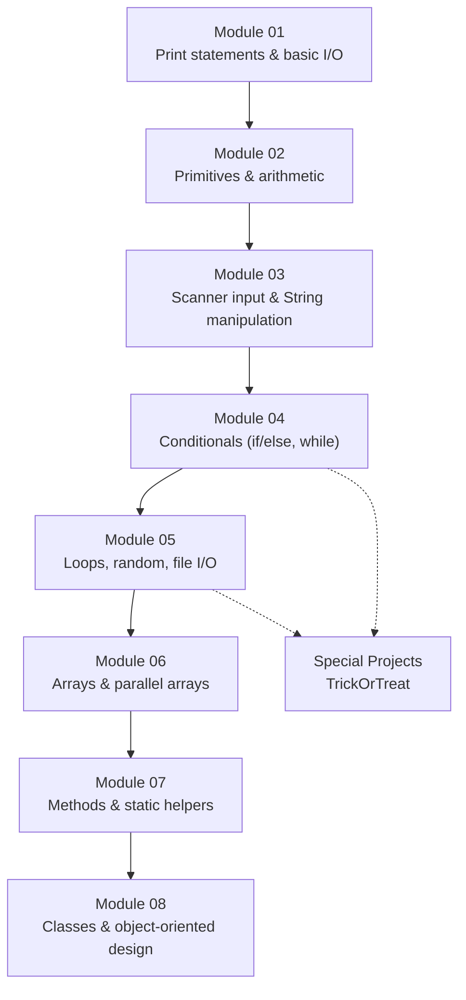

# Architecture

This is a coursework repository, not a single application — there's no runtime that ties the modules together. The structure here is the **AP Computer Science A curriculum as taught at Marjory Stoneman Douglas High School** (Parkland, FL) during the 2019-2020 school year, with one directory per curriculum module and one Java program (or implementation/tester pair) per major assignment. Each module builds on language features introduced in the one before it, and Module 08 is the synthesis where everything from prior modules collapses into a single OO pattern — which is precisely how the AP CS A exam is scoped.

## Module Dependency Graph

The solid arrows are pedagogical prerequisites (Module 05's file-driven Monte Carlo needs Module 04's `while` loops + Module 03's `Scanner`). The dotted arrows show how the `Special Projects/TrickOrTreat` program reuses ideas (modulus + branching) from earlier modules without belonging to any single one.

## Component Descriptions

### Module 01 — Foundation: print statements
- **Purpose**: First Java program; demonstrates `System.out.print` vs `println`, escape characters, and column-aligned text output
- **Location**: `Module 01/src/StudentInfoCard.java`
- **Key responsibilities**: A formatted "student info card" rendered entirely through `print`/`println` calls

### Module 02 — Primitives & arithmetic
- **Purpose**: Declare `int` and `double` variables, perform all five arithmetic operations plus modulus, and observe operator precedence
- **Location**: `Module 02/src/CalculationsV6.java`, `CurrencyV1.java`, `GradesV2.java`
- **Key responsibilities**: `CalculationsV6` is the operator drill; `CurrencyV1` converts USD into five other currencies via static exchange rates; `GradesV2` does hard-coded grade averaging (no `Scanner` yet)

### Module 03 — Input & String manipulation
- **Purpose**: Read user input with `Scanner`, parse numeric strings with `Integer.parseInt`/`Double.parseDouble`, and slice strings via `indexOf`/`substring`/`replaceAll`
- **Location**: `Module 03/src/buyMovieTickets.java`, `GradesV3.java`
- **Key responsibilities**: `buyMovieTickets` is the centerpiece — it prompts for a name and a debit card number, then masks the first part of the card before printing an e-receipt. That's the first "real" program in the repo.

### Module 04 — Conditionals
- **Purpose**: `if`/`else if`/`else` decision trees, validation against ranges
- **Location**: `Module 04/src/BMI.java`, `TDEE.java`
- **Key responsibilities**: Both apps gather user metrics (weight, height, gender, activity level) and bucket the result into a category. `BMI` is the simpler one; `TDEE` adds gender-conditional formulas and a multi-level activity multiplier.

### Module 05 — Loops, random, file I/O
- **Purpose**: First exposure to `while` and `for` loops, `Math.random()`, and reading text files with `Scanner(File)`. First exposure to `PrintWriter`.
- **Location**: `Module 05/src/AnimalPopulation.java`, `Family.java`, `LotteryV2.java`, `SecretPasscodes.java`
- **Key responsibilities**: `AnimalPopulation` runs a Monte Carlo simulation (≥1000 trials, prompted) and writes results to a file. `Family` reads a file of `BB`/`GG`/`BG` family-composition tokens and computes population percentages. `SecretPasscodes` generates random passwords with a user-chosen character set.

### Module 06 — Arrays & parallel arrays
- **Purpose**: Parallel array pattern (multiple same-length arrays indexed in lockstep), formatted output via `printf`, file I/O at scale
- **Location**: `Module 06/src/AnnualWeatherV2.java`, `HurricaneSelector.java`
- **Key responsibilities**: `AnnualWeatherV2` holds month/temperature/precipitation as three same-length arrays and lets the user pick F/C and in/cm units. `HurricaneSelector` is the largest program in the repo: it reads a 156-row Atlantic hurricane dataset into five parallel arrays, filters by user-chosen year range, computes per-category counts via the Saffir-Simpson scale, and emits a formatted summary to both stdout and `hurricanesummary.txt`.

### Module 07 — Methods
- **Purpose**: Extract repeated logic into `private static` helper methods with return values
- **Location**: `Module 07/src/CirclePoints.java`, `PlanetGravity.java`, `PlanetWeight.java`
- **Key responsibilities**: `CirclePoints` calculates `(x, y)` points on a circle for a given radius. `PlanetGravity` computes `g = GM/r²` for the eight solar-system planets using a helper `surfaceGravity(double dia, double mass)` method — the first piece of real abstraction in the repo. `PlanetWeight` extends the same data to compute a user's weight on each planet.

### Module 08 — Object-oriented design
- **Purpose**: Implementation/tester class pairs, encapsulation with private fields and public getters/setters, arrays of objects, and aggregate statistics over object collections
- **Location**: `Module 08/src/SquareV3.java`, `SquareV7.java`, `SquareV8.java`, `V7Tester.java`, `V8Tester.java`, plus `.java.txt` artifacts (`AnnualWeatherImplementation`, `CO2FromWasteV1`, `KinematicsImplementation` and their testers)
- **Key responsibilities**: `SquareV3 → V7 → V8` shows the same shape problem refactored across three increasingly OO designs. `V8Tester` instantiates an array of five `SquareV8` objects and computes min/max/average area and volume.

### Special Projects — TrickOrTreat
- **Purpose**: A free-form FizzBuzz-style exercise using nested conditionals and `Math.random()`
- **Location**: `Special Projects/src/TrickOrTreat.java`
- **Key responsibilities**: Generates 30 random numbers in `[2, 28]` and maps each to a candy name based on which modular conditions it satisfies first

## Data Flow

Each program is self-contained and follows the same shape:

1. **Initialize** — declare primitive variables and (when needed) a `Scanner`, `File`, or `PrintWriter`
2. **Gather inputs** — either hard-coded values (Modules 01-02), user `Scanner` prompts (Modules 03-04, 06-07), or file reads (Modules 05-06)
3. **Compute** — arithmetic and conditional logic in `main`, plus (from Module 07 onward) calls into private static helpers
4. **Emit output** — `System.out.println`/`printf` to stdout, and for Modules 05-07 a `PrintWriter` to a side-effect file like `hurricanesummary.txt` or `planetgravity.txt`

## External Integrations

This repo has no external services, network calls, or third-party libraries. The "integrations" are the assignment-provided text data files the programs read from disk.

| File | Read by | Format |
|------|---------|--------|
| `maleFemaleInFamily.txt` | `Module 05/Family.java` | Whitespace-separated `BB`/`GG`/`BG`/`GB` tokens |
| `HurricaneData.txt` | `Module 06/HurricaneSelector.java` | 156 rows of `year month pressure windspeed name` |
| `planetweight.txt` | `Module 07/PlanetWeight.java` | Numeric data parallel to a hard-coded planet array |

## Key Architectural Decisions

### Standalone classes instead of a shared package
- **Context**: AP CS A is taught one topic per module; each assignment is meant to be runnable in isolation
- **Decision**: Every `.java` file has its own `main` and lives at the top of its module's `src/` directory with no package declaration
- **Rationale**: Lets a grader `javac File.java && java File` from anywhere with zero setup. The downside — no code reuse across modules — is intentional, because each module is a fresh demonstration of one concept.

### Parallel arrays in Module 06 instead of a class
- **Context**: Module 06 introduces arrays before Module 08 introduces classes
- **Decision**: `HurricaneSelector.java` uses five separately-allocated arrays (`years[]`, `months[]`, `pressures[]`, `windSpeeds[]`, `names[]`) indexed in lockstep, rather than an array of `Hurricane` objects
- **Rationale**: The curriculum sequencing demands it — students don't have classes yet. The natural consequence is that `Module 08/AnnualWeatherImplementation.java.txt` later revisits the same weather-data problem from Module 06 *as a class*, making the contrast between the two approaches the lesson.

### Implementation + Tester pattern in Module 08
- **Context**: Module 08 is where objects appear, and the assignment specifies one class to hold state/behavior and a separate class with `main` to exercise it
- **Decision**: Every Module 08 program ships as a pair: `Foo.java` (instance fields, constructor, getters/setters) + `FooTester.java` (the `main` that instantiates and calls). `Square` exists as three versions (V3, V7, V8) tracking the progression.
- **Rationale**: This is industry-standard separation of concerns — the data-and-behavior class shouldn't care how it's tested. Building the habit early matters more than any single program in the module.

### Two output sinks: stdout + file (Modules 06-07)
- **Context**: Several assignments ask for "a report" that should both display and persist
- **Decision**: Use `PrintWriter` alongside `System.out.printf`, calling each one with the same format string back-to-back
- **Rationale**: The duplication is ugly (every `printf` is written twice — see `HurricaneSelector` lines 96-101 and 162-168) but matches the assignment rubric, which grades both the terminal output and the on-disk file. A real refactor would extract a `writeBoth(PrintWriter, String, Object...)` helper — but that's a Module 08 idea, applied retroactively.
