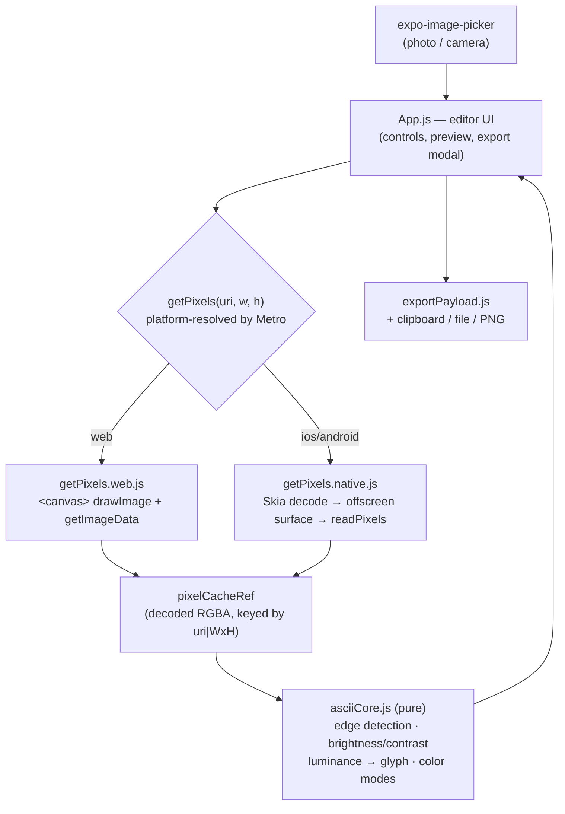

# Architecture

## System Diagram

## Component Descriptions

### Editor UI
- **Purpose**: The entire user-facing app — home screen, the editor with live preview, control panel, and the export sheet.
- **Location**: `App.js`
- **Key responsibilities**: Owns all React state (image URI, dimensions, character set, color mode, tone settings), orchestrates conversion, and renders the ASCII output (as styled text on native, as a `
`/`<pre>` on web for colored spans).

### Conversion core
- **Purpose**: The actual image→ASCII transformation, with zero React/DOM/native imports so it's pure and unit-testable.
- **Location**: `src/asciiCore.js`
- **Key responsibilities**: `pixelsToAscii()` maps an RGBA buffer to text/HTML; `applyEdgeDetection()` produces a Sobel magnitude map; `adjustBrightnessContrast()` and `rgbToAnsi()` are per-pixel helpers.

### Platform pixel readers
- **Purpose**: The one piece that genuinely differs per platform — getting raw RGBA bytes out of an image at a target resolution.
- **Location**: `src/getPixels.web.js`, `src/getPixels.native.js`
- **Key responsibilities**: Both expose the identical async signature `getPixels(uri, w, h) → RGBA bytes`. Web uses an offscreen `<canvas>`; native uses a Skia offscreen surface (`MakeImageFromEncoded` → `drawImageRect` downscale → `readPixels`). Metro picks the right file by extension, so neither platform's dependencies leak into the other's bundle.

### Export builder
- **Purpose**: Decide what string gets written/shared and how.
- **Location**: `src/exportPayload.js`
- **Key responsibilities**: `buildExportPayload(colorMode, asciiArt, asciiHtml)` returns `{ payload, extension, mimeType }` — plain text for most modes, a full HTML document for the HTML-RGB mode.

## Data Flow

1. The user picks a photo (or takes one on native) via `expo-image-picker`.
2. `getPixels(uri, w, h)` decodes and downscales the image to the chosen resolution and returns a flat RGBA byte array. The result is cached in a ref keyed by `uri|WxH`.
3. On any tone/character/color change, the cached buffer is reused: optional edge detection runs, then `pixelsToAscii()` produces the text and colored-HTML output. The reprocess effect is debounced ~150 ms.
4. The preview renders; export builds a payload and routes it to clipboard, a file/share sheet, or a rendered PNG.

## External Integrations

| Service | Purpose | Notes |
|---------|---------|-------|
| Expo image picker | Select or capture a photo | Requests media-library / camera permission |
| Expo file system + sharing | Write and share `.txt` / `.html` exports | Native only; web uses a Blob download |
| Skia | Decode + sample pixels on iOS/Android | Native module — requires a dev build, not Expo Go |

## Key Architectural Decisions

### One pure conversion core, platform-specific only at the pixel boundary
- **Context**: React Native has no DOM `<canvas>`, so the web technique for reading pixels doesn't exist on native — but the brightness→glyph mapping, color modes, and edge detection are identical everywhere.
- **Decision**: Isolate everything platform-agnostic in a pure `asciiCore.js`, and put *only* pixel acquisition behind a two-file interface (`getPixels.web.js` / `getPixels.native.js`) resolved by Metro's platform extensions.
- **Rationale**: The hard, bug-prone logic lives in one tested place instead of being copy-pasted per platform. Metro's extension resolution also keeps the native-only Skia dependency out of the web bundle entirely — verified by the web build, which compiles without pulling Skia in.

### Cache the decoded image; only re-map on setting changes
- **Context**: Decoding/downscaling an image is the expensive step; tweaking brightness or the character set shouldn't pay that cost again.
- **Decision**: Cache the decoded RGBA buffer in a ref keyed by `uri|WxH`, and re-run only the cheap `pixelsToAscii()` pass when tone/character/color changes. Decode is re-triggered only when the image or its dimensions change.
- **Rationale**: Slider and toggle changes feel instant, and edge detection (which returns a *new* buffer rather than mutating the cache) can be toggled on and off without corrupting the original pixels.

### Debounced, single-source reprocessing
- **Context**: The brightness/contrast steppers can fire many changes in quick succession, and an unthrottled conversion on each one blocks the UI thread.
- **Decision**: A single debounced effect (~150 ms) drives all reprocessing; the image picker just sets the URI and lets the effect convert, rather than kicking off a second conversion itself.
- **Rationale**: Rapid taps collapse into one conversion, conversion lives in exactly one place, and the spinner reflects real work instead of flickering on every keystroke.

### Edge detection as a real edge map
- **Context**: The "edge detection" control needs to actually isolate edges, not just brighten the image.
- **Decision**: `applyEdgeDetection()` runs a Sobel kernel and writes the gradient *magnitude* into a fresh, fully-opaque buffer, leaving the source untouched.
- **Rationale**: It produces a genuine edge map (and is unit-tested against flat regions and a known vertical edge), and because it never mutates its input, it composes cleanly with the pixel cache.
