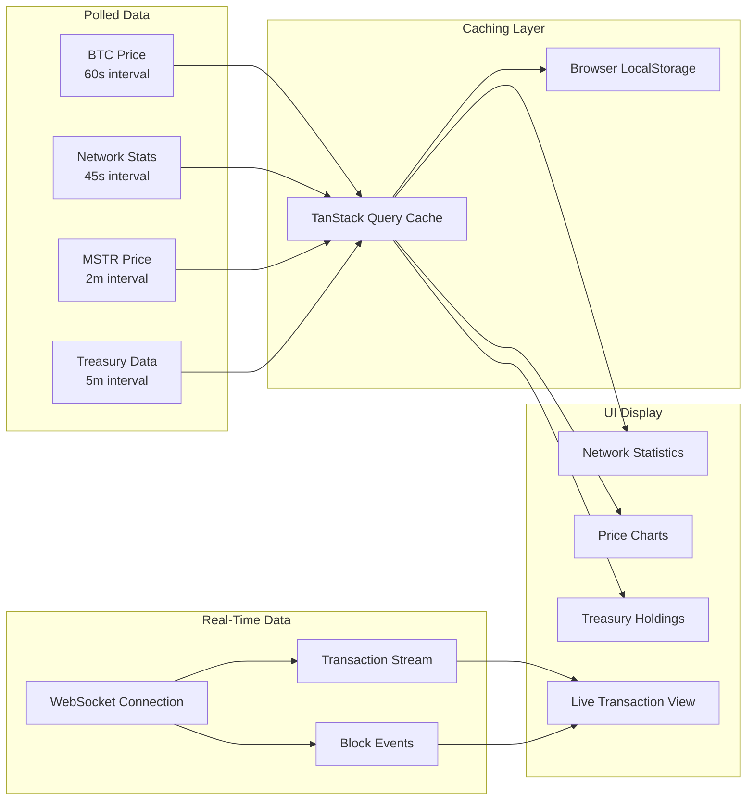

# BTC Explorer - Architecture

## System Architecture Diagram

```mermaid
flowchart TB
    subgraph Client["Browser Client"]
        UI[React UI Components]
        Router[React Router]
        State[TanStack Query Cache]
        Three[Three.js 3D Engine]
    end

    subgraph Frontend["Frontend Application (Vite)"]
        Pages[Page Components]
        Hooks[Custom Hooks]
        Lib[Utility Libraries]
    end

    subgraph External["External APIs"]
        Mempool[Mempool.space API]
        CoinGecko[CoinGecko API]
        Blockchain[Blockchain.info WebSocket]
        Yahoo[Yahoo Finance API]
        Stooq[Stooq API]
        Coinbase[Coinbase API]
    end

    subgraph Serverless["Vercel Serverless Functions"]
        MstrAPI[/api/mstr<br/>MSTR Price Proxy]
    end

    subgraph Edge["Edge Functions"]
        TreasuryProxy[Treasury Proxy<br/>Cloudflare Worker]
        CoinGeckoProxy[CoinGecko Proxy<br/>Cloudflare Worker]
    end

    subgraph Hosting["Hosting & CDN"]
        Vercel[Vercel Edge Network]
    end

    UI --> Router
    Router --> Pages
    Pages --> Hooks
    Pages --> Three
    Hooks --> State

    State --> Mempool
    State --> Blockchain
    State --> MstrAPI
    State --> TreasuryProxy
    State --> CoinGeckoProxy

    MstrAPI --> Yahoo
    MstrAPI --> Stooq
    TreasuryProxy --> Yahoo
    TreasuryProxy --> Stooq
    CoinGeckoProxy --> CoinGecko

    Hooks --> Coinbase

    Vercel --> Client
```

## Data Flow Architecture



## Architecture Overview

### Why I Chose This Architecture

I designed BTC Explorer as a single-page application (SPA) with a focus on real-time data visualization.

### Key Architectural Decisions

**1. Client-Side Rendering with React**

I chose React 18 with client-side rendering for several reasons:
- The application is highly interactive with real-time updates
- No SEO requirements for the main dashboard functionality
- Simplified deployment as a static site on Vercel
- Excellent ecosystem for data visualization libraries

**2. WebSocket for Live Transactions**

For the live transaction stream, I use WebSockets connecting directly to Blockchain.info's public API. I implemented automatic reconnection logic and visibility-based pause/resume to conserve bandwidth when the tab is not active.

**3. Server-Side API Proxies**

Several APIs I needed (Yahoo Finance, BitcoinTreasuries.net) have CORS restrictions. I use two approaches to solve this:
- **Vercel Serverless Functions** - A `/api/mstr` endpoint fetches MSTR stock price server-side from Yahoo Finance (with proper User-Agent headers) and Stooq as fallback. Vercel's CDN caches responses for 60 seconds with stale-while-revalidate, reducing upstream API calls. Being same-origin, this eliminates CORS entirely.
- **Cloudflare Workers** - Lightweight proxies for BitcoinTreasuries.net and CoinGecko data, caching responses at the edge. The treasury proxy aggregates data from BitcoinTreasuries.net, covering 100+ entities across companies, ETFs, governments, and private holdings.

**4. Aggressive Client-Side Caching**

I implemented a multi-layer caching strategy using TanStack Query and LocalStorage. Treasury data uses a 6-hour cache with a force-refresh option (`?refresh=1` URL parameter) for debugging. The getCached/setCached utilities in useBlockchain.js provide TTL-based localStorage caching across all data sources.

**5. Lazy Loading and Code Splitting**

All page components are lazy-loaded using React's lazy() and Suspense.

**6. Static Data for Historical Content**

I maintain a curated dataset in bitcoinData.js for historical events and wallet recommendations.

### Component Architecture

```
api/
└── mstr.js               # Vercel serverless: MSTR price (Yahoo → Stooq fallback)
src/
├── main.jsx              # App entry, providers setup
├── App.jsx               # Route definitions, lazy imports
├── components/
│   ├── Layout.jsx        # Navigation, footer, live status bar
│   └── ThreeScenes.jsx   # All 3D visualizations
├── pages/
│   ├── HomePage.jsx              # Landing with hero and features
│   ├── LivePage.jsx              # Real-time transaction stream
│   ├── MarketsPage.jsx           # Wrapper → VisualizationsPage
│   ├── VisualizationsPage.jsx    # Price history, adoption, halving charts
│   ├── PowerLawPage.jsx          # Price model and calculator
│   ├── CorporateHoldingsPage.jsx # 100+ entity treasury tracker
│   ├── MicroStrategyPage.jsx     # Strategy deep dive
│   ├── LearnPage.jsx             # Wrapper → TechnologyPage
│   ├── TechnologyPage.jsx        # Bitcoin technology education
│   └── WalletsPage.jsx           # Hardware & software wallet guide
└── lib/
    ├── useBlockchain.js   # All data fetching hooks
    ├── bitcoinData.js     # Static datasets (72+ events, wallets, specs)
    └── queryClient.js     # TanStack Query config
```

### Trade-offs and Limitations

**What I Sacrificed:**
- Server-side rendering would improve initial load SEO
- A dedicated backend could provide more reliable caching
- Real-time prices are limited by free API rate limits

**What I Gained:**
- Zero infrastructure costs (static hosting + free API tiers + serverless functions)
- Simple deployment and maintenance
- No database to manage or scale
- Application works offline with cached data
