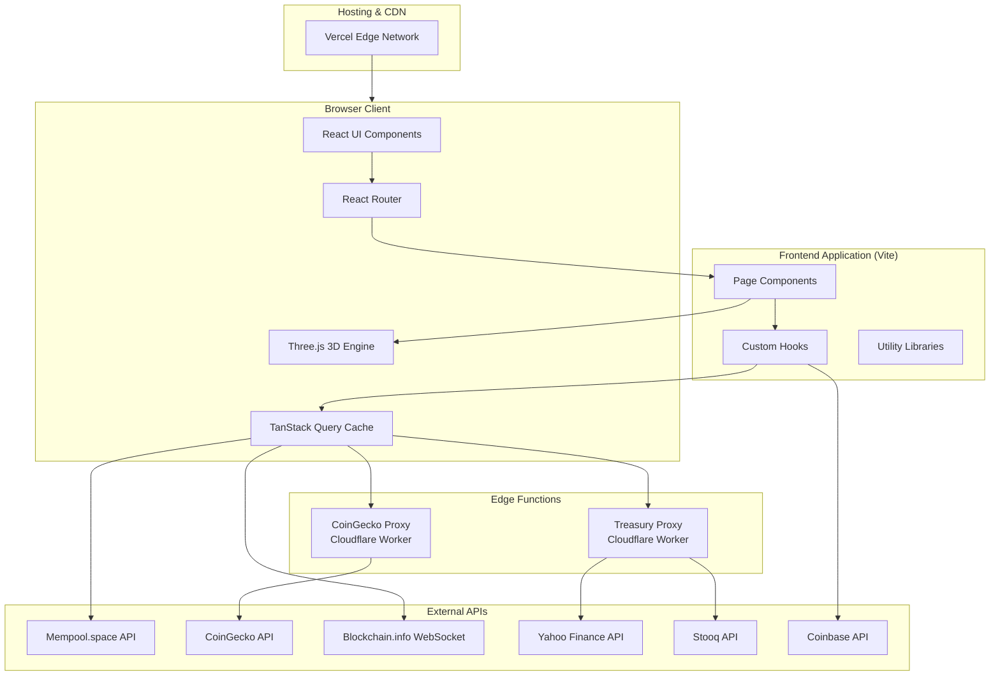
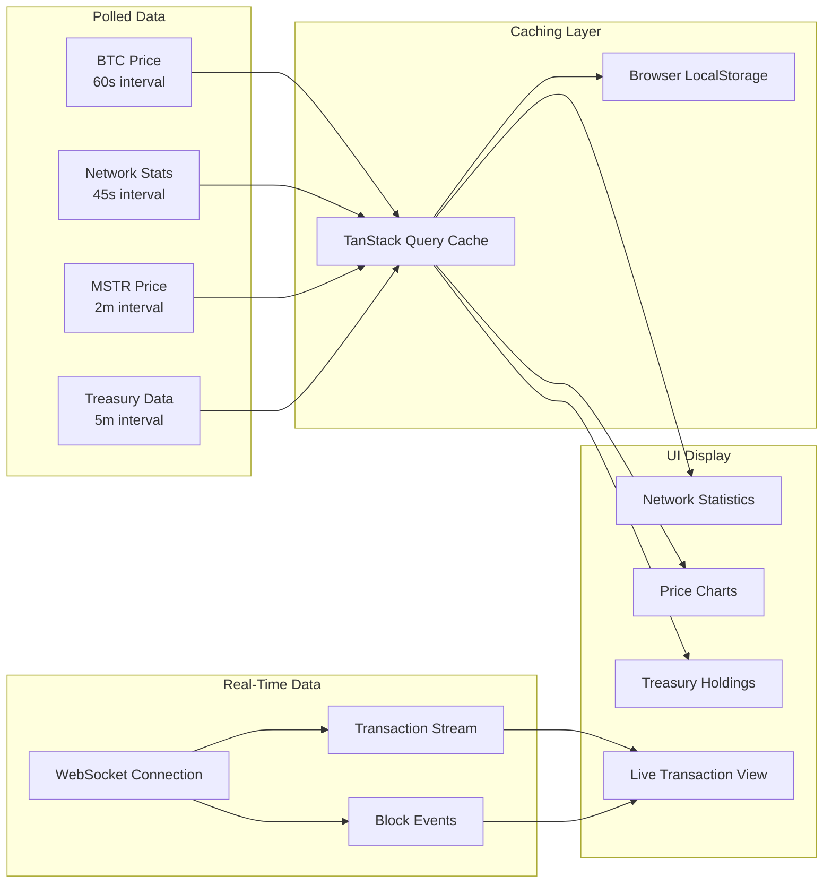

# BTC Explorer - Architecture

## System Architecture Diagram



## Data Flow Architecture



## Architecture Overview

### Why I Chose This Architecture

I designed BTC Explorer as a single-page application (SPA) with a focus on real-time data visualization.

### Key Architectural Decisions

**1. Client-Side Rendering with React**

I chose React 18 with client-side rendering for several reasons:
- The application is highly interactive with real-time updates
- No SEO requirements for the main dashboard functionality
- Simplified deployment as a static site on Vercel
- Excellent ecosystem for data visualization libraries

**2. WebSocket for Live Transactions**

For the live transaction stream, I use WebSockets connecting directly to Blockchain.info's public API. I implemented automatic reconnection logic and visibility-based pause/resume to conserve bandwidth when the tab is not active.

**3. Edge Function Proxies**

Several APIs I needed (Yahoo Finance, BitcoinTreasuries.net) have CORS restrictions. I built lightweight Cloudflare Workers to proxy requests and cache responses.

**4. Aggressive Client-Side Caching**

I implemented a multi-layer caching strategy using TanStack Query and LocalStorage.

**5. Lazy Loading and Code Splitting**

All page components are lazy-loaded using React's lazy() and Suspense.

**6. Static Data for Historical Content**

I maintain a curated dataset in bitcoinData.js for historical events and wallet recommendations.

### Component Architecture

```
src/
├── main.jsx           # App entry, providers setup
├── App.jsx            # Route definitions, lazy imports
├── components/
│   ├── Layout.jsx     # Navigation, footer, live status bar
│   └── ThreeScenes.jsx # All 3D visualizations
├── pages/
│   ├── HomePage.jsx       # Landing with hero and features
│   ├── LivePage.jsx       # Real-time transaction stream
│   ├── PowerLawPage.jsx   # Price model and calculator
│   └── CorporateHoldingsPage.jsx # Treasury tracker
└── lib/
    ├── useBlockchain.js   # All data fetching hooks
    ├── bitcoinData.js     # Static datasets
    └── queryClient.js     # TanStack Query config
```

### Trade-offs and Limitations

**What I Sacrificed:**
- Server-side rendering would improve initial load SEO
- A dedicated backend could provide more reliable caching
- Real-time prices are limited by free API rate limits

**What I Gained:**
- Zero infrastructure costs (static hosting + free API tiers)
- Simple deployment and maintenance
- No database to manage or scale
- Application works offline with cached data
