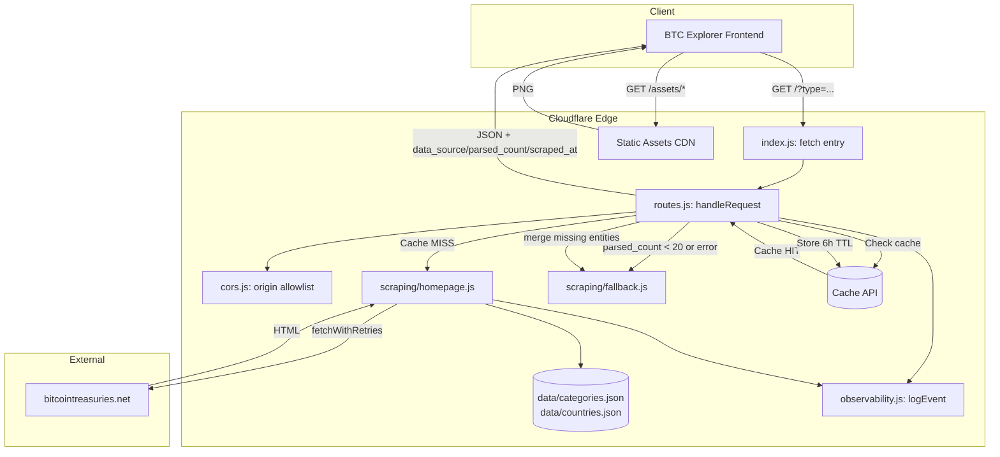

# Architecture Overview

## System Diagram

## Component Descriptions

### Worker Entry Point
- **Purpose**: Receives the request and immediately delegates to the route handler. Re-exports pure helpers so tests can import them from `src/index.js`.
- **Location**: `src/index.js`
- **Key responsibilities**:
  - Default-export `fetch` handler that calls `handleRequest`
  - Named re-exports for `parseBtcAmount`, `cleanCompanyName`, `mapCountryCode`, `categorizeCompany`, `determineEntityType` (test surface)

### Request Router
- **Purpose**: Orchestrates the request lifecycle: method/route checks, cache lookup, scrape, merge, validate, sort, cache write, response shaping.
- **Location**: `src/routes.js` (`handleRequest`)
- **Key responsibilities**:
  - Validate the `type` query param against `VALID_TYPES` before it becomes part of the cache key (cache-key-poisoning defence)
  - Validate `refresh=...` against `env.REFRESH_SECRET` for forced cache bypass
  - 404 for unknown routes, 405 for non-GET/OPTIONS methods, OPTIONS scoped to known routes
  - Look up/serve from Cache API; on miss, scrape and merge with fallback
  - Merge logic: if scraped entity count >= 20 the fallback fills gaps (ETFs, governments, DeFi); below 20 the full fallback is served standalone
  - Tag every response with `data_source` (`"scrape"` or `"fallback"`), `parsed_count`, and `scraped_at` so downstream consumers can distinguish fresh from cold-start data
  - Emit structured `logEvent` calls at every branch (`cache_hit`, `scrape_result` success/fallback/error, `refresh_requested`)

### CORS Helper
- **Purpose**: Exact-match origin allowlisting with `Vary: Origin`.
- **Location**: `src/cors.js`
- **Key responsibilities**:
  - Prod allowlist is `https://btcexplorer.io` and `https://www.btcexplorer.io`
  - `http://localhost:5173` and `http://localhost:3000` are appended only when `env.ENVIRONMENT` is `dev` or `development`, so production never echoes a localhost origin
  - Unknown origins receive a response with CORS method/header listings but no `Access-Control-Allow-Origin` (denied, not wildcarded)

### Homepage Scraper
- **Purpose**: Fetches and parses the BitcoinTreasuries.net homepage. The parser is split from the fetcher so it can be tested against an HTML fixture.
- **Location**: `src/scraping/homepage.js`
- **Key responsibilities**:
  - `scrapeHomepage()` issues the request via `fetchWithRetries` with browser-like headers, returns parsed entities plus `upstreamStatus` and `durationMs`
  - `parseHomepageHtml(html)` is a pure function over a string; it walks `<table>` rows, extracts name/country/ticker/BTC, then sweeps the treemap chart text (bounded to 50 KB to avoid overshoot) for additional entities
  - Deduplicates by lowercased name

### Categorization
- **Purpose**: Tag every entity with `category` and `type` from a versioned lookup table.
- **Location**: `src/scraping/categorize.js`, backed by `data/categories.json`
- **Key responsibilities**:
  - `lookupCategory(name, ticker)` -> `{ category, country }` checks `byTicker` first (case-insensitive), then iterates compiled `byNamePattern` regexes
  - `compilePattern` translates Perl-style `(?i)`/`(?s)`/`(?m)` inline-flag prefixes into JavaScript regex flags
  - `categorizeCompany` and `determineEntityType` are back-compat shims so the test surface and re-exports remain stable
  - The JSON is byte-identical with the sibling `Crypto-Proxy-coingecko` proxy and carries a `version` field

### Country Code Normalization
- **Purpose**: Map BitcoinTreasuries.net country slugs to ISO 3166-1 alpha-2 codes.
- **Location**: `src/scraping/countries.js`, backed by `data/countries.json`
- **Key responsibilities**:
  - Normalize the slug (lowercase, alpha-only), look it up in `slugToIso`
  - Includes both descriptive (`unitedkingdom` -> `GB`) and shorthand (`uk` -> `GB`) entries
  - Falls back to `US` when no match exists

### Parsers
- **Purpose**: Tiny pure functions for repeated string work.
- **Location**: `src/scraping/parsers.js`
- **Key responsibilities**:
  - `parseBtcAmount` strips non-numerics, returns a float
  - `cleanCompanyName` collapses whitespace, strips trailing commas

### Comprehensive Fallback Dataset
- **Purpose**: Curated dataset of 100+ entities; safety net for total scrape failure and a top-up for entity types that don't appear on the homepage.
- **Location**: `src/scraping/fallback.js` (`COMPREHENSIVE_FALLBACK`)

### Retry Utility
- **Purpose**: Single retry helper used everywhere outbound HTTP is needed.
- **Location**: `src/fetchWithRetries.js`
- **Key responsibilities**:
  - 10-second per-attempt timeout via `AbortController`
  - Exponential backoff (500 ms base, doubling)
  - Status-aware: retries 429/500/502/503/504, fast-fails on every other non-ok response

### Observability
- **Purpose**: Single chokepoint for structured logs.
- **Location**: `src/observability.js`
- **Key responsibilities**:
  - `logEvent(event, fields)` emits one JSON line per call via `console.log`
  - Cloudflare Workers Logs indexes the line as JSON, so events like `event:"scrape_result"` with `outcome`, `parsed_count`, `upstream_status`, and `duration_ms` are filterable in the dashboard

### Static Assets (Cloudflare Edge CDN)
- **Purpose**: Serves OG preview image and favicons directly from the edge without Worker CPU.
- **Location**: `public/assets/`, configured in `wrangler.jsonc`
- **Key responsibilities**:
  - Serves `preview.png` and `favicon-*.png` at `/assets/*` paths
  - `run_worker_first: ["/", "/health"]` ensures API routes always hit the Worker

## Data Flow

1. **Request arrives** at the Cloudflare edge; `/assets/*` paths short-circuit to the static asset CDN
2. **`/` and `/health`** are routed through the Worker by `run_worker_first`; `src/index.js` immediately calls `handleRequest`
3. **Method check** rejects non-GET/OPTIONS with 405; OPTIONS returns 204 only on known routes
4. **Input validation**: `type` is validated against `VALID_TYPES`; `refresh` is compared to `env.REFRESH_SECRET`; only validated values can affect the cache key
5. **Cache lookup**: `caches.default.match` keyed by validated type filter; on hit, emit `cache_hit`, attach CORS, return with `x-cache: hit`
6. **On miss**: `scrapeHomepage()` calls `fetchWithRetries` (10 s timeout, 3 attempts, status-aware), parses HTML, returns entities plus upstream status/duration
7. **Fallback merge**: if `entities.length < 20`, the full fallback dataset is used (`data_source = "fallback"`); otherwise the fallback fills gaps for entities missing from the scrape (`data_source = "scrape"`)
8. **Validation**: drop entries with no ASCII letters in the name, pure-numeric tickers, or non-positive BTC
9. **Filter**: apply the validated `?type=` filter if present
10. **Sort**: descending by BTC
11. **Totals**: single-pass calculation of `total_holdings`, `total_entities`, `by_type`, `entity_counts`
12. **Cache write**: 6 hours fresh, 24 hours `stale-if-error`
13. **Observability**: every branch (`cache_hit`, `scrape_result` success/fallback/error, `refresh_requested`) writes a JSON line via `logEvent`
14. **Response**: JSON with `entities`, `totals`, `source`, `data_source`, `parsed_count`, `scraped_at`, `updated_at`, plus `x-cache: miss`

## External Integrations

| Service | Purpose | Documentation |
|---------|---------|---------------|
| BitcoinTreasuries.net | Source data for Bitcoin treasury holdings | N/A (scraped) |
| Cloudflare Workers | Serverless edge compute runtime | [Workers Docs](https://developers.cloudflare.com/workers/) |
| Cloudflare Cache API | Edge caching for responses | [Cache API Docs](https://developers.cloudflare.com/workers/runtime-apis/cache/) |
| Cloudflare Static Assets | Edge CDN serving for OG image and favicons | [Static Assets Docs](https://developers.cloudflare.com/workers/static-assets/) |
| Cloudflare Workers Logs | Indexed structured-log search for `logEvent` JSON output | [Logs Docs](https://developers.cloudflare.com/workers/observability/logs/) |

## Key Architectural Decisions

### Scraping vs API
- **Context**: BitcoinTreasuries.net doesn't expose a public API.
- **Decision**: HTML table scraping and treemap text parsing as primary strategy.
- **Rationale**: The homepage contains a Top 100 table and treemap chart that provide structured entity data.

### Hardcoded Fallback Dataset
- **Context**: Scraping can break if the source site changes its HTML structure.
- **Decision**: Maintain a comprehensive fallback dataset of ~100 entities with known BTC holdings, and tag each response with `data_source` so the frontend knows when it is reading curated rather than fresh data.
- **Rationale**: Ensures the API always returns useful data even when scraping fails, avoiding downstream breakage on BTC Explorer. Tagging the response keeps the contract honest.

### Shared Data Files Between Sibling Proxies
- **Context**: This Worker and the sibling `Crypto-Proxy-coingecko` Worker both need the same ticker -> category map and the same country slug -> ISO code map. Inline tables in two different source files drift the moment one repo gets a fix the other doesn't.
- **Options**: (a) inline tables in each repo and trust diff reviews, (b) publish a shared npm package, (c) duplicate the data as JSON files with a written sync contract.
- **Choice**: Option (c). `data/categories.json` and `data/countries.json` are byte-identical between the two repos; `data/KEEP_IN_SYNC.md` documents the rules and points the reviewer at a one-line `diff` to verify, and each file carries a dated `version` field.
- **Rationale**: Zero build-time coupling between the repos (no package version skew, no private-registry plumbing), reviewer can verify equality with a single command, and breaking the contract is a noisy `diff` rather than a silent drift.

### Locking the Scraping Contract With an HTML Fixture
- **Context**: A live-fetch test against `bitcointreasuries.net` is both flaky and rude. But a parser that never sees real HTML drifts from reality.
- **Decision**: Snapshot a 1.6 MB copy of the live homepage HTML into `test/fixtures/bitcointreasuries-homepage.html` and run `parseHomepageHtml` against it in CI (`test/scraping/parseHomepage.spec.ts`). Miniflare's `modulesRules` maps `**/*.html` to the Text module type so the fixture imports as a string.
- **Rationale**: The parser must extract >= 50 entities from the fixture and must always find Strategy (MSTR) as a top entity with >100k BTC. If upstream HTML drifts in a way that breaks the parser, CI fails on the next refresh of the fixture - well before the change reaches production.

### Static Assets with Worker-First Routing
- **Context**: The worker needs to serve both a JSON API and static image assets (OG image, favicons).
- **Decision**: Use Cloudflare's static assets binding with `run_worker_first: ["/", "/health"]`.
- **Rationale**: Static assets are served directly from the edge CDN with zero Worker CPU cost. The `run_worker_first` array explicitly protects API routes from being shadowed by static files, which is safer than relying on the absence of `index.html`.

### Edge Caching Strategy
- **Context**: Scraping is slow and the source data changes infrequently.
- **Decision**: 6-hour cache TTL with 24-hour `stale-if-error`.
- **Rationale**: Bitcoin treasury holdings update at most a few times per day; aggressive caching reduces scraping load while `stale-if-error` ensures availability during source outages.
