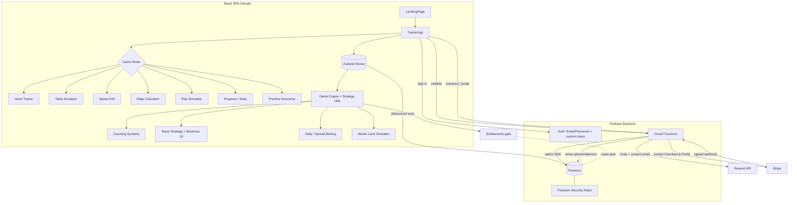

# Architecture

## System Diagram

## Component Descriptions

### Game Engine (Zustand store)
- **Purpose**: Single source of truth for the deck, hands, dealer logic, bankroll, and per-decision analysis.
- **Location**: `src/store/gameStore.ts` with supporting modules in `src/store/gameStore/` (`types.ts`, `defaults.ts`, `helpers.ts`).
- **Key responsibilities**: Deal/hit/stand/double/split/surrender, post-split payout resolution, deck-exhaustion guarding, count tracking, and producing the decision/bet/insurance feedback the UI renders.

### Strategy & Math Utilities
- **Purpose**: Pure, testable functions that encode the actual blackjack math.
- **Location**: `src/utils/` — `countingSystems.ts`, `basicStrategy.ts`, `illustrious18.ts`, `betting.ts`, `houseEdge.ts`, `simulator.ts`, `analysis.ts`, `deck.ts`.
- **Key responsibilities**: Card-counting values for five systems, basic-strategy lookups, count-based deviations, optimal bet sizing, rule-driven house-edge computation, and Monte Carlo / analytic EV projection. Each has a colocated `*.test.ts`.

### Mode Components
- **Purpose**: One screen per practice mode, code-split so the initial bundle stays small.
- **Location**: `src/components/` (e.g. `BlackjackTable.tsx`, `SpeedDrill.tsx`, `EdgeCalculator.tsx`, `SimulatorPage.tsx`, `PracticeScenarios.tsx`, `ProgressPage.tsx`).
- **Key responsibilities**: Heavy modes are loaded with `React.lazy` + `Suspense` from `src/App.tsx`; only the active mode's code is fetched.

### Auth & Roles
- **Purpose**: Invite-only access with three privilege tiers.
- **Location**: `src/auth/` (`useAuth.tsx`, `RequireRole.tsx`, `types.ts`), `src/firebase.ts`.
- **Key responsibilities**: Firebase Auth session, role resolution (`user`/`admin`/`dev`), dev impersonation, and propagating an inviting admin's branding to their users via an `effectiveProfile`.

### Cloud Functions
- **Purpose**: Trusted server-side operations that must not be exposed to the client.
- **Location**: `functions/src/` (`sendInvite.ts`, `createUserWithInvite.ts`, `createUserSelfServe.ts`, `disableUser.ts`, `transferUser.ts`, `sendContactForm.ts`, `invalidateCache.ts`, `createCheckoutSession.ts`, `createPortalSession.ts`, `stripeWebhook.ts`, `demoAccess.ts`).
- **Key responsibilities**: Issue and consume invite tokens, send invite/contact emails via Resend, cascade-disable an admin's users, transfer users between admins, broadcast a cache-invalidation signal, start Stripe Checkout/Portal sessions, process the Stripe webhook, and provision/log demo accounts.

### Billing & Entitlements
- **Purpose**: A flag-gated subscription system where the server is the only writer of paid status.
- **Location**: `src/config/plans.ts` (tiers, pricing, `BILLING_ENABLED`), `src/utils/entitlements.ts` (access decisions), `src/services/billing.ts` (client redirect helpers), `functions/src/stripeWebhook.ts` and `functions/src/billing/` (server entitlement logic).
- **Key responsibilities**: Decide free vs Pro per mode in one place, redirect to Stripe-hosted Checkout/Portal (no client Stripe SDK), and let the webhook denormalize `plan`/`subscriptionStatus`/period fields onto the user doc. B2B team subscriptions write an org entitlement to `adminConfigs/{adminUid}` so invited seats inherit Pro without per-user writes.

### Demo Access
- **Purpose**: Frictionless, pre-branded preview accounts for sales outreach.
- **Location**: `functions/src/demoAccess.ts` (`createDemoAdmin`, `demoLogin`), `src/services/demoAuth.ts`.
- **Key responsibilities**: A dev mints a pre-branded admin account and a `#demo=<key>` magic link; opening the link exchanges the key for a Firebase custom token (no signup/password) and records first/last access and visit count as a sales signal.

### User State Sync
- **Purpose**: Cross-device persistence of settings, stats, achievements, and high scores without burning Firestore quota.
- **Location**: `src/services/userState.ts`, `src/services/firebaseUsageTracker.ts`, `src/services/cacheInvalidation.ts`.
- **Key responsibilities**: Debounced writes, parallel batch loads on login, flush-on-hidden, and per-user read/write usage tracking.

## Data Flow

1. A visitor lands on `LandingPage` (with an interactive demo trainer) and enters the app, which requires sign-in.
2. On login, `useAuth` resolves the user's profile and roles, and `userState` batch-loads settings/stats/achievements in parallel.
3. The user plays a hand: the game store deals from a counted shoe, evaluates each decision against basic strategy and the Illustrious 18, and computes the optimal bet for the current true count.
4. Stats and settings changes are queued and written to Firestore on a 60-second debounce, with an immediate flush when the tab is hidden.
5. Admins/devs open the Admin Panel, which invokes Cloud Functions (e.g. `sendInvite`) — all privilege checks run server-side, with Firestore rules as a second gate.
6. To upgrade, the client calls `createCheckoutSession` and is redirected to Stripe-hosted Checkout; on payment, Stripe posts a signed webhook that writes the user's `plan`/`subscriptionStatus` to Firestore, and the live profile listener unlocks Pro modes within a second.
7. A demo prospect opens a `#demo=<key>` link; `demoLogin` validates the key, records the visit, and returns a custom token that signs them straight into a pre-branded admin account.

## External Integrations

| Service | Purpose | Notes |
|---------|---------|-------|
| Firebase Auth | Email/password sign-in, invite-only | Client SDK; sessions resolved in `useAuth` |
| Cloud Firestore | User profiles, settings, stats, achievements, invites | Access enforced by `firestore.rules`; writes debounced |
| Cloud Functions | Invites, user management, contact form, cache invalidation | Node 22, `firebase-functions` v7, `firebase-admin` v13 |
| Resend | Transactional email for invites and the contact form | Called only from Cloud Functions, key never reaches the client |
| Stripe | Subscription billing (individual Pro + B2B team plans) | Hosted Checkout/Portal redirects; entitlements written only by the signature-verified webhook |
| Vercel | Static hosting + SPA rewrites for the Vite build | `vercel.json` rewrites all routes to `index.html` |

## Key Architectural Decisions

### Strategy math as pure, unit-tested functions
- **Context**: A counting trainer is only credible if its feedback is mathematically correct — a wrong "optimal play" teaches the user to lose money.
- **Decision**: Keep all blackjack math in pure functions under `src/utils/` with colocated Vitest suites, separate from React and from the Zustand store.
- **Rationale**: Pure functions let the EV, true-count, house-edge, and deviation logic be tested exhaustively without rendering anything. The alternative — math tangled into components — would make correctness regressions invisible until they reached the UI.

### Two paths in the Monte Carlo simulator: sampled and analytic
- **Context**: Users want both a realistic distribution of outcomes (risk of ruin, percentiles) and a stable, deterministic expected value they can trust.
- **Decision**: `simulator.ts` ships `runSimulation` (deals a real shoe, tracks Hi-Lo, samples thousands of sessions) alongside `calculateExpectedValue` (weights a theoretical true-count distribution analytically) and `calculateN0`.
- **Rationale**: Sampling captures variance and tail risk; the analytic path gives a noise-free EV/hour and dollar-weighted edge. Relying on sampling alone would make headline numbers jitter run-to-run; relying on the analytic model alone would hide ruin and drawdown.

### Server-side privilege enforcement with rules as a second gate
- **Context**: Invites, role changes, and account disabling are abuse-sensitive and cannot be trusted to client code.
- **Decision**: All sensitive mutations run in Cloud Functions that re-check the caller's role; Firestore rules independently block users from editing protected fields (`roles`, `disabled`, `invitedBy`, `impersonating`) and scope admin reads to their own invitees.
- **Rationale**: Defense in depth — even a compromised or bypassed client cannot escalate a role or read other admins' users. Doing checks only in rules would be brittle for multi-step operations like cascade-disable; doing them only in functions would leave direct Firestore writes unguarded.

### Debounced, flush-on-hidden Firestore sync
- **Context**: Settings and stats change constantly during play; writing each change would be expensive and could exceed free-tier quota.
- **Decision**: Coalesce writes on a 60-second debounce, flush immediately on `visibilitychange → hidden`, and track per-user reads/writes in memory.
- **Rationale**: This trades a small risk of losing the last few seconds of unsynced state for a large reduction in writes, while the hidden-tab flush captures almost every real departure. Writing eagerly would have made the trainer costly to run for a hobby project.

### Webhook-as-single-writer for entitlements, behind a kill-switch flag
- **Context**: A client must never be able to grant itself a paid plan, and I needed to ship the whole billing system before the payment account was live without changing app behavior.
- **Decision**: Paid status (`plan`, `subscriptionStatus`, period fields) is written *only* by the signature-verified Stripe webhook using the Admin SDK; Firestore rules block clients from touching those fields. The client uses Stripe-hosted Checkout/Portal (no client Stripe SDK) and reads its plan via the existing profile listener. The entire paywall sits behind a single `BILLING_ENABLED` flag — with it off, `entitlements.ts` returns full access for everyone.
- **Rationale**: Server-only writes make plan-spoofing impossible regardless of client tampering, and hosted Checkout keeps card data off my surface entirely. The flag let me develop, test, and deploy billing as dead code with zero user-visible change, then flip it on (and roll it back instantly) without a code deploy.

### B2B seats as inherited org entitlements
- **Context**: Team customers buy one subscription that should grant Pro to many invited players, and seat counts change as the admin invites or removes users.
- **Decision**: A team subscription writes an org entitlement (`orgPlan`, `seatLimit`) to `adminConfigs/{adminUid}`; invited users inherit Pro by reading their inviting admin's config in `useAuth`, and `sendInvite` enforces the seat cap server-side. No per-seat user document is written when the plan changes.
- **Rationale**: Treating the admin's doc as the source of truth means activating, downgrading, or canceling a team plan is a single write that all seats observe — avoiding a fan-out write to every member and keeping the seat cap authoritative on the server.

### Code-split modes behind `React.lazy`
- **Context**: The app has seven distinct modes, several of which (table simulator, Monte Carlo, scenarios) pull in heavy logic most users won't open first.
- **Decision**: Lazy-load each non-default mode with `Suspense` fallbacks from `src/App.tsx`.
- **Rationale**: The hand trainer — the landing experience — loads fast, and heavier modes pay their cost only when selected. Shipping one monolithic bundle would slow the first paint for everyone.
