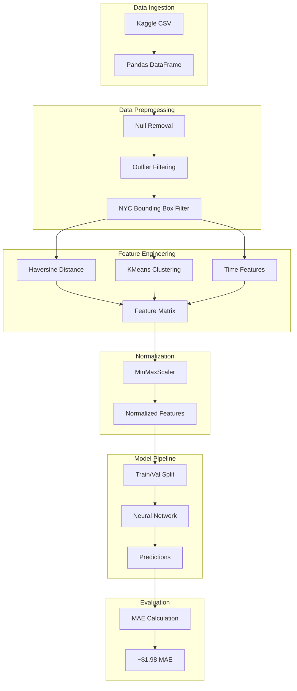

# Architecture Overview

## System Diagram

## Component Descriptions

### Data Loading
- **Purpose**: Load and sample data from Kaggle dataset
- **Location**: `Main.ipynb` (Cell 4)
- **Key responsibilities**:
  - Read CSV with configurable row limit (default 1M)
  - Handle datetime parsing with UTC timezone

### Data Cleaning
- **Purpose**: Remove invalid and outlier records
- **Location**: `Main.ipynb` (Cells 4-5)
- **Key responsibilities**:
  - Drop null values
  - Filter fare outliers ($2-$100 range)
  - Validate passenger counts (1-6 passengers)
  - Enforce NYC geographic boundaries

### Feature Engineering
- **Purpose**: Create predictive features from raw data
- **Location**: `Main.ipynb` (Cells 6-9)
- **Key responsibilities**:
  - Calculate Haversine distance between pickup/dropoff
  - Cluster locations using KMeans (5 clusters)
  - Extract temporal features (hour, day, weekday, month)
  - Flag peak hours (7-9 AM, 5-10 PM)

### Neural Network Model
- **Purpose**: Predict taxi fares from engineered features
- **Location**: `Main.ipynb` (Cells 31-34)
- **Key responsibilities**:
  - Process 17 input features through dense layers
  - Apply early stopping to prevent overfitting
  - Reduce learning rate on validation plateau

## Data Flow

1. Raw CSV data loaded into Pandas DataFrame (1M rows)
2. Cleaning pipeline removes ~15-20% invalid records
3. Feature engineering creates distance, cluster, and time features
4. MinMaxScaler normalizes continuous features
5. 80/20 train/validation split for model training
6. Neural network trained with early stopping and LR scheduling
7. Final predictions evaluated with Mean Absolute Error

## Key Architectural Decisions

### Haversine Distance over Euclidean
- **Context**: Need accurate distance between GPS coordinates
- **Decision**: Implemented Haversine formula for great-circle distance
- **Rationale**: Accounts for Earth's curvature, more accurate than Euclidean for geospatial data

### KMeans Clustering for Location Encoding
- **Context**: Raw lat/lon coordinates don't capture neighborhood patterns
- **Decision**: Use KMeans with 5 clusters on combined pickup/dropoff coordinates
- **Rationale**: Reduces dimensionality while preserving geographic patterns; 5 clusters balance granularity and model complexity

### MAE Loss over MSE
- **Context**: Need a loss function for fare prediction
- **Decision**: Use Mean Absolute Error instead of Mean Squared Error
- **Rationale**: MAE is more interpretable (in dollars) and less sensitive to outliers than MSE

### Two Hidden Layers (128 → 64)
- **Context**: Choosing neural network depth and width
- **Decision**: Simple two-layer architecture with decreasing width
- **Rationale**: Sufficient capacity for tabular data; deeper networks showed no improvement and risked overfitting
