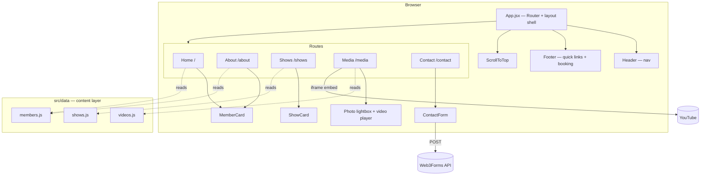

# Architecture

## System Diagram

## Component Descriptions

### App shell
- **Purpose**: Defines the five routes and the persistent layout (header, footer, scroll-reset).
- **Location**: `src/App.jsx`
- **Key responsibilities**: `BrowserRouter` setup; mounts `Header`, `Footer`, and `ScrollToTop` around a `Routes` block for `/`, `/about`, `/shows`, `/media`, `/contact`.

### Content data layer
- **Purpose**: Keeps all editable content out of the components so copy changes don't touch JSX.
- **Location**: `src/data/members.js`, `src/data/videos.js`, `src/data/shows.js`
- **Key responsibilities**: Exports `mainMembers`, `supportingMembers`, and `bandDescription`; the list of YouTube video IDs/titles; and the upcoming/past show records.

### MemberCard
- **Purpose**: Renders a band member as a card or a full bio block.
- **Location**: `src/components/MemberCard/`
- **Key responsibilities**: Accepts a `variant` (`preview` / `full`) and a `showBio` flag; splits the multi-paragraph bio string into `
` elements.

### ShowCard
- **Purpose**: Renders a single show with a date badge.
- **Location**: `src/components/ShowCard/`
- **Key responsibilities**: Parses the show date in local time; renders a "Get Tickets" button only when a real ticket URL is present; collapses time/CTA for past shows.

### Media page
- **Purpose**: Video gallery and photo lightbox.
- **Location**: `src/pages/Media.jsx`
- **Key responsibilities**: Tracks the active video in state; switches it from a thumbnail strip; lazy-loads the YouTube iframe; opens photos in a keyboard-accessible lightbox (Escape to close, focusable photo buttons).

### ContactForm
- **Purpose**: Booking/inquiry form.
- **Location**: `src/components/ContactForm/`
- **Key responsibilities**: Controlled inputs; posts JSON to Web3Forms; surfaces submitting/success/error states with no backend.

## Data Flow

1. A visitor lands on a route; `ScrollToTop` resets scroll position on every navigation.
2. The page component imports the relevant module from `src/data/` and maps the records into components (`MemberCard`, `ShowCard`, video thumbnails).
3. On the Media page, selecting a thumbnail updates React state and swaps the embedded YouTube video; clicking a photo opens the lightbox overlay.
4. On Contact, the form serializes its fields plus the Web3Forms access key and `POST`s to the Web3Forms API, which emails the submission; the UI reflects success or error.

## External Integrations

| Service | Purpose | Notes |
|---------|---------|-------|
| Web3Forms | Contact-form delivery | Client-side `POST`; access key supplied via `VITE_WEB3FORMS_KEY`; no backend required |
| YouTube | Video embeds | `iframe` embeds with `loading="lazy"`; thumbnails pulled from `img.youtube.com` |
| Vercel | Hosting + CI deploys | Production deploys on push to `main`; env vars configured per environment |

## Key Architectural Decisions

### Content split from components into a data layer
- **Context**: Band content (bios, videos, shows) changes far more often than layout.
- **Decision**: Centralize all editable content in `src/data/*.js` and keep components purely presentational.
- **Rationale**: Updating a bio or adding a show is a one-line data edit with no JSX risk. The alternative — content inlined in components — couples copy changes to markup and invites regressions.

### Serverless contact form over a custom backend
- **Context**: The site needs a booking form but is otherwise fully static.
- **Decision**: Post directly to Web3Forms from the client.
- **Rationale**: Avoids standing up and maintaining a server or serverless function just to relay an email. The trade-off — a public access key in the bundle — is acceptable because Web3Forms keys are designed to be client-side; it's still pulled from an env var so it can be rotated without code changes.

### Component colocation
- **Context**: A small component library where styles and markup evolve together.
- **Decision**: Each component lives in its own folder with `Component.jsx`, `Component.css`, and an `index.js` barrel export; styling relies on global CSS variables rather than a CSS-in-JS runtime.
- **Rationale**: Keeps related files together and imports clean, with zero styling-runtime cost. A design-token set in `src/styles/global.css` keeps the retro palette consistent without a heavier styling dependency.

### Timezone-safe date rendering
- **Context**: Show dates are stored as bare `YYYY-MM-DD` strings, which JavaScript's `new Date()` interprets as UTC midnight — shifting to the previous day for US viewers.
- **Decision**: Parse the date parts manually and construct a local-time `Date` in `ShowCard`.
- **Rationale**: Guarantees the displayed day matches the intended calendar date regardless of the visitor's timezone, without pulling in a date library for one formatting need.
