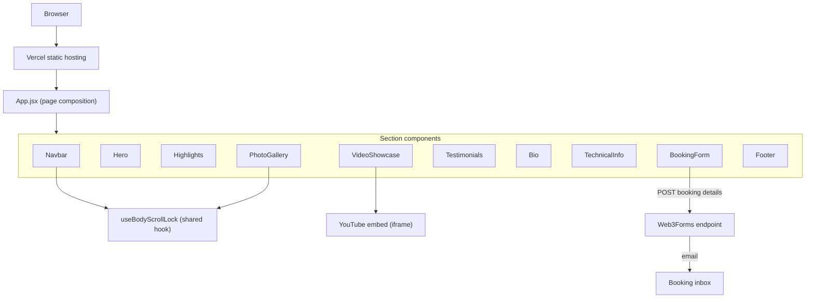

# Architecture

## System Diagram

## Component Descriptions

### App shell
- **Purpose**: Assembles the single-page site by rendering each section in document order.
- **Location**: `src/App.jsx`, `src/main.jsx`
- **Key responsibilities**: Wraps the tree in `<MotionConfig reducedMotion="user">` so every Framer Motion animation in the app honors the OS "reduce motion" setting from one place, and mounts under `React.StrictMode`.

### Section components
- **Purpose**: Each visual section of the page is an isolated component with its own local state and scroll-reveal animation.
- **Location**: `src/components/*.jsx`
- **Key responsibilities**: Most use `useInView(ref, { once: true, margin: '-100px' })` to animate in when scrolled into view and never re-trigger. Content (highlight cards, rider sections, video list, gallery images) is defined as plain data arrays at the top of each file and mapped to markup.

### `useBodyScrollLock` hook
- **Purpose**: Prevent the page behind an overlay from scrolling while a modal-like surface is open.
- **Location**: `src/hooks/useBodyScrollLock.js`
- **Key responsibilities**: Toggles `document.body.style.overflow`, but tracks a **module-level lock counter** so two simultaneous consumers (the mobile menu and the gallery lightbox) don't fight — scroll is restored only when the last lock releases, and the original overflow value is preserved.

### VideoShowcase
- **Purpose**: Show performance videos via embedded YouTube players.
- **Location**: `src/components/VideoShowcase.jsx`
- **Key responsibilities**: Tracks the active video and a `hasInteracted` flag; the embed URL only appends `&autoplay=1` after the user has explicitly chosen a video, so the page is quiet on load but a thumbnail click plays immediately.

### PhotoGallery
- **Purpose**: Browsable image grid with a full-screen viewer.
- **Location**: `src/components/PhotoGallery.jsx`
- **Key responsibilities**: Manages lightbox open/close and prev/next index math, wires global keyboard handlers (Escape / arrow keys) while open, exposes the overlay as `role="dialog" aria-modal="true"`, and lazy-loads grid thumbnails.

### BookingForm
- **Purpose**: Capture and deliver event-booking inquiries without a backend.
- **Location**: `src/components/BookingForm.jsx`
- **Key responsibilities**: Controlled form state, submit/loading/success/error UI, a hidden honeypot field for spam filtering, and a `fetch` POST to the Web3Forms API.

## Data Flow

1. A visitor lands on the static bundle served by Vercel; `App.jsx` renders all sections at once (single-page scroll experience).
2. As the visitor scrolls, each section's `useInView` flips and Framer Motion plays its entrance animation — unless the OS requests reduced motion, in which case `MotionConfig` skips it.
3. Opening the mobile menu or a gallery image acquires a body-scroll lock; navigating the lightbox with arrow keys recomputes the index; closing releases the lock.
4. Picking a video sets `hasInteracted`, which re-renders the iframe with an autoplay URL.
5. On booking submit, a filled honeypot short-circuits to a fake success; otherwise the form POSTs JSON to Web3Forms, which emails the inquiry to the act's inbox. The UI shows success or error and auto-resets after a few seconds.

## External Integrations

| Service | Purpose | Notes |
|---------|---------|-------|
| Web3Forms | Email delivery for the booking form | Client-side POST with a public access key; no server to run or secrets to manage. |
| YouTube (embed) | Performance video playback | `iframe` embeds with `rel=0` and `playsinline=1`; autoplay only after interaction. |
| Google Fonts | Bebas Neue + Inter typefaces | Loaded via `<link>` with `preconnect`. |
| Vercel | Static hosting / CDN | Build output (`dist/`) is deployed directly. |

## Key Architectural Decisions

### No backend — static site with a serverless form endpoint
- **Context**: The site needs exactly one dynamic capability: delivering a booking inquiry by email. Everything else is presentational.
- **Decision**: Ship a pure static React build and delegate form delivery to Web3Forms.
- **Rationale**: Standing up an API or serverless function just to relay one form would add hosting, secrets, and uptime concerns for a brochure site. A client-side POST to a form service keeps deployment to "upload static files" while still emailing inquiries. The trade-off — the access key is visible in the client — is acceptable because the key only authorizes submissions to a fixed inbox, and the honeypot handles the spam that public exposure invites.

### Reference-counted scroll lock instead of per-component booleans
- **Context**: Two independent components (mobile menu, lightbox) each need to freeze background scroll, and they can be triggered in overlapping ways.
- **Decision**: Centralize the behavior in `useBodyScrollLock` with a shared counter and a saved "previous overflow" value.
- **Rationale**: If each component just set and unset `overflow: hidden`, the first one to close would unlock scroll while the other was still open. Counting active locks and only restoring on the final release makes the hook composable and correct regardless of open order.

### Interaction-gated autoplay rather than always-on or always-off
- **Context**: Autoplaying media on load is hostile (and blocked by browsers), but requiring a second click inside the player after choosing a thumbnail feels broken.
- **Decision**: Treat the first thumbnail selection as the autoplay trigger by conditionally building the embed URL.
- **Rationale**: It gives the best of both — a silent initial load and one-click playback — without reaching for the YouTube IFrame Player API, which would add a script dependency and async player lifecycle for what a URL parameter already does.

### Accessibility handled at the root, not per-animation
- **Context**: Dozens of Framer Motion animations across many components would each need to check the user's motion preference.
- **Decision**: Wrap the whole app in `<MotionConfig reducedMotion="user">`.
- **Rationale**: One declaration makes the entire animation system respect `prefers-reduced-motion`, so no individual component has to remember to do it and new sections inherit the behavior for free.

### Data-driven sections
- **Context**: Highlights, rider specs, the video list, and gallery images are all repetitive card/list structures whose content changes more often than their layout.
- **Decision**: Define each section's content as a plain array at the top of its component and render it by mapping over the data.
- **Rationale**: Editing copy or adding a milestone means touching a data array, not JSX — lower risk of breaking markup and a clear separation between content and presentation.
