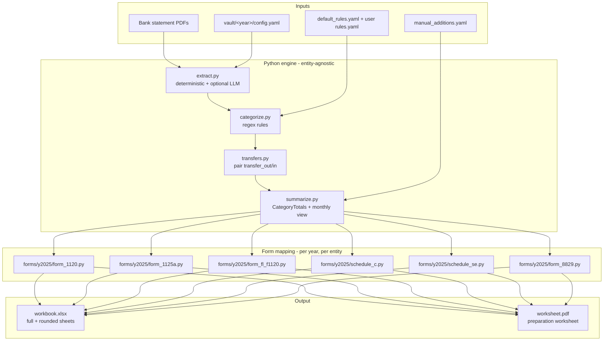

# Architecture

## System Diagram

## Component Descriptions

### `extract.py` — bank statement → transactions
- **Purpose**: Turn a directory of bank statement PDFs into a list of `Transaction` objects
- **Location**: `src/tax_toolkit/extract.py`
- **Key responsibilities**: Three-stage extraction chain — (1) deterministic `pdfplumber` parser that knows the synthetic Acme/Chase-like layout; (2) optional Anthropic text-mode fallback when stage 1 returns nothing and `ANTHROPIC_API_KEY` is set; (3) optional multimodal-PDF fallback for scanned statements. Raises a custom `ExtractionNeedsHelp` exception (CLI exits with code 3) when all paths fail without an API key, so callers know to route the PDF through a different reader.

### `categorize.py` — transactions → categorized transactions
- **Purpose**: Apply regex rules to label each transaction with a `Category` + `subcategory`
- **Location**: `src/tax_toolkit/categorize.py`
- **Key responsibilities**: Layered rule files (`rules/default_rules.yaml` for shipped patterns, `vault/<year>/rules.yaml` for user-scoped learned rules). User rules take precedence. Unmatched transactions can be batched to Claude for category proposals; the rule the user confirms is written back to `vault/<year>/rules.yaml`, so categorization improves over time. The `--emit-unmatched` and `--apply` CLI flags expose this loop without requiring an SDK call.

### `transfers.py` — pair inter-account transfers
- **Purpose**: Stop money moving between checking and savings from inflating revenue
- **Location**: `src/tax_toolkit/transfers.py`
- **Key responsibilities**: Same-date opposite-sign transactions across two source files are paired and re-tagged as `Category.TRANSFER`. This was the single bug most amateur DIY tax spreadsheets had, so it's a deliberate first-class concern.

### `summarize.py` — CategoryTotals + monthly view
- **Purpose**: Roll categorized transactions into per-category totals + a 12-month rollup
- **Location**: `src/tax_toolkit/summarize.py`
- **Key responsibilities**: Splits revenue into positive (Line 1a) and negative-as-positive (Line 1b returns and allowances). Routes operating-expense subcategories into an `other_deductions_breakdown` dict that downstream form modules iterate. Excludes transfer-tagged transactions from every total.

### `forms/y2025/*.py` — form line mapping
- **Purpose**: Pure functions from `CategoryTotals` to `{line_number: Decimal}` dicts
- **Location**: `src/tax_toolkit/forms/y2025/`
- **Key responsibilities**: One file per form (Form 1120, Form 1125-A, FL F-1120, Statement of Other Deductions, Schedule C, Schedule SE, Form 8829). No file I/O, no rendering — just the tax-law mapping. Year-versioned under `y2025/` so 2026 form changes become a sibling directory rather than a global edit.

### `output/workbook.py` + `output/schedule_c_workbook.py`
- **Purpose**: Build the multi-sheet xlsx
- **Location**: `src/tax_toolkit/output/`
- **Key responsibilities**: Renders full-precision and rounded-to-whole-dollar versions of each form, a Summary sheet with monthly inflows/outflows (with and without transfers), per-transaction detail sheets, and a hidden Audit sheet that records the rule provenance for every categorized transaction.

### `manual_additions.py` — non-bank line items
- **Purpose**: Add line items that don't appear in bank statements (mileage logs, expenses paid on a personal card)
- **Location**: `src/tax_toolkit/manual_additions.py`
- **Key responsibilities**: Loads `vault/<year>/manual_additions.yaml`, validates each entry against a strict `ManualAddition` pydantic model, merges them into the categorized-transactions stream before `summarize` runs. Sign convention: positive amounts in YAML, direction inferred from category — removes the footgun of users writing `-247.18` for an expense.

### `cli.py` + `cli_init.py` + `cli_summary.py`
- **Purpose**: Typer CLI surface
- **Location**: `src/tax_toolkit/`
- **Key responsibilities**: `init` walks the user through creating a `vault/<year>/` interactively; `process` and `process-schedule-c` orchestrate the engine; `cli_summary` prints headline tax-form values to the terminal after a successful run.

## Data Flow

1. User runs `tax-toolkit init` and answers prompts (year, entity type, filing status, home office, inventory). Result: `vault/<year>/config.yaml` + empty rules and manual-additions stubs + `statements/` subdirectories.
2. User drops monthly bank statement PDFs into `vault/<year>/statements/checking/` (and `savings/` for C-corp).
3. `tax-toolkit process` or `process-schedule-c` runs the engine: `extract → categorize → detect_transfers → load_manual_additions → merge → summarize → forms/y2025/*.map(...) → workbook + worksheet PDF`.
4. The Audit sheet inside the workbook records `rule_id` provenance for every transaction; users (or their CPA) inspect this to verify categorization before transcribing numbers to the official IRS forms.

## External Integrations

| Service | Purpose | Notes |
|---------|---------|-------|
| Anthropic Claude (API) | Optional fallback: bank-PDF extraction when the deterministic parser doesn't recognize the layout; transaction categorization for unmatched merchants | Gated on `ANTHROPIC_API_KEY` env var. Without the key, the CLI exits with code 3 and a message pointing at the alternative agent-driven flow. The tests use a strict `MockClaudeClient` so CI never makes real API calls. |

The toolkit can also be driven by an external agent runtime that reads PDFs
and categorizes unmatched merchants itself — using the `--emit-unmatched`
and `--apply` CLI flags as the integration seam — which avoids needing the
API key at all.

## Key Architectural Decisions

### Year-versioned form modules
- **Context**: IRS form line numbers, rates, and thresholds change every tax year. The simplest design is one big `forms.py` that conditionals on year; that turns into a sea of `if year == 2025` branches over time.
- **Decision**: One sibling directory per tax year (`forms/y2025/`, `forms/y2026/` in the future), with parallel module names and a constants file per year.
- **Rationale**: When the 2026 forms ship, copy `y2025/` to `y2026/` and edit. The diff between two years' modules is the only place tax-law changes live, which makes audit and validation tractable. Rejected: a single module with year parameters (because line numbers themselves get renumbered, not just rate values).

### Three-stage extraction with explicit exit codes
- **Context**: The toolkit needs to work on any user's bank statement PDF, but I only have one bank's format on hand for the deterministic parser. Real banks (Chase, BofA, Wells, etc.) each have their own layout.
- **Decision**: Deterministic parser first → optional Anthropic text-mode fallback → optional Anthropic multimodal-PDF fallback. When all three are unavailable (no API key), raise `ExtractionNeedsHelp` and have the CLI exit with code 3 so an outer process can substitute its own reader.
- **Rationale**: Lets the toolkit work both fully offline (deterministic only) and end-to-end on unknown formats (with API key) without conflating the two paths. The exit-code-3 contract is the seam an agent runtime uses when it wants to be the reader instead of the API.

### Decimal-only money, with `float` rejection at the boundary
- **Context**: Floating-point arithmetic introduces small rounding errors that compound across thousands of transactions and surface as cents-off totals on the filed return.
- **Decision**: `Decimal` throughout the pipeline. Every pydantic model with a money field has a `mode="before"` validator that explicitly rejects `float` and `bool` (because `bool` is an `int` subclass and `Decimal(True) == Decimal(1)` silently).
- **Rationale**: Catches money-precision bugs at the type boundary rather than letting them surface as rounding mismatches downstream. The `bool` guard came directly from a code-review finding during v0.2.0 work.

### Four-layer privacy posture
- **Context**: A toolkit for handling real tax data has to make accidental commits structurally impossible, not "carefully" possible.
- **Decision**: (1) Aggressive `.gitignore` rules — everything under `vault/`, all PDFs outside `examples/` and `docs/`, all xlsx/csv outside `examples/expected_output/` and `tests/`, filename heuristics for "real-data" / "CONFIDENTIAL" patterns (case-insensitive). (2) A `.githooks/pre-commit` shell script that re-runs the staging check at commit time, including a regex scan for EIN-shaped patterns in text-file content. (3) A `scripts/check_clean.py` working-tree scanner runnable as `make check-clean` for release gating. (4) The `vault/<year>/` convention with a committed `README.md` explaining where real data goes.
- **Rationale**: Single failures (gitignore typo, careless `git add .`, IDE auto-stage) are not enough to leak data. The pre-commit hook reads staged content via `git show :path` rather than the working-tree file, so even a dirty-working-tree-but-clean-staged combo behaves correctly.

### Manual additions as ghost transactions
- **Context**: Real returns include line items that don't appear in business bank statements — IRS-standard-mileage mileage deductions, expenses paid on personal cards, year-end accrual adjustments. The pre-v0.4 toolkit had no way to add these.
- **Decision**: `vault/<year>/manual_additions.yaml` adds entries that get merged into the categorized-transaction stream before `summarize` runs. Sign convention is "amount is always positive; category infers direction" so users don't need to remember to write `-247.18` for an expense.
- **Rationale**: Lets users (or a CPA reviewer) match a filed return's Line 26 itemization line-for-line, not just the bank-derivable subset. Audit sheet tags these with `rule_id = "manual_addition"` so the provenance is preserved.

### Engine ↔ intelligence layer split
- **Context**: AI capabilities (PDF parsing for unknown formats, categorization for unknown merchants) shouldn't be hard-wired into the Python engine, but the toolkit also needs to work for users who don't or can't set an API key.
- **Decision**: The Python engine is the math + storage layer. AI work happens either via the Anthropic SDK (gated on env var) or via an external agent runtime (which drives the engine through the `--emit-unmatched` / `--apply` CLI seam). Either substitutes for the other; the engine doesn't care which.
- **Rationale**: Means every future AI capability (anomaly detection, audit summaries, multi-year trend analysis) gets both modes automatically. The toolkit isn't locked to any single AI vendor or runtime.
