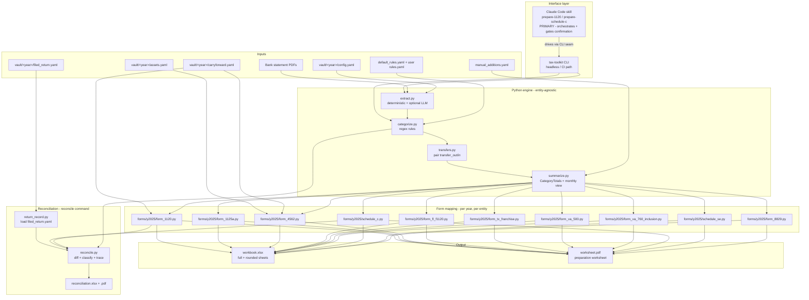

# Architecture

## System Diagram

## Component Descriptions

### `extract.py`: bank statement → transactions
- **Purpose**: Turn a directory of bank statement PDFs into a list of `Transaction` objects
- **Location**: `src/tax_toolkit/extract.py`
- **Key responsibilities**: Deterministic `pdfplumber` parser that knows the synthetic Acme/Chase-like layout. On an unknown layout it raises a custom `ExtractionNeedsHelp` exception and the CLI exits with code 3 rather than guessing. That exit code is the hand-off seam: under the skill, the model reads the PDF in-session (multimodal) and supplies the transactions; on the headless path, the CLI falls back to the Anthropic SDK, text-mode then multimodal-PDF, when `ANTHROPIC_API_KEY` is set.

### `categorize.py`: transactions → categorized transactions
- **Purpose**: Apply regex rules to label each transaction with a `Category` + `subcategory`
- **Location**: `src/tax_toolkit/categorize.py`
- **Key responsibilities**: Layered rule files (`rules/default_rules.yaml` for shipped patterns, `vault/<year>/rules.yaml` for user-scoped learned rules). User rules take precedence. The `--emit-unmatched` flag writes the unmatched transactions to JSON with no model call; under the skill, the model proposes a category for each and the user confirms; `--apply` writes the confirmed rules back to `vault/<year>/rules.yaml`, so categorization improves over time. The headless CLI can instead use the SDK-backed `--propose` mode for the same step.

### `transfers.py`: pair inter-account transfers
- **Purpose**: Stop money moving between checking and savings from inflating revenue
- **Location**: `src/tax_toolkit/transfers.py`
- **Key responsibilities**: Same-date opposite-sign transactions across two source files are paired and re-tagged as `Category.TRANSFER`. This was the single bug most amateur DIY tax spreadsheets had, so it's a deliberate first-class concern.

### `summarize.py`: CategoryTotals + monthly view
- **Purpose**: Roll categorized transactions into per-category totals + a 12-month rollup
- **Location**: `src/tax_toolkit/summarize.py`
- **Key responsibilities**: Splits revenue into positive (Line 1a) and negative-as-positive (Line 1b returns and allowances). Routes operating-expense subcategories into an `other_deductions_breakdown` dict that downstream form modules iterate. Excludes transfer-tagged transactions from every total.

### `forms/y2025/*.py`: form line mapping
- **Purpose**: Pure functions from `CategoryTotals` (and, for Form 4562, a list of `DepreciableAsset`) to `{line_number: Decimal}` dicts
- **Location**: `src/tax_toolkit/forms/y2025/`
- **Key responsibilities**: One file per form (Form 1120, Form 1125-A, Form 4562, Statement of Other Deductions, Schedule C, Schedule SE, Form 8829, and three state modules: FL F-1120, TX Franchise, VA Form 500, VA 760 Inclusion). No file I/O, no rendering, just the tax-law mapping. Year-versioned under `y2025/` so 2026 form changes become a sibling directory rather than a global edit. The CLI dispatches one state module per vault based on the `state:` field in `config.yaml`.

### `forms/y2025/form_4562.py`: depreciation computation
- **Purpose**: Compute the current-year depreciation deduction from a list of `DepreciableAsset` objects
- **Location**: `src/tax_toolkit/forms/y2025/form_4562.py`
- **Key responsibilities**: Implements three methods, MACRS GDS half-year convention (IRS percentage tables for 5-year and 7-year property), 40% bonus depreciation (2025 TCJA phase-down rate), and §179 immediate expensing (2025 cap $1,250,000, phaseout at $3,130,000, income limit enforced so §179 cannot create a loss, disallowed amount tracked as carryforward). Two-pass §179 ordering: all §179 elections are summed first to test the income limit; only the allowed amount is allocated across elections proportionally. Prior-year assets continue depreciating off the same MACRS table using their original placed-in-service date.

### `output/workbook.py` + `output/schedule_c_workbook.py`
- **Purpose**: Build the multi-sheet xlsx
- **Location**: `src/tax_toolkit/output/`
- **Key responsibilities**: Renders full-precision and rounded-to-whole-dollar versions of each form, a Summary sheet with monthly inflows/outflows (with and without transfers), per-transaction detail sheets, and a hidden Audit sheet that records the rule provenance for every categorized transaction.

### `manual_additions.py`: non-bank line items
- **Purpose**: Add line items that don't appear in bank statements (mileage logs, expenses paid on a personal card)
- **Location**: `src/tax_toolkit/manual_additions.py`
- **Key responsibilities**: Loads `vault/<year>/manual_additions.yaml`, validates each entry against a strict `ManualAddition` pydantic model, merges them into the categorized-transactions stream before `summarize` runs. Sign convention: positive amounts in YAML, direction inferred from category, removes the footgun of users writing `-247.18` for an expense.

### `assets.py`: capital asset loader
- **Purpose**: Load and validate the `vault/<year>/assets.yaml` file that declares depreciable business assets
- **Location**: `src/tax_toolkit/assets.py`
- **Key responsibilities**: Parses each `DepreciableAsset` entry via a strict pydantic model (fields: `description`, `cost`, `placed_in_service`, `recovery_period`, `business_use_percent`, `method`). Validates recovery period (5 or 7), business-use percentage range (1–100), and method enum (`macrs` | `section_179` | `bonus`). Absent or empty file is treated as zero assets, no depreciation is computed. Returns a typed list that `form_4562.py` consumes.

### `return_record.py`: filed-return loader
- **Purpose**: Load and validate the `vault/<year>/filed_return.yaml` file that records what a taxpayer actually filed for a past year
- **Location**: `src/tax_toolkit/return_record.py`
- **Key responsibilities**: Parses a `FiledReturn` via a strict pydantic model, `entity_type`, `year`, optional `prepared_by`, and a partial-tolerant `lines` map (any subset of the form's line keys). Money values reject `float` literals via the same `mode="before"` discipline as `assets.py`. Reserves (defines but does not consume) carryforward fields, NOL, §179 disallowed, per-asset remaining basis, so a future carryforward engine is purely additive. Absent file returns `None` ("nothing to reconcile").

### `reconcile.py`: filed vs recomputed diff engine
- **Purpose**: Compare a `FiledReturn` against a fresh re-import of the year's statements and classify every line
- **Location**: `src/tax_toolkit/reconcile.py`
- **Key responsibilities**: Pure function `reconcile(filed, recomputed_lines, transactions)` returning a `ReconciliationReport` of `LineDiff`s. Classifies each filed line `match` / `minor` (sub-$1 threshold) / `material`; flags `missed_deduction` (a non-zero recomputed deduction line absent from the filed return, gated by a per-entity deduction allowlist) and `over_claim` (a filed line with no recomputed counterpart). For material lines it traces the delta to contributing transactions by inverting the Schedule C subcategory→line routing table (`line_sources`). Reports the headline delta on the bottom-line figure (net profit / taxable income).

### `output/reconciliation_report.py`: reconciliation workbook + PDF
- **Purpose**: Render a `ReconciliationReport` as a standalone workbook sheet and PDF
- **Location**: `src/tax_toolkit/output/`
- **Key responsibilities**: `build_reconciliation_workbook` writes a "Reconciliation" sheet (`Line | Filed | Recomputed | Delta | Status | Notes`) with a summary header; `build_reconciliation_pdf` renders the same table via reportlab. Both prepend the prior-year-rules caveat when the reconciled year predates the shipped form set.

### `carryforward.py`: carryforward inputs + ending-state computation
- **Purpose**: Load `vault/<year>/carryforward.yaml` and compute the carryforward state rolling into the next year
- **Location**: `src/tax_toolkit/carryforward.py`
- **Key responsibilities**: `CarryforwardInput` (strict, float-rejecting pydantic model) holds the scalar inputs, `nol_carryforward` (C-corp) and `section_179_carryforward`; an absent file loads as zeros. `compute_ending_carryforward(...)` is a pure function returning an `EndingCarryforward` (unused NOL + current-year loss for C-corps, unused §179, and each prior-year asset's remaining MACRS basis). The inputs feed `form_4562.map(section_179_carryforward_in=...)` and `form_1120.map(nol_carryforward_in=...)`; the ending state is display-only (workbook sheet + PDF section + terminal summary). Prior-year bonus/§179 assets continue depreciating via a `remaining_basis` field on `assets.yaml` entries.

### `cli.py` + `cli_init.py` + `cli_summary.py`
- **Purpose**: Typer CLI surface
- **Location**: `src/tax_toolkit/`
- **Key responsibilities**: `init` walks the user through creating a `vault/<year>/` interactively; `process` and `process-schedule-c` orchestrate the engine; `reconcile` re-runs the recompute pipeline for a past year and diffs it against `filed_return.yaml`; `cli_summary` prints headline tax-form values to the terminal after a successful run.

## Data Flow

1. User runs `tax-toolkit init` and answers prompts (year, entity type, filing status, home office, inventory). Result: `vault/<year>/config.yaml` + empty rules, manual-additions, and assets stubs + `statements/` subdirectories.
2. User drops monthly bank statement PDFs into `vault/<year>/statements/checking/` (and `savings/` for C-corp). Capital asset purchases are tagged with a categorization rule (`category: capital_asset`) so they are excluded from regular expense totals, the same mechanism used to exclude inter-account transfers.
3. `tax-toolkit process` or `process-schedule-c` runs the engine: `extract → categorize → detect_transfers → load_manual_additions → merge → summarize → forms/y2025/*.map(...) → workbook + worksheet PDF`. If `assets.yaml` is present, `assets.py` loads it and passes the `DepreciableAsset` list to `form_4562.py`, which computes the depreciation deduction and feeds it to Schedule C Line 13 or Form 1120 Line 20.
4. The Audit sheet inside the workbook records `rule_id` provenance for every transaction; users (or their CPA) inspect this to verify categorization before transcribing numbers to the official IRS forms.
5. To check a past year, the user records what they filed in `vault/<year>/filed_return.yaml` and runs `tax-toolkit reconcile --year <year>`. The same recompute pipeline runs, then `reconcile.py` diffs the recomputed lines against the filed record and writes `reconciliation.xlsx` + `reconciliation.pdf` flagging material discrepancies, missed deductions, and over-claims, tracing material deltas to the contributing transactions.
6. Carryforward inputs in `vault/<year>/carryforward.yaml` (NOL, §179) and `remaining_basis` on prior-year `assets.yaml` entries are consumed during `process`: the NOL fills Form 1120 line 29a (80%-limited), the §179 carryforward is applied against the income limit, and prior-year bonus/§179 assets continue depreciating. The ending carryforward state for next year is shown in a "Carryforward" workbook sheet, the worksheet PDF, and the terminal summary.

## External Integrations

| Service | Purpose | Notes |
|---------|---------|-------|
| Claude Code (skill) | Primary interface: the `prepare-1120` / `prepare-schedule-c` skill orchestrates the engine, reads unknown-layout PDFs in-session, and proposes categories for unmatched merchants | Drives the engine through the `--emit-unmatched` / `--apply` CLI seam. Needs no `ANTHROPIC_API_KEY`; the model does the reading and reasoning as part of the session. |
| Anthropic Claude (API) | Headless fallback for the raw CLI: bank-PDF extraction on unknown layouts and unmatched-merchant categorization | Gated on `ANTHROPIC_API_KEY`. Without the key, the CLI exits with code 3 on an unknown layout. The tests use a strict `MockClaudeClient` so CI never makes real API calls. |

Both interfaces drive the same engine through the same `--emit-unmatched` /
`--apply` CLI seam, so the math is identical regardless of which is at the
wheel.

## Key Architectural Decisions

### Year-versioned form modules
- **Context**: IRS form line numbers, rates, and thresholds change every tax year. The simplest design is one big `forms.py` that conditionals on year; that turns into a sea of `if year == 2025` branches over time.
- **Decision**: One sibling directory per tax year (`forms/y2025/`, `forms/y2026/` in the future), with parallel module names and a constants file per year.
- **Rationale**: When the 2026 forms ship, copy `y2025/` to `y2026/` and edit. The diff between two years' modules is the only place tax-law changes live, which makes audit and validation tractable. Rejected: a single module with year parameters (because line numbers themselves get renumbered, not just rate values).

### Deterministic-first extraction with a typed exit-code hand-off
- **Context**: The toolkit needs to work on any user's bank statement PDF, but only one bank's format is on hand for the deterministic parser. Real banks (Chase, BofA, Wells, etc.) each have their own layout.
- **Decision**: Deterministic `pdfplumber` parser first. On an unknown layout, raise `ExtractionNeedsHelp` and exit with code 3, never guess. Code 3 is a typed hand-off: under the skill, the model reads the PDF in-session and supplies the transactions; on the headless path, the CLI falls back to the Anthropic SDK (text-mode then multimodal) when `ANTHROPIC_API_KEY` is set.
- **Rationale**: Distinguishing "can't parse this format" (code 3) from "crashed" (code 1) lets a reader, the model in a session, the SDK, or any outer process, step in cleanly without re-coupling the engine to one specific alternative. The deterministic path stays fully offline; the unknown-layout path is handled by whoever is driving.

### Decimal-only money, with `float` rejection at the boundary
- **Context**: Floating-point arithmetic introduces small rounding errors that compound across thousands of transactions and surface as cents-off totals on the filed return.
- **Decision**: `Decimal` throughout the pipeline. Every pydantic model with a money field has a `mode="before"` validator that explicitly rejects `float` and `bool` (because `bool` is an `int` subclass and `Decimal(True) == Decimal(1)` silently).
- **Rationale**: Catches money-precision bugs at the type boundary rather than letting them surface as rounding mismatches downstream. The `bool` guard came directly from a code-review finding during v0.2.0 work.

### Four-layer privacy posture
- **Context**: A toolkit for handling real tax data has to make accidental commits structurally impossible, not "carefully" possible.
- **Decision**: (1) Aggressive `.gitignore` rules, everything under `vault/`, all PDFs outside `examples/` and `docs/`, all xlsx/csv outside `examples/expected_output/` and `tests/`, filename heuristics for "real-data" / "CONFIDENTIAL" patterns (case-insensitive). (2) A `.githooks/pre-commit` shell script that re-runs the staging check at commit time, including a regex scan for EIN-shaped patterns in text-file content. (3) A `scripts/check_clean.py` working-tree scanner runnable as `make check-clean` for release gating. (4) The `vault/<year>/` convention with a committed `README.md` explaining where real data goes.
- **Rationale**: Single failures (gitignore typo, careless `git add .`, IDE auto-stage) are not enough to leak data. The pre-commit hook reads staged content via `git show :path` rather than the working-tree file, so even a dirty-working-tree-but-clean-staged combo behaves correctly.

### Manual additions as ghost transactions
- **Context**: Real returns include line items that don't appear in business bank statements, IRS-standard-mileage mileage deductions, expenses paid on personal cards, year-end accrual adjustments. The pre-v0.4 toolkit had no way to add these.
- **Decision**: `vault/<year>/manual_additions.yaml` adds entries that get merged into the categorized-transaction stream before `summarize` runs. Sign convention is "amount is always positive; category infers direction" so users don't need to remember to write `-247.18` for an expense.
- **Rationale**: Lets users (or a CPA reviewer) match a filed return's Line 26 itemization line-for-line, not just the bank-derivable subset. Audit sheet tags these with `rule_id = "manual_addition"` so the provenance is preserved.

### Depreciate-don't-expense + tag-and-exclude capital purchases
- **Context**: Capital asset purchases appear in bank statements as ordinary outflows. Without special handling, a $2,500 laptop would land in operating expenses and be fully deducted in the year of purchase, incorrect for most assets, and inconsistent with Form 4562 depreciation.
- **Decision**: A categorization rule tags the transaction as `capital_asset`; the summarizer excludes `capital_asset`-tagged transactions from all expense totals (the same mechanism already used for inter-account transfers). The depreciation deduction is then computed separately from `assets.yaml` and inserted on the dedicated form lines (Schedule C Line 13 / Form 1120 Line 20). This mirrors exactly how transfers are handled: tag to exclude, then account for the economic effect through the correct channel.
- **Rationale**: Keeps the bank-statement pipeline category-agnostic, the summarizer does not need to know which transactions are assets vs. expenses, only which tags to skip. Adding a new exclusion category (capital assets, inter-company loans, etc.) is a one-line change to the exclusion list, not a structural refactor.

### Two-pass §179 income-limit ordering
- **Context**: §179 immediate expensing cannot create a business loss, the deduction is capped at taxable income before the §179 election. When multiple assets elect §179, the ordering in which they are evaluated affects which assets get the full deduction vs. a partial one if the income limit binds.
- **Decision**: `form_4562.py` uses a two-pass approach: first, sum all §179 elections to determine the total requested and compare against the income limit; then, if the limit binds, allocate the allowed amount across elections proportionally to their individual costs. Any disallowed amount is surfaced as a carryforward in the terminal summary and workbook without affecting line totals.
- **Rationale**: Proportional allocation is consistent with IRS guidance when the income limit partially disallows a group of §179 elections, and it avoids surprising the user by silently zeroing out a particular asset's deduction. The disallowed amount is surfaced as a carryforward in the terminal summary and workbook, and is consumed the following year as an explicit `section_179_carryforward` input (see "Carryforward as explicit inputs" below) rather than being silently written back into the privacy-sensitive vault.

### Reconciliation as a diff between a filed record and a fresh re-import
- **Context**: A common real-world need is checking a past year's filed return for errors, missed deductions, miscategorized expenses, omitted income, arithmetic mistakes. The toolkit already recomputes a return deterministically from statements, so the missing piece was a record of what was actually filed and an engine to compare the two.
- **Decision**: A per-year `filed_return.yaml` records the filed line values (any subset). The `reconcile` command re-runs the existing recompute pipeline to produce the current-engine line values, then a pure `reconcile.py` engine diffs filed-vs-recomputed, classifies each line (match / minor / material / missed-deduction / over-claim), and traces material deltas to the contributing transactions by inverting the subcategory→line routing the form modules use.
- **Rationale**: Reusing the recompute pipeline means reconciliation always reflects the full current engine (including Form 4562 depreciation) with no parallel logic to drift. Keeping the diff engine pure (it takes a dict of recomputed lines, not a vault path) makes it trivially testable and reusable. The `FiledReturn` model reserves carryforward fields from day one so the future carryforward engine is additive. Known limitation, surfaced as a report caveat: pre-2025 years recompute with the 2025 engine, so year-specific lines (bonus %, §179 caps, mileage rate) may differ from that year's rules, year-versioned form modules are the eventual fix.

### Carryforward as explicit inputs with display-only ending state
- **Context**: NOLs, disallowed §179, and partially-depreciated assets carry from one tax year into the next. The toolkit could try to derive them by recomputing the prior year, but it ships only 2025 form rules, and year-specific provisions (bonus %, §179 caps, mileage rate) differ, so a recomputed prior year would be wrong.
- **Decision**: Carryforward amounts are explicit user inputs, entity-level scalars in `vault/<year>/carryforward.yaml` (NOL, §179) plus a `remaining_basis` field on prior-year `assets.yaml` entries (defined as the post-first-year MACRS basis the depreciation table runs on). The engine consumes them in the current-year computation (Form 1120 line 29a with the 80% limit; §179 carryforward added to current elections under the income limit; prior-year bonus/§179 assets continuing MACRS). The *ending* carryforward state is computed and surfaced (workbook sheet, PDF, terminal) but not auto-written into next year's files.
- **Rationale**: Inputs-not-derivation is both simpler and more correct given the year-versioned-rules limitation, the user holds the authoritative figures from their filed prior return. Keeping the ending-state computation in a pure `compute_ending_carryforward` makes it testable in isolation, and display-only output matches the toolkit's "preparation aid, not a filer" stance (no silent writes into the privacy-sensitive vault). The `FiledReturn` model reserved these fields back in v0.7, so v0.8 was purely additive.

### Skill orchestrates, engine computes
- **Context**: A tax tool must never let a language model do the arithmetic, one hallucinated line number is a wrong return. But the fuzzy parts (reading an unfamiliar PDF, guessing an unknown merchant) genuinely benefit from a model and shouldn't be hard-wired into the engine either.
- **Decision**: The Python engine is the math + storage layer and exposes a thin CLI seam (`--emit-unmatched` / `--apply`). The primary interface is a Claude Code skill that drives that seam: it runs commands, reads the unmatched-transactions JSON, proposes categories, and gates write-backs on confirmation, but never touches a computed total. The headless SDK path (gated on `ANTHROPIC_API_KEY`) drives the same seam for non-session use.
- **Rationale**: The model stays an orchestrator, so the output is auditable: every number on a form is traceable to deterministic Python, not to a generation. And because both interfaces drive one engine, every future capability (anomaly detection, audit summaries, multi-year trends) and every bug fix reaches both paths automatically, with no lock-in to a single runtime.
