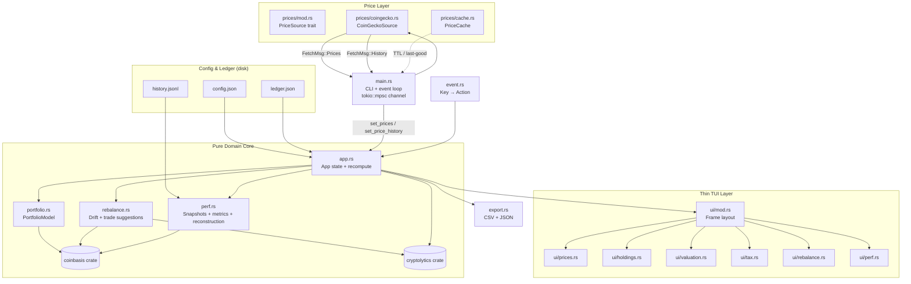

# Architecture

## System Diagram

## Component Descriptions

### `main.rs` — CLI, terminal setup, async event loop
- **Purpose**: Entry point. Parses CLI args (config, ledger, --offline, --import), sets up the ratatui terminal, and drives the `tokio::select!` loop.
- **Location**: `src/main.rs`
- **Key responsibilities**: Spawning the background fetch tasks via `tokio::spawn`; routing `FetchMsg` channel messages into `App`; writing `history.jsonl` snapshots after each successful price fetch; restoring the terminal on panic via a custom hook.

### `app.rs` — Central application state
- **Purpose**: Owns all mutable state and keeps derived reports in sync whenever method, tax year, or prices change.
- **Location**: `src/app.rs`
- **Key responsibilities**: `recompute()` recomputes holdings, valuation, capital gains, income, rebalance actions, volatility, correlation, portfolio vol, backtests, and reconstructed snapshots in one pass. `set_prices` and `set_price_history` both call `recompute` after updating their respective fields.

### `portfolio.rs` — coinbasis wrapper
- **Purpose**: Thin adapter over `coinbasis::Portfolio` that enriches raw holdings with live market value and unrealized P&L (fields `coinbasis::Holding` does not carry).
- **Location**: `src/portfolio.rs`
- **Key responsibilities**: `PortfolioModel::holdings_with_value`, `capital_gains`, `valuation`; `estimate_sell_gain` which models a hypothetical HIFO sell to produce the tax-aware gain estimate shown in the Rebalance view.

### `rebalance.rs` — Drift and trade suggestions
- **Purpose**: Pure, deterministic drift computation and trade suggestion logic.
- **Location**: `src/rebalance.rs`
- **Key responsibilities**: `suggest()` takes a `PortfolioReport` and target weights, normalizes them, and emits `RebalanceAction` items filtered by band tolerance and minimum trade size. `Strategy::Band` skips coins within the tolerance; `Strategy::Full` suggests trades for all drifted coins.

### `perf.rs` — Performance snapshots and reconstruction
- **Purpose**: Persists forward-recorded `(date, value, cost, pl)` snapshots to `history.jsonl` (JSONL format, one object per line) and reconstructs daily snapshots by replaying the ledger against per-coin price history.
- **Location**: `src/perf.rs`
- **Key responsibilities**: `record_snapshot` deduplicates within `min_interval_seconds`; `reconstruct_series` iterates the union of history dates, filters ledger transactions to those on or before each date, calls `coinbasis::Portfolio::valuation`, and builds a `Vec<Snapshot>`.

### `prices/` — Price abstraction and caching
- **Purpose**: `PriceSource` trait with two implementations: `CoinGeckoSource` (live) and `MockSource` (tests). `PriceCache` persists the last fetched `PriceBook` to disk.
- **Location**: `src/prices/`
- **Key responsibilities**: `CoinGeckoSource::fetch` calls `coins_markets` for prices, 24h/7d change, market cap, and sparklines in one request. `fetch_history` calls `coin_market_chart` per coin (best-effort — a failure for one coin does not abort the rest). `PriceCache::load_fresh` enforces the TTL; `load_last_good` returns the stale book when the TTL has expired, allowing offline startup.

### `config.rs` — Configuration
- **Purpose**: Deserializes `config.json` into typed structs. Handles `~` expansion in the cache dir and env-var override for the CoinGecko key.
- **Location**: `src/config.rs`

### `ledger.rs` — Ledger I/O and CSV import
- **Purpose**: Loads and saves `ledger.json` (a JSON array of `coinbasis::Transaction`); parses the CSV import format and deduplicates against the existing ledger before appending.
- **Location**: `src/ledger.rs`

### `export.rs` — CSV + JSON export
- **Purpose**: Hand-rolled (no CSV crate) writers for `CapitalGainsReport` and `[Holding]`, writing both CSV and JSON from a single `e` keypress on the Tax or Holdings views.
- **Location**: `src/export.rs`

### `ui/` — Thin ratatui rendering layer
- **Purpose**: Reads immutable `&App` state and renders to a `ratatui::Frame`. No business logic lives here.
- **Location**: `src/ui/`
- **Key responsibilities**: `ui::draw` composes the tab bar, active view, status bar, and optional help overlay. Each view module (`prices.rs`, `holdings.rs`, `valuation.rs`, `tax.rs`, `rebalance.rs`, `perf.rs`) renders its own pane.

## Data Flow

1. **Startup**: `main.rs` loads `config.json` and `ledger.json`; initializes `App`. If a fresh cache hit exists it is loaded immediately so the UI is non-empty before the network responds. `history.jsonl` is loaded into `App::history` for the Performance view.
2. **Async fetch**: Two `tokio::spawn` tasks run concurrently — one calls `CoinGeckoSource::fetch` for current prices, the other calls `fetch_history` for daily price series. Results arrive as `FetchMsg::Prices` and `FetchMsg::History` on an `mpsc` channel.
3. **State update**: The event loop receives a `FetchMsg`, calls `app.set_prices` or `app.set_price_history`. Both trigger `App::recompute`, which regenerates all six views' worth of derived data in one synchronous pass.
4. **Render**: `ui::draw` reads from `App` and renders the active view. The frame is drawn on every loop iteration regardless of whether new data arrived.
5. **User interaction**: `event.rs` maps crossterm `KeyEvent`s to `Action` values; `apply` mutates `App` (cycling method, changing view, etc.) and triggers `recompute` where needed. Pressing `r` spawns fresh fetch tasks.
6. **Cache write-through**: After each successful price fetch the new `PriceBook` is stored to disk via `PriceCache::store`. A snapshot is appended to `history.jsonl` at most once per `refresh_seconds` interval.

## External Integrations

| Service | Purpose | Notes |
|---------|---------|-------|
| CoinGecko API | Live prices, 24h/7d change, market cap, sparklines, and daily price history | Demo and Pro plan supported; key read from `COINGECKO_API_KEY` env var or `config.json`. Without a key, the public Demo endpoint is used but the `coin_market_chart` history endpoint may be rate-limited. |

## Key Architectural Decisions

### Pure domain core + thin TUI for testability
- **Context**: ratatui renders to a real terminal, which makes test assertions on rendered output fragile unless the backend is swapped.
- **Decision**: All business logic lives in `app.rs`, `portfolio.rs`, `rebalance.rs`, and `perf.rs`; the `ui/` layer reads `&App` immutably and has no side effects.
- **Rationale**: Unit tests can exercise `recompute`, `suggest`, `reconstruct_series`, etc. without a terminal. Integration tests (`tests/integration.rs`) use `MockSource` and `ratatui::backend::TestBackend` to verify full render output without network calls. The alternative — embedding logic in the render functions — would have made the core untestable.

### Delegate tax and cost-basis to coinbasis rather than reimplementing
- **Context**: FIFO/LIFO/HIFO/Average lot matching, wash-sale handling, progressive tax brackets, and capital-gains classification involve a non-trivial amount of stateful bookkeeping.
- **Decision**: Use `coinbasis::Portfolio` for all lot matching and report generation.
- **Rationale**: Reimplementing lot matching inline would have duplicated logic and risked subtle correctness bugs. Delegating keeps `portfolio.rs` to ~90 lines of adapter code and lets `coinbasis` own correctness for its domain. The cost is a crate dependency; the benefit is that all tax semantics (including `TaxConfig` bracket format) are shared with external tooling.

### `Decimal` end-to-end; `f64` only at the CoinGecko API boundary
- **Context**: Floating-point arithmetic is unsuitable for monetary values. CoinGecko returns `f64` JSON fields.
- **Decision**: All internal prices, cost bases, gains, and portfolio values use `rust_decimal::Decimal`. Conversion from `f64` happens once in `prices/coingecko.rs` via `Decimal::from_f64_retain`; the analytics functions in `cryptolytics` receive `f64` return-series as is appropriate for statistical computation.
- **Rationale**: A single conversion boundary is easier to audit than scattered `as f64` casts throughout the codebase. Keeping Decimal through `coinbasis` and `rebalance.rs` means gains and drift amounts are exact.

### On-disk cache with last-good fallback for offline resilience
- **Context**: The TUI must be usable without a network connection (e.g. on a plane, after hitting a rate limit).
- **Decision**: `PriceCache` writes every successful `PriceBook` to disk. On startup, `load_fresh` is tried first (within TTL); if it misses, `load_last_good` is tried (any age, marked `stale`). The `--offline` flag skips all network calls entirely.
- **Rationale**: The alternative (fail hard on no network) would make the app unusable in any offline or rate-limited scenario. Marking stale data visually (the status bar shows `[stale]`) keeps the user informed without hiding the data.

### Ledger-replay reconstruction for true historical P&L
- **Context**: Appending a snapshot each time prices refresh only records values from the moment the app is running; it cannot retroactively show what the portfolio was worth last month.
- **Decision**: `perf::reconstruct_series` replays the ledger — filtering transactions to those on or before each history date — and calls `coinbasis::Portfolio::valuation` with the historical price for that date. This produces a complete daily series for the history window without any stored state.
- **Rationale**: Forward-recording is cheap to implement but gives a sparse, app-uptime-dependent history. Replay gives a complete picture for the entire price-history window (configurable `history_days`) and accurately reflects what the portfolio looked like before the app was first launched. The tradeoff is that replay is O(dates × lot-count), which is acceptable for typical portfolios over a 90-day window.

### Single `recompute` pass rather than incremental invalidation
- **Context**: Many derived reports depend on the same inputs (method, tax year, prices, price history); keeping them consistent under rapid input changes is error-prone with selective invalidation.
- **Decision**: `App::recompute` regenerates all derived reports in one synchronous function call, triggered by every state-changing action.
- **Rationale**: The total work per recompute is small (portfolio sizes are measured in tens of coins, not millions of rows), so the constant overhead of recomputing everything is negligible compared to the simplicity of always having a consistent `Derived` struct. Selective invalidation would require tracking inter-report dependencies and would be a source of subtle stale-data bugs.
