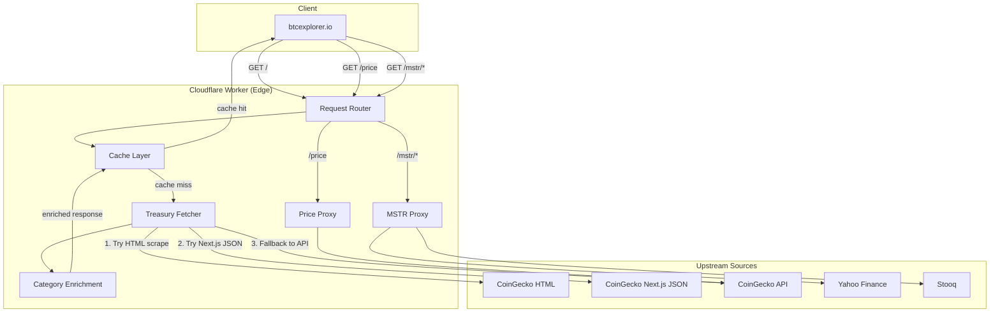

# Architecture Overview

## System Diagram

## Component Descriptions

### Request Router
- **Purpose**: Routes incoming requests to the appropriate handler based on pathname
- **Location**: `src/index.js:293-303`
- **Key responsibilities**: CORS preflight handling, path matching, origin validation, authenticated cache bypass

### Cache Layer
- **Purpose**: Stores and serves treasury data from Cloudflare's edge cache
- **Location**: `src/index.js:348-355`
- **Key responsibilities**: 12-hour TTL caching, stale-if-error fallback, authenticated cache bypass via `?refresh=1&secret=`, empty-result guard (refuses to cache empty company lists)

### Treasury Fetcher
- **Purpose**: Retrieves Bitcoin treasury data using a multi-source fallback strategy
- **Location**: `src/index.js:360-456`
- **Key responsibilities**: HTML scraping with guarded __NEXT_DATA__ JSON parsing, regex-validated buildId for Next.js JSON fetch, direct CoinGecko API fallback, capped exponential backoff retries

### Category Enrichment (CATEGORY_MAP)
- **Purpose**: Enriches raw treasury data with industry categories and country codes
- **Location**: `src/index.js:21-225`
- **Key responsibilities**: Normalized ticker/name matching, 150+ curated company mappings, category assignment (mining, fintech, exchange, etc.)

### Price Proxy
- **Purpose**: Returns current BTC price and 24h change
- **Location**: `src/index.js:306-315`
- **Key responsibilities**: Proxies CoinGecko simple/price endpoint

### MSTR Proxy
- **Purpose**: Returns Strategy (MSTR) stock data from multiple sources
- **Location**: `src/index.js:318-343`
- **Key responsibilities**: Yahoo Finance proxy, Stooq proxy, streamed response body (no buffering), pinned content-type (no upstream reflection), error handling with 502 JSON fallback

## Data Flow

1. Client sends `GET /` request to the Cloudflare Worker edge
2. Router checks for cache hit — if found and not authenticated `?refresh=1&secret=`, returns cached response with `x-cache: hit`
3. On cache miss, fetcher tries CoinGecko HTML page and extracts `__NEXT_DATA__` JSON
4. If HTML contains a valid `buildId` (regex-validated), fetcher tries the Next.js build-specific JSON endpoint for cleaner data
5. If HTML path fails, fetcher falls back to the CoinGecko public treasury API
6. If all sources fail and stale cache exists, returns stale data with `x-cache: stale`
7. Raw company data is normalized and enriched via `CATEGORY_MAP` (industry + country)
8. If enriched list is empty, returns 502 error instead of caching empty data
9. Final JSON is cached (12h TTL) and returned to client with `x-cache: miss`

## External Integrations

| Service | Purpose | Documentation |
|---------|---------|---------------|
| CoinGecko HTML | Primary treasury data source (scraping) | https://www.coingecko.com/en/treasuries/bitcoin |
| CoinGecko API | Fallback treasury data + BTC price | https://www.coingecko.com/en/api/documentation |
| Yahoo Finance | MSTR stock chart data | https://query1.finance.yahoo.com |
| Stooq | MSTR stock OHLCV data | https://stooq.pl |

## Key Architectural Decisions

### Multi-Source Fallback for Treasury Data
- **Context**: CoinGecko aggressively rate-limits API requests (429s are common) and the free API returns fewer companies than the website
- **Decision**: Scrape the HTML page first (full dataset), then try build-specific JSON, then fall back to the API
- **Rationale**: The HTML page contains all companies (150+), while the API may return a subset. Stale cache prevents total failure during rate-limiting.

### Static Category Map Instead of Dynamic Classification
- **Context**: CoinGecko doesn't provide industry categories for treasury-holding companies
- **Decision**: Maintain a hand-curated map of 150+ tickers and company names to categories/countries
- **Rationale**: Categories are stable (a mining company stays a mining company). Static mapping is fast, deterministic, and avoids external API dependencies.

### Edge Caching with 12-Hour TTL
- **Context**: Treasury data changes infrequently (companies report BTC holdings quarterly), but CoinGecko updates periodically
- **Decision**: Cache responses for 12 hours with stale-if-error fallback
- **Rationale**: Balances freshness with rate-limit protection. The `?refresh=1&secret=` parameter allows authenticated on-demand cache busting.

### Authenticated Cache Bypass
- **Context**: An unauthenticated `?refresh=1` parameter could be weaponized to force continuous upstream scraping, triggering CoinGecko rate limits
- **Decision**: Gate cache bypass behind a `REFRESH_SECRET` environment variable
- **Rationale**: Only authorized clients can force upstream fetches. Without the secret, `?refresh=1` is silently ignored, serving from cache as normal.
