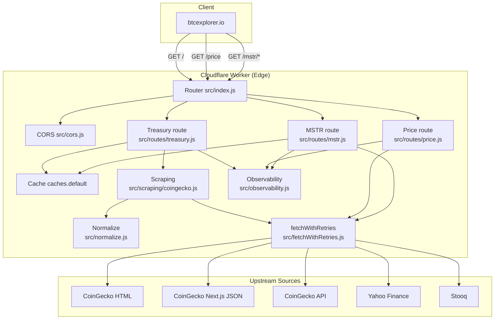

# Architecture Overview

## System Diagram

```mermaid
flowchart TD
    subgraph Client
        A[btcexplorer.io]
    end

    subgraph "Cloudflare Worker (Edge)"
        B[Router src/index.js]
        C[CORS src/cors.js]
        D[Cache caches.default]
        T[Treasury route<br/>src/routes/treasury.js]
        P[Price route<br/>src/routes/price.js]
        M[MSTR route<br/>src/routes/mstr.js]
        S[Scraping<br/>src/scraping/coingecko.js]
        N[Normalize<br/>src/normalize.js]
        R[fetchWithRetries<br/>src/fetchWithRetries.js]
        O[Observability<br/>src/observability.js]
    end

    subgraph "Upstream Sources"
        H[CoinGecko HTML]
        I[CoinGecko Next.js JSON]
        J[CoinGecko API]
        K[Yahoo Finance]
        L[Stooq]
    end

    A -->|GET /| B
    A -->|GET /price| B
    A -->|GET /mstr/*| B

    B --> C
    B --> T
    B --> P
    B --> M

    T --> D
    M --> D

    T --> S
    S --> R
    P --> R
    M --> R

    R --> H
    R --> I
    R --> J
    R --> K
    R --> L

    S --> N
    T --> O
    P --> O
    M --> O
```

## Component Descriptions

### Request Router
- **Purpose**: Routes incoming requests by pathname to the appropriate route handler
- **Location**: `src/index.js`
- **Key responsibilities**: CORS preflight (`OPTIONS`) responses, pathname dispatch to `handleTreasury`, `handlePrice`, and `handleMstr`, and a JSON 404 for unknown paths

### CORS
- **Purpose**: Builds response headers with a strict origin allowlist
- **Location**: `src/cors.js`
- **Key responsibilities**: Allowlists `https://btcexplorer.io` and `https://www.btcexplorer.io` (plus localhost when `ENVIRONMENT=dev`). Unknown origins receive no `Access-Control-Allow-Origin` header — there is no wildcard fallback. Always sets `Vary: Origin`.

### Cache Layer
- **Purpose**: Stores and serves responses from Cloudflare's edge cache
- **Location**: `src/routes/treasury.js` (12h TTL for `/`) and `src/routes/mstr.js` (5min TTL for `/mstr/*`)
- **Key responsibilities**: `caches.default` get/put, `stale-if-error` hint, refresh-token bypass for `/`, empty-list guard (refuses to cache an empty company list), and per-request `Response.clone()` to avoid stream reuse

### Treasury Route
- **Purpose**: Retrieves Bitcoin treasury data via a multi-source fallback strategy and enriches it
- **Location**: `src/routes/treasury.js`
- **Key responsibilities**: Cache check → HTML scrape via `fetchTreasuryHtml` → guarded `__NEXT_DATA__` parse → optional Next.js build-specific JSON (regex-validated `buildId`) → CoinGecko public API fallback → stale-cache fallback on 429. Adds `data_source`, `parsed_count`, and `scraped_at` to the response so the frontend can distinguish fresh data from a stale-cache serve.

### Scraping
- **Purpose**: Owns all CoinGecko upstream specifics — fetchers and the HTML parser
- **Location**: `src/scraping/coingecko.js`
- **Key responsibilities**: `fetchTreasuryHtml`, `fetchNextBuildJson`, `fetchTreasuryApi`, and the pure `parseTreasuryHtml(html)` parser (extracted from the route so it can be unit-tested against HTML fixtures without hitting the network)

### Categorize / Countries
- **Purpose**: Static lookup of industry category and country code per company
- **Location**: `src/scraping/categorize.js`, `src/scraping/countries.js`
- **Key responsibilities**: `lookupCategory(name, ticker)` reads `data/categories.json` (a `byTicker` exact-match map plus a `byNamePattern` regex list — the helper handles `(?i)` inline-flag prefixes since JS regex doesn't support them natively). `mapCountryCode(slug)` reads `data/countries.json` and maps CoinGecko's slug values to ISO 3166-1 alpha-2 codes (e.g. `united-kingdom` → `GB`, `british-virgin-islands` → `VG`).

### Normalize
- **Purpose**: Single normalization point producing the wire-shape company object
- **Location**: `src/normalize.js`
- **Key responsibilities**: Merges raw upstream fields with category/country lookup output and chooses sensible fallbacks for missing `btc`, `country`, `type`

### Price Route
- **Purpose**: Returns current BTC price and 24h change
- **Location**: `src/routes/price.js`
- **Key responsibilities**: Calls CoinGecko `simple/price` via `fetchWithRetries`, validates the response shape (rejects missing `price`), emits a `price_fetch_result` event, returns `{ price, change24h }`. Optional `COINGECKO_API_KEY` secret upgrades to Pro endpoint headers.

### MSTR Route
- **Purpose**: Returns Strategy (MSTR) stock data from Yahoo Finance or Stooq
- **Location**: `src/routes/mstr.js`
- **Key responsibilities**: 5-minute edge cache per source, `fetchWithRetries` for upstream resilience, pinned `content-type: application/json` (never reflects upstream headers), 502 JSON on failure

### fetchWithRetries
- **Purpose**: Shared resilient HTTP client used by every non-streaming upstream call
- **Location**: `src/fetchWithRetries.js`
- **Key responsibilities**: 10s per-attempt `AbortController` timeout, status-aware retry on 429/500/502/503/504 (other 4xx return as-is — no point retrying a 404), exponential backoff (`baseDelayMs * 2^i`). The `lint:fetches` npm script greps `src/routes/` and `src/scraping/` to prevent raw `fetch()` regressions.

### Observability
- **Purpose**: Single JSON-line event emitter
- **Location**: `src/observability.js`
- **Key responsibilities**: `logEvent(event, fields)` writes one JSON object per `console.log` line — Cloudflare Workers Logs indexes these automatically. Events: `scrape_result`, `cache_hit`, `refresh_requested`, `price_fetch_result`, `mstr_fetch_error`, each carrying `upstream_status`, `parsed_count`, `duration_ms`, and `outcome` where relevant.

## Data Flow

1. Client sends `GET /` to the Worker edge
2. Router (`src/index.js`) dispatches to `handleTreasury`
3. Cache lookup — if hit and not a valid `?refresh=<SECRET>`, return cached body with `x-cache: hit` and a `cache_hit` event
4. HTML scrape: `fetchTreasuryHtml` returns the page, `parseTreasuryHtml` extracts `__NEXT_DATA__`
5. If a `buildId` is present and regex-valid, fetch the Next.js JSON endpoint for a cleaner payload
6. If HTML failed entirely, fall back to the CoinGecko public API
7. If the API returns 429 and a cached body exists, serve stale with `x-cache: stale`
8. Companies are normalized via `normalizeCompany` (category + country)
9. Empty enriched lists are refused — return 502 instead of poisoning the cache for 12h
10. Final JSON (with `data_source`, `parsed_count`, `scraped_at`) is cached for 12h and returned with `x-cache: miss`

## External Integrations

| Service | Purpose | Documentation |
|---------|---------|---------------|
| CoinGecko HTML | Primary treasury data source (scraping) | https://www.coingecko.com/en/treasuries/bitcoin |
| CoinGecko Next.js JSON | Build-specific JSON endpoint (cleaner payload than HTML) | — |
| CoinGecko API | Fallback treasury data + BTC price | https://www.coingecko.com/en/api/documentation |
| Yahoo Finance | MSTR stock chart data | https://query1.finance.yahoo.com |
| Stooq | MSTR stock OHLCV data | https://stooq.pl |

## Key Architectural Decisions

### Multi-Source Fallback for Treasury Data
- **Context**: CoinGecko aggressively rate-limits API requests (429s are common) and the free API returns fewer companies than the website
- **Decision**: Scrape the HTML page first (full dataset), then try the build-specific Next.js JSON, then fall back to the API, then serve stale cache
- **Rationale**: The HTML contains all 150+ companies; the API returns a subset. Stale cache prevents total failure during upstream outages.

### Static Category Map in Data Files
- **Context**: CoinGecko doesn't expose industry categories or ISO country codes for treasury holders
- **Decision**: Maintain `data/categories.json` (ticker + name-pattern map) and `data/countries.json` (slug → ISO 3166-1 alpha-2 map), loaded as JSON modules
- **Rationale**: Categories are stable, deterministic, and free. Moving them to JSON files lets the sibling `BitcoinTreasuries-Proxy` repo consume byte-identical data (sync rules in `data/KEEP_IN_SYNC.md`), so two independent scrapers produce a consistent shape for the same frontend.

### Edge Caching with 12-Hour TTL for `/`, 5-Minute TTL for `/mstr/*`
- **Context**: Treasury data changes infrequently. MSTR stock data moves intraday but doesn't need second-by-second freshness.
- **Decision**: Cache `/` for 12 hours with `stale-if-error`. Cache `/mstr/yahoo` and `/mstr/stooq` for 5 minutes.
- **Rationale**: Each TTL is sized to the source's actual update cadence and the cost of a miss. The MSTR cache also protects against Yahoo/Stooq rate limits, which used to fire on every page view.

### `?refresh=<SECRET>` Cache Bypass
- **Context**: An unauthenticated `?refresh` parameter could be hammered to force continuous upstream scraping, tripping CoinGecko's rate limits
- **Decision**: Bypass cache only when `?refresh=<SECRET>` matches the `REFRESH_SECRET` environment variable. The parameter value IS the secret — there is no separate `secret=` field.
- **Rationale**: One value to manage, one comparison to make. If `REFRESH_SECRET` is unset, no value can ever bypass — the bypass path is closed by default. A missing-or-wrong refresh value is silently ignored so probing looks identical to normal traffic.

### Caching the MSTR Stock Proxies
- **Context**: `/mstr/yahoo` and `/mstr/stooq` previously hit upstream on every request. Yahoo in particular rate-limits aggressively from Workers IP ranges, and the data doesn't need sub-minute freshness for a Bitcoin-treasuries view.
- **Decision**: Add a 5-minute edge cache keyed by source, with the same `fetchWithRetries` retry policy as everything else
- **Rationale**: Cuts upstream calls by ~99% at modest traffic, eliminates the previous source of intermittent 502s, and stays well within the "stock price is fresh enough" bar for this UI.

### `fetchWithRetries` for Every Upstream Call
- **Context**: Before extraction, the treasury scraper had no per-attempt timeout and retried inconsistently. A slow upstream could pin a request to the Worker's invocation budget.
- **Decision**: Route every non-streaming upstream call through `src/fetchWithRetries.js` — 10s per-attempt `AbortController` timeout, status-aware retry on 429/500/502/503/504 only, exponential backoff. A `lint:fetches` npm script greps `src/routes/` and `src/scraping/` to keep the convention enforceable.
- **Rationale**: One place to tune timeout and retry policy, no surprise hangs, no pointless retries on 404. Status-aware fast-fail on non-retryable 4xx saves request budget.

### Strict CORS Allowlist (No Wildcard Fallback)
- **Context**: The previous behavior returned `Access-Control-Allow-Origin: *` for unknown origins, effectively making the API publicly callable from any site
- **Decision**: Reflect the request's origin only if it appears in the allowlist; otherwise omit the header entirely
- **Rationale**: The proxy exists for `btcexplorer.io`. Random origins shouldn't get a CORS green light just because they ask. Browsers will block cross-origin reads from unallowed sites, which is the intended posture.

### Structured JSON Logging via `console.log`
- **Context**: Plain string logs are hard to query in Workers Logs once you have multiple upstream paths
- **Decision**: Emit one-line JSON events (`scrape_result`, `cache_hit`, `price_fetch_result`, `mstr_fetch_error`, `refresh_requested`) with consistent fields: `event`, `timestamp`, `source`, `outcome`, `upstream_status`, `parsed_count`, `duration_ms`
- **Rationale**: Workers Logs indexes JSON automatically, so I can filter by `outcome:stale` or `upstream_status:429` without parsing free-form strings. No external observability dependency.
