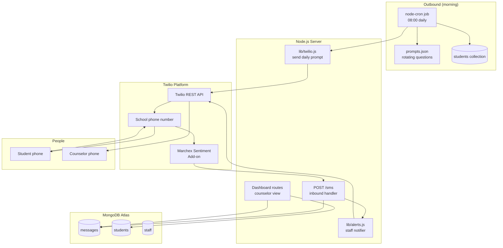

# Architecture

## System Diagram

## Component Descriptions

### Express webhook (`Server.js`)
- **Purpose**: Receive inbound SMS replies from Twilio and acknowledge them inline with TwiML.
- **Location**: `Server.js`
- **Key responsibilities**:
  - Parse the URL-encoded webhook body, including the `AddOns` field that contains the Marchex Sentiment result.
  - Persist the message (text, sender, sentiment, country) to MongoDB.
  - Hand off to the alerter if the sentiment is `negative`.
  - Reply with a TwiML `MessagingResponse` so the student gets an immediate acknowledgement.

### Outbound scheduler (`lib/scheduler.js`)
- **Purpose**: Send the daily check-in prompt to every enrolled student.
- **Location**: `lib/scheduler.js`
- **Key responsibilities**:
  - A node-cron expression (configurable, default `0 8 * * *`) fires once per school day.
  - Pulls the active student roster from MongoDB.
  - Picks a prompt from `data/prompts.json` so the message reads slightly different each day.
  - Calls Twilio's REST API through `lib/twilio.js` for each opted-in student.

### Staff alerter (`lib/alerts.js`)
- **Purpose**: Notify a counselor when a student's reply is flagged negative.
- **Location**: `lib/alerts.js`
- **Key responsibilities**:
  - Look up the on-duty staff member from the `staff` collection.
  - Send them an SMS containing the student's name, the reply, and a short link into the dashboard for context.
  - Record the alert on the message document so duplicate pages don't fire if the student keeps texting.

### Counselor dashboard (`routes/dashboard.js`)
- **Purpose**: Give counselors a private view of recent check-ins and per-student trends.
- **Location**: `routes/dashboard.js`, `views/`
- **Key responsibilities**:
  - HTTP Basic auth scoped to staff accounts (the school's network is the only entry point in practice).
  - List view of recent messages, filterable by sentiment.
  - Per-student detail page with a simple sentiment-over-time chart.

## Data Flow

### Morning outbound
1. node-cron fires at 08:00 local time.
2. The scheduler reads the `students` collection (only those flagged opted-in).
3. For each student, it picks a prompt from the rotating list and calls the Twilio REST API.
4. Twilio delivers the SMS from the school's provisioned number.

### Inbound reply
1. The student texts a reply to the school number.
2. Twilio routes the message through the Marchex Sentiment Add-on, which attaches a positive/negative/neutral classification to the webhook payload.
3. Twilio POSTs to `/sms` with the body, sender, and `AddOns` JSON.
4. The handler stores the message and inspects the sentiment.
5. If negative, the alerter pages the on-duty counselor.
6. The handler returns a TwiML acknowledgement so the student sees an immediate reply.

## External Integrations

| Service | Purpose | Notes |
|---------|---------|-------|
| Twilio Programmable SMS | Outbound prompts and inbound webhooks | Single school number, US-only sender/recipients |
| Twilio Add-ons Marketplace (Marchex Sentiment) | Inline sentiment scoring of every inbound message | Result lives at `AddOns.results.marchex_sentiment.result.result`; no extra round trip needed |
| MongoDB Atlas | Persistent store for students, staff, messages | Free shared tier; small per-school footprint |

## Key Architectural Decisions

### Inline Twilio Add-on for sentiment over a separate ML service
- **Context**: The webhook needs to know the sentiment of an inbound message before it can decide whether to alert a counselor.
- **Decision**: Use Twilio's Marchex Sentiment Add-on, which runs on Twilio's side and arrives in the same webhook payload.
- **Rationale**: A second call to an external NLP API (Google Cloud Natural Language, AWS Comprehend) would have added latency, a second set of credentials, and another failure mode. The Add-on collapses the decision into a single inbound request.

### SMS instead of a dedicated app
- **Context**: The product has to reach students who may not have the latest phone, app store access, or willingness to install yet another wellness app.
- **Decision**: Use plain SMS as the entire user interface.
- **Rationale**: Texting is the lowest-friction channel for a high schooler. No install, no login, no notification permission. The counselors specifically asked for this — they had already tried a school-issued portal and watched it sit unused.

### node-cron in-process instead of a separate scheduler service
- **Context**: The system needs to fire one outbound batch per school morning. There is only one server.
- **Decision**: Embed a node-cron job inside the Express process.
- **Rationale**: A single VM running both the webhook and the scheduler is enough for a single school's roster. Pulling in a separate scheduler (system cron, a managed queue) would have added moving parts for no operational benefit at this scale.

### MongoDB over a relational database
- **Context**: The message schema kept evolving — first just `{text, sender, sentiment}`, later adding country, alert metadata, and prompt-variant tracking.
- **Decision**: Store messages and students in MongoDB collections with no fixed schema.
- **Rationale**: As a first-time builder iterating with counselors, the cost of every schema change in Postgres would have eaten the project's momentum. MongoDB Atlas's free tier also matched the budget for a high-school side project ($0).

### Negative-sentiment alerts go to a human, not a dashboard
- **Context**: The whole point of the system is to catch a student who is struggling on a specific day. A dashboard that nobody checks fails the use case.
- **Decision**: When a reply is flagged negative, the system pages the on-duty counselor by SMS immediately. The dashboard is secondary.
- **Rationale**: Counselors are already on their phones. Pushing an alert beats hoping someone opens a web view. The dashboard exists for context and trend review, not as the primary signal path.

### Acknowledge inbound messages with TwiML
- **Context**: A student who texts in and hears nothing back assumes the system is broken — or worse, that nobody is reading.
- **Decision**: Reply to every inbound message with a short acknowledgement in the same HTTP turn, using Twilio's TwiML `MessagingResponse`.
- **Rationale**: It costs nothing (no extra API call — TwiML returns the reply in the webhook response body) and it visibly confirms to the student that their message was received.
