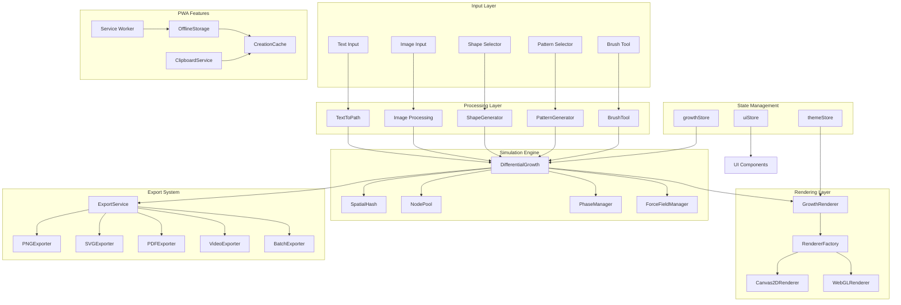
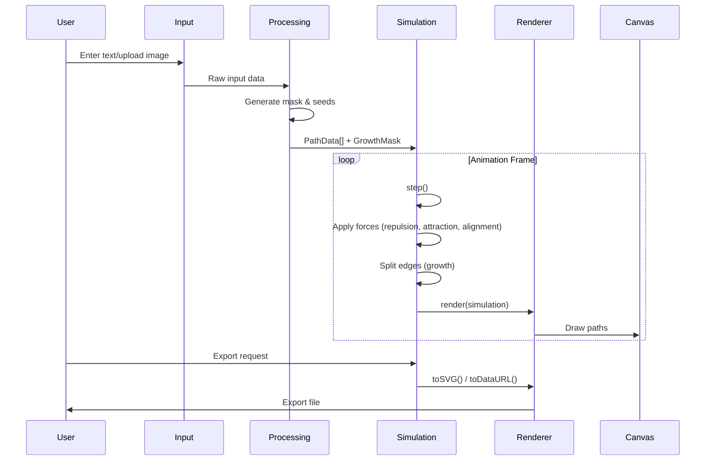

# Architecture

## System Overview

## Data Flow

## Key Architecture Decisions

### 1. Simulation Engine Design

I chose to implement the differential growth algorithm as a standalone class (`DifferentialGrowth`) rather than embedding it in React components. This separation provides several benefits:

- **Testability**: The simulation logic can be unit tested independently of the UI
- **Performance**: The class can maintain mutable state without triggering React re-renders
- **Portability**: The engine could be extracted and used in other contexts (CLI tools, other frameworks)

The simulation uses a physics-based approach with multiple force types:
- **Repulsion**: Nodes push each other apart when too close
- **Attraction**: Neighboring nodes in a path pull toward each other
- **Alignment**: Smoothing force keeps curves natural
- **Mask constraint**: Forces push nodes back inside boundaries

### 2. Spatial Hashing for Performance

The naive approach to neighbor detection is O(n^2), checking every node against every other node. With thousands of nodes, this becomes prohibitively slow.

I implemented `SpatialHash` to partition space into a grid. Each cell contains nodes within that region. To find neighbors, I only need to check the current cell and its 8 adjacent cells, reducing lookups to O(1) average case.

The spatial hash also supports incremental updates - when a node moves, it only needs to update if it crossed a cell boundary, avoiding full rebuilds each frame.

### 3. Object Pooling

I discovered that creating new `Node` objects during growth (when edges split) caused significant garbage collection pauses. The `NodePool` pre-allocates nodes and recycles them, eliminating GC spikes during animation.

### 4. React Hook Architecture

The `useGrowthSimulation` hook acts as the bridge between React and the simulation engine. Key design choices:

- **Ref-based state**: Animation stats are stored in refs and only synced to React state periodically to avoid re-render overhead
- **Callback-based updates**: The hook accepts an `onStatsUpdate` callback for external state management
- **DPR awareness**: The hook handles device pixel ratio for crisp rendering on high-DPI displays

### 5. Adaptive Quality System

I implemented an adaptive quality system that monitors FPS and automatically adjusts:
- **Node limit multiplier**: Reduces maximum nodes on slower devices
- **Update frequency**: May skip simulation frames to maintain render rate

This ensures smooth performance across devices without manual configuration.

### 6. Renderer Abstraction

I created a renderer interface (`IRenderer`) with Canvas2D and WebGL implementations. The `RendererFactory` selects the appropriate renderer based on browser capabilities, with automatic fallback to Canvas2D if WebGL is unavailable.

### 7. State Management with Zustand

I chose Zustand over Redux or Context for several reasons:
- **Minimal boilerplate**: Simple store creation without actions/reducers
- **Direct mutations**: Can update state without immutable patterns
- **Persistence middleware**: Easy to persist theme preferences to localStorage
- **Performance**: No context re-render issues

Three stores separate concerns:
- `growthStore`: Simulation parameters
- `themeStore`: Visual theme with persistence
- `uiStore`: Transient UI state (dialogs, panels)

### 8. PWA Architecture

The PWA implementation uses:
- **next-pwa**: Service worker generation and caching
- **IndexedDB** (via CreationCache): Stores rendered images and settings
- **Clipboard API**: Direct image copying without intermediate downloads

Offline support ensures users can continue creating even without internet access.

### 9. Export System Design

The export system uses a service-based architecture:
- **ExportService**: Unified interface for all formats
- **Format-specific exporters**: PNG, SVG, PDF, WebP, GIF, Video
- **Progress callbacks**: UI can show export progress for slow operations
- **Dynamic imports**: Heavy dependencies (jsPDF, ffmpeg.wasm) are loaded only when needed

### 10. Component Composition

The UI follows a composition pattern:
- **GrowthCanvas**: Owns the canvas element, handles resize, delegates to renderer
- **ControlPanel**: Groups related simulation controls
- **Input components**: TextInput, ImageUpload, ShapeSelector are interchangeable

This makes it easy to add new input modes or control panels without touching the core simulation code.
