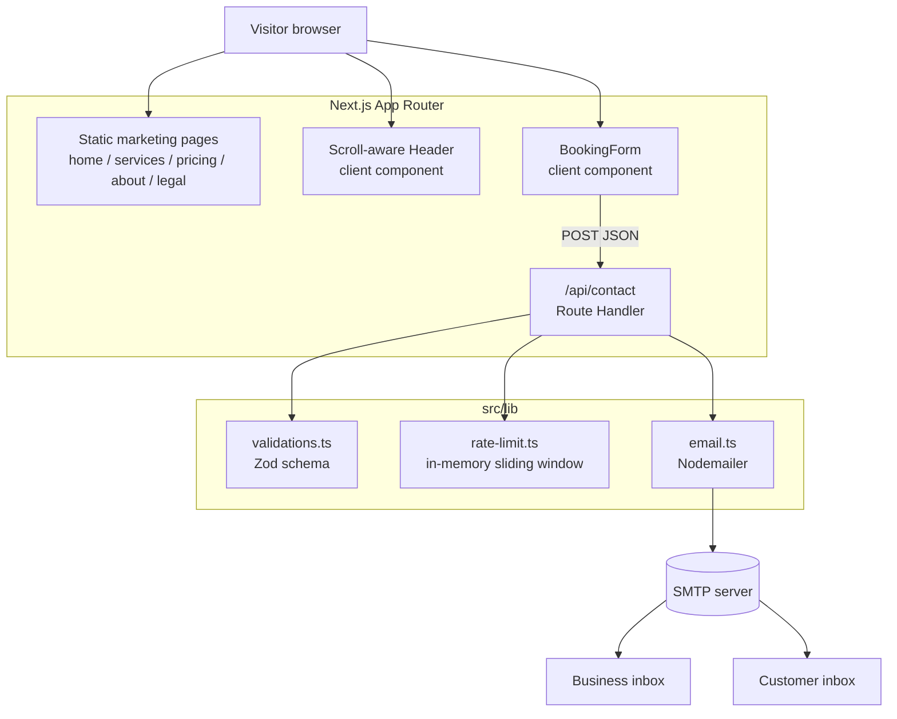

# Architecture

## System Diagram

## Component Descriptions

### Marketing pages (App Router)
- **Purpose**: Present the company, its fleet, and its three core services; convert visitors to booking leads.
- **Location**: `src/app/` — `page.tsx` (home), `services/{yukon-xl,sprinter,airport}/`, `pricing/`, `about/`, plus `terms`, `privacy`, and a branded `not-found.tsx`.
- **Key responsibilities**: Each service route pairs a `page.tsx` with a sibling `layout.tsx` that exports route-specific `metadata`, so titles and descriptions are tuned per page rather than inherited from the root.

### Scroll-aware Header
- **Purpose**: Provide navigation that looks good both overlaid on the homepage hero and on content-heavy interior pages.
- **Location**: `src/components/layout/Header.tsx`
- **Key responsibilities**: Tracks scroll position (debounced) and current pathname to toggle between a transparent and a solid bar; reads the initial scroll position on mount so a mid-page reload paints the correct state immediately; manages the mobile menu and locks body scroll while it's open.

### BookingForm
- **Purpose**: Collect a booking request and give the user immediate feedback.
- **Location**: `src/components/contact/BookingForm.tsx`
- **Key responsibilities**: Wires React Hook Form to the shared Zod schema via `zodResolver` for client-side validation, posts JSON to `/api/contact`, and renders distinct success / rate-limited / error states. Includes the off-screen honeypot field that the API checks server-side.

### Contact API route
- **Purpose**: Server-side entry point for booking submissions.
- **Location**: `src/app/api/contact/route.ts`
- **Key responsibilities**: Runs a four-stage pipeline — honeypot check → rate limit → schema validation → email delivery — and maps each failure to the right HTTP status (200 silent drop for bots, 429, 400, 500).

### lib utilities
- **Purpose**: Pure, reusable logic kept out of the request handler and components.
- **Location**: `src/lib/` — `validations.ts` (the single source of truth for the form shape), `rate-limit.ts`, `email.ts`, `utils.ts` (`cn`, phone/email link formatters, `debounce`).

## Data Flow

1. A visitor fills out the booking form; React Hook Form validates against the Zod schema on the client and blocks submission until the fields are valid.
2. The form POSTs the payload as JSON to `/api/contact`.
3. The route inspects the honeypot field first — if it's filled, the bot gets a `200` and nothing else happens.
4. It derives the client IP from `x-forwarded-for` and checks the per-IP rate limiter; over the limit returns `429`.
5. The same Zod schema re-validates the body server-side; invalid input returns `400` with field-level errors.
6. `sendBookingNotification` emails the business inbox (failure here is a `500`); `sendCustomerConfirmation` then sends the customer auto-reply as best-effort — its failure is logged but does not fail the request.
7. The client surfaces success, a "too many requests" message, or a "please call us" fallback.

## External Integrations

| Service | Purpose | Notes |
|---------|---------|-------|
| SMTP (Nodemailer) | Deliver booking notifications and customer confirmations | Configured entirely via `SMTP_HOST/PORT/USER/PASS`; `secure` is inferred from port 465. No third-party email SDK or vendor lock-in. |

## Key Architectural Decisions

### Static-first site with a single serverless endpoint
- **Context**: A small business marketing site needs to be cheap, fast, and easy to deploy — but it still has to turn the booking form into a real email.
- **Decision**: Render every page statically and confine all server logic to one App Router Route Handler.
- **Rationale**: This avoids standing up a database or admin panel for what is fundamentally a "send an email" workflow. The alternative — a headless CMS plus a backend — would add operational surface area the business doesn't need.

### One Zod schema validates on both client and server
- **Context**: Client validation gives fast feedback but can't be trusted; the server must re-check.
- **Decision**: Define the contact schema once in `src/lib/validations.ts` and consume it from both the form (`zodResolver`) and the API route (`safeParse`).
- **Rationale**: A single source of truth means the rules can't drift between the two layers, and the inferred `ContactFormData` type flows into the email builder so a schema change surfaces as a compile error rather than a runtime bug.

### Defense-in-depth on the form rather than a CAPTCHA
- **Context**: A public contact form is a spam magnet, but a CAPTCHA adds friction and a third-party dependency for a luxury brand that wants a clean experience.
- **Decision**: Combine a hidden honeypot field with a per-IP sliding-window rate limiter, layered before email delivery.
- **Rationale**: Bots that fill the honeypot are silently accepted (200, no email) so they get no signal to adapt; the rate limiter caps abuse from a single source. Both are zero-friction for real users and need no external service.

### Two-email transaction with asymmetric failure handling
- **Context**: A booking should both notify the business and reassure the customer, but the two emails have very different importance.
- **Decision**: Treat the business notification as required (its failure returns `500`) and the customer confirmation as best-effort (its failure is caught and logged).
- **Rationale**: A typo'd or bouncing customer address must not make the business lose the lead after the notification already went out. Ordering and try/catch boundaries in the route encode that priority explicitly.

### Honest in-memory rate limiter with a documented upgrade path
- **Context**: A KV-backed limiter is the "correct" serverless choice, but it's over-engineering for the current low-traffic deployment.
- **Decision**: Ship a simple in-memory sliding-window limiter and document, in the module itself, that it must be swapped for a KV store (Upstash / Vercel KV) before relying on it under real serverless load.
- **Rationale**: It deters casual abuse today with zero infrastructure, and the limitation is written down at the call site rather than hidden — so the upgrade is a known follow-up, not a silent correctness bug.
