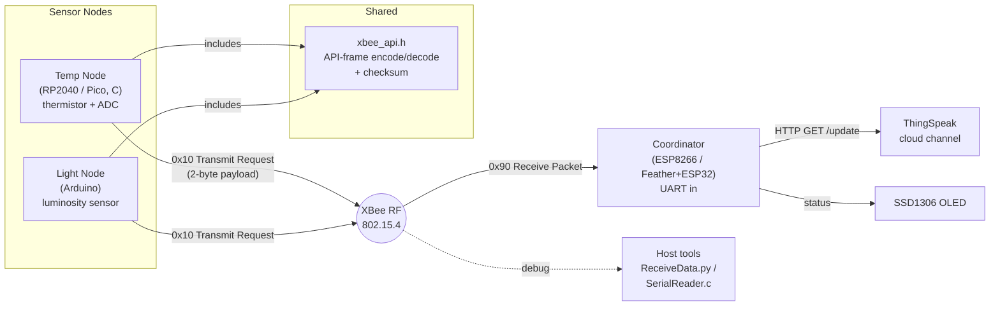

# Architecture

## System Diagram

## Component Descriptions

### XBee API frame library
- **Purpose**: Encode and decode XBee API-mode frames so firmware never hand-assembles raw byte buffers.
- **Location**: `XBeeAPI/xbee_api.h` (symlinked from `TempNode/xbee_api.h` and `LightNode/xbee_api.h`, so all nodes share one copy)
- **Key responsibilities**: build AT command frames (`0x08`), transmit-request frames (`0x10`), and parse receive packets (`0x90`); compute and verify the XBee checksum; grow the frame buffer with `realloc` as needed. All UART I/O is delegated to two functions the host firmware must provide: `xbee_api_uart_write()` and `xbee_api_uart_getchar()`.

### Temperature node
- **Purpose**: Measure ambient temperature and broadcast it.
- **Location**: `TempNode/main.c`
- **Key responsibilities**: initialize UART + ADC on the Pico; oversample the thermistor across a fixed time window and average; convert ADC counts → resistance (voltage-divider) → temperature (B-parameter equation) → Fahrenheit; encode the reading as a fixed-point `int16` (°F × 10) and transmit it.

### Light node
- **Purpose**: Measure luminosity and broadcast it.
- **Location**: `LightNode/LightNode.ino`
- **Key responsibilities**: read the light sensor and transmit a 2-byte reading using the same XBee frame format, with the Arduino `Serial` port wired in as the API library's UART backend.

### Coordinator / base station
- **Purpose**: Receive sensor data over the air and forward it to the cloud.
- **Location**: `BaseStation/BaseStation.ino` (ESP8266 + OLED) and `FeatherWingFiles/code.py` (CircuitPython on Feather + ESP32 AirLift)
- **Key responsibilities**: connect to WiFi; read XBee frames over UART; issue an HTTP GET to the ThingSpeak `/update` endpoint with the reading in a field parameter; surface connection state and IP on the SSD1306 OLED.

### Host-side decoding tools
- **Purpose**: Bring-up and debugging without a microcontroller in the loop.
- **Location**: `ReceiveData.py` (digi-xbee library), `SerialReader/SerialReader.c` (raw serial parse), `XBeeAPI/xbee_api_receive.py`
- **Key responsibilities**: read frames from a serial port and print the decoded payload, so frame formatting and sensor math can be verified on a laptop.

## Data Flow

1. A sensor node samples its sensor (thermistor ADC, or light sensor).
2. The raw reading is converted to a physical value and packed into a 2-byte fixed-point payload.
3. The payload is wrapped in an XBee `0x10` transmit-request frame (with destination address and checksum) and written to the radio over UART.
4. The XBee mesh delivers the frame to the coordinator, which receives it as a `0x90` packet and extracts the payload.
5. The coordinator builds a ThingSpeak `/update` URL with the reading and issues an HTTP GET over WiFi; the OLED reflects status.

## External Integrations

| Service     | Purpose                          | Notes                                                        |
|-------------|----------------------------------|--------------------------------------------------------------|
| ThingSpeak  | Cloud logging / charting of data | HTTP GET to `/update` with an API key; one field per metric. |
| XBee radios | The RF transport itself          | API mode (not transparent/AT mode) so payloads carry addressing + framing. |

## Key Architectural Decisions

### One protocol library, many MCUs
- **Context**: The temperature node (Pico, C/Pico SDK) and the light node (Arduino C++) run on different toolchains and have completely different UART APIs, but both must speak identical XBee frames.
- **Decision**: Put all framing logic in a header (`xbee_api.h`) that calls two externally-defined I/O functions, and let each firmware define those functions against its own UART.
- **Rationale**: Avoids forking the protocol code per board and guarantees the temp and light nodes can't drift into incompatible frame formats. The alternative — duplicating frame code in each `.ino`/`.c` — would have doubled the surface area for checksum/offset bugs.

### XBee API mode over transparent mode
- **Context**: Multiple sensor nodes report to one coordinator, which needs to know *who* sent each reading.
- **Decision**: Run the radios in API mode and parse `0x90` receive packets, which include the sender's 64-bit address, rather than transparent serial passthrough.
- **Rationale**: Transparent mode would have merged all nodes into one undifferentiated byte stream. API mode preserves per-node addressing and delivery status for free.

### Fixed-point payloads instead of strings
- **Context**: RF airtime and MCU memory are limited, and floats are awkward to transmit reliably.
- **Decision**: Encode each reading as a 2-byte `int16` scaled by 10 (e.g. 73.4 °F → `734`) and reconstruct on the receiver.
- **Rationale**: Keeps payloads to 2 bytes with predictable framing and no parsing ambiguity, versus sending variable-length ASCII like `"73.4F"`.

### Shared protocol library via symlinks
- **Context**: Three firmwares (the two Pico C targets and the Arduino node) each need the XBee frame code, but duplicating the header invites the copies to drift apart.
- **Decision**: Keep one real `XBeeAPI/xbee_api.h` and point `TempNode/xbee_api.h` and `LightNode/xbee_api.h` at it with symlinks, so each firmware still `#include "xbee_api.h"` locally but compiles the same bytes.
- **Rationale**: Guarantees one source of truth for the wire format across boards with different build systems (CMake vs Arduino IDE), without a build step to copy files around. The alternative — committing three independent copies — is exactly how the temp and light nodes briefly diverged during parallel development before being unified.
