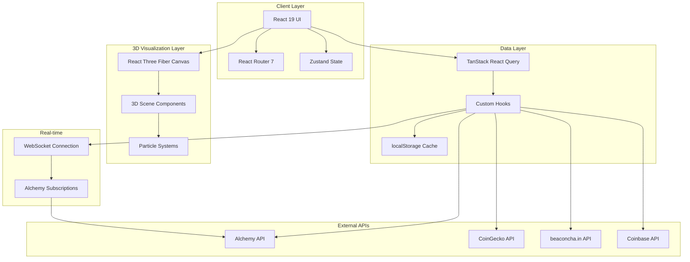
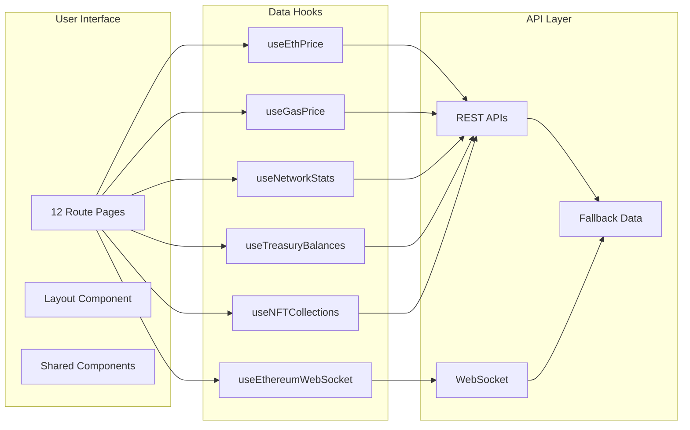

# Architecture Overview

## System Architecture Diagram

## Data Flow Architecture

## Key Architectural Decisions

### 1. React 19 with Lazy Loading

I chose React 19 for its latest features and performance improvements. Every page component is lazy-loaded using `React.lazy()` with Suspense boundaries, which significantly reduces the initial bundle size. Users only download the code for pages they actually visit.

### 2. Hybrid Data Strategy: Real-time + Fallback

The application uses a hybrid approach for data fetching:

- **Real-time data**: When an Alchemy API key is configured, the app connects via WebSocket for live pending transactions and new blocks
- **Graceful fallback**: When APIs are unavailable or rate-limited, simulated data keeps the UI functional
- **Multi-source redundancy**: Price data cascades from CoinGecko to Coinbase; gas prices try Alchemy, Owlracle, Blocknative, then Etherscan

This ensures the educational experience remains intact even when external services fail.

### 3. 3D Rendering Architecture

I separated the 3D visualization into distinct concerns:

- **PageBackground**: A fixed full-page particle system that persists across navigation
- **HeroScene**: The rotating Ethereum logo specific to the homepage
- **TransactionFlowScene**: Interactive particle visualization that responds to live transaction data
- **NetworkScene / StakingScene**: Specialized visualizations for specific pages

Each scene uses `React.memo` and refs to prevent unnecessary re-renders when transaction data updates rapidly.

### 4. Caching Strategy

I implemented a multi-tier caching system:

- **React Query cache**: In-memory caching with configurable stale times (15s for gas, 60s for prices, 15min for treasuries)
- **localStorage persistence**: Treasury and NFT data persist between sessions to minimize API calls
- **Fallback static data**: When all else fails, reasonable default values keep the UI populated

### 5. Component-Based Routing

The navigation uses a hierarchical structure with dropdown menus for grouping related pages:

- **Home / Live**: Top-level quick access
- **Learn**: Educational content (History, Technology, Smart Contracts, Layer 2)
- **Finance**: DeFi-focused pages (Markets, DApps, Staking, NFTs, Treasuries)
- **Wallets**: Standalone resource page

### 6. Error Boundaries for 3D Content

Three.js can crash on certain devices or browser configurations. I wrapped all Canvas components in React error boundaries that show a graceful fallback UI instead of breaking the entire page.

### 7. State Management Philosophy

I kept state management minimal:

- **Local state**: Most UI state (filters, view modes, paused state) lives in component useState
- **React Query**: All server state flows through TanStack Query
- **Zustand**: Reserved for any cross-component state that doesn't fit the above (currently unused but configured)

This avoids the complexity of global state management for what is primarily a read-only educational application.
