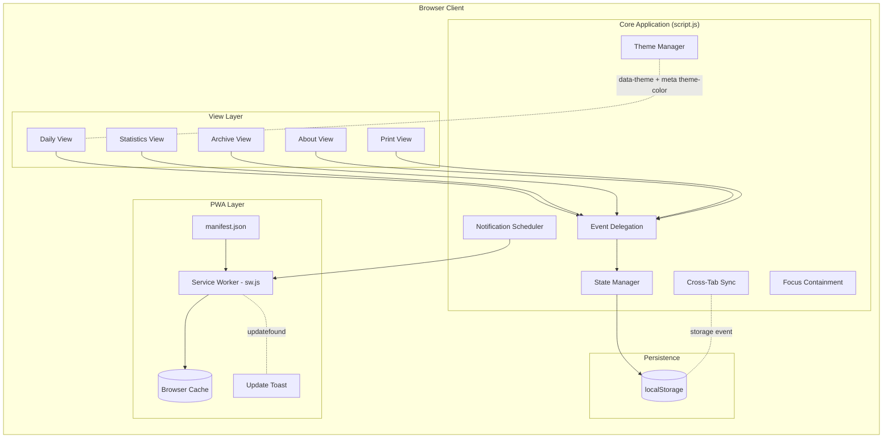

# Architecture

## System Diagram

## Data Flow

1. The user opens the app; `index.html` boots `script.js`, which hydrates state from `localStorage` and runs a small set of idempotent migrations (task-id assignment, archive date normalization, hidden-slot reconciliation) before first render.
2. Pointer or touch events on the time grid are caught by a single delegated listener on the table body, which routes to either the block-edit modal (tap) or the drag-select flow (drag).
3. State changes (create/edit/delete block, toggle task, change category) update the in-memory state and write through to `localStorage` with debouncing.
4. The renderer recomputes rowSpans in a single pass and updates the DOM; the current-time line and notification scheduler tick on a one-minute interval.
5. A `storage` event listener picks up writes from other tabs and re-renders the affected view, buffering reloads while a modal is open so the user's in-progress edits aren't blown away.
6. The service worker serves cached static assets immediately and refreshes them in the background. When a new version is installed and ready to activate, a non-blocking toast prompts the user to reload.

## Component Descriptions

### `index.html`
- **Purpose**: Single document holding every view (daily, statistics, archive, about, print) toggled by visibility.
- **Location**: `index.html`
- **Key responsibilities**: Markup for all views, modal containers, registration of the service worker and manifest.

### `script.js`
- **Purpose**: Application orchestrator — event delegation, rendering, drag logic, modal lifecycle, persistence, cross-tab sync.
- **Location**: `script.js`
- **Key responsibilities**: Time-grid rendering with `rowSpan`, touch/mouse drag selection, recurring-block resolution at render time, current-time line ticker, idempotent on-load migrations, `storage`-event listener for cross-tab convergence, `MutationObserver`-driven `inert` toggling on background sections when any modal is open.

### `sw.js`
- **Purpose**: Offline support via a stale-while-revalidate cache, plus an explicit update channel.
- **Location**: `sw.js`
- **Key responsibilities**: Precache static assets on install, serve from cache and refresh in the background on fetch, `skipWaiting` + `clients.claim` so a new worker can take over and trigger the in-page update toast.

### `styles.css`
- **Purpose**: Theming and layout, including dark mode via CSS custom properties.
- **Location**: `styles.css`
- **Key responsibilities**: `:root` palette, `[data-theme="dark"]` override, `prefers-color-scheme` media query for the auto setting, responsive breakpoints for mobile layouts.

## External Integrations

| Service | Purpose | Notes |
|---------|---------|-------|
| GitHub Pages | Static hosting and HTTPS | Auto-deploy on push to `main` |
| Browser Notification API | 5-minute pre-block reminders | Only fires while a tab is open |
| Service Worker API | Offline cache + update channel | Stale-while-revalidate; `updatefound` drives an in-page reload toast |
| Web Storage `storage` event | Multi-tab convergence | One tab's `localStorage` write triggers a buffered reload in others |

## Key Architectural Decisions

### Zero runtime dependencies
- **Context**: A planner that needs to work offline, install as a PWA, and stay buildable in five years without dependency maintenance.
- **Decision**: Vanilla JS, no bundler, no framework, no library at runtime.
- **Rationale**: Frameworks would add a transpile step and ~40 KB of runtime for what is mostly DOM and `localStorage` work. The trade-off is more hand-written code (e.g., a small time helper instead of a date library), but the resulting bundle is ~190 KB total with no upgrade treadmill.

### Single `script.js` over a module split
- **Context**: Earlier in the project I tried extracting helpers into a `modules/` directory consumed via native ES module imports. In practice, most of the file's complexity is the orchestration layer — event delegation, drag state, render — and the imported helpers tended to drift in subtle ways from inline copies that the orchestration code still kept around for performance or convenience.
- **Decision**: Keep all application logic in a single `script.js` served as a module.
- **Rationale**: One file means one place to grep, one place to set a breakpoint, and no chance of two implementations of the same helper drifting apart. The cost is that `script.js` is ~4k lines, but each section has a clear `/*** Section Name ***/` header and the file is searchable in any editor.

### `localStorage` over IndexedDB
- **Context**: A few JSON arrays (blocks, archive, preferences) that comfortably fit in single-digit MB, with no query needs.
- **Decision**: Plain `localStorage` with thin save/load wrappers.
- **Rationale**: Synchronous API keeps render and persistence code simple. IndexedDB's object stores and async API would be overhead with no payoff at this scale. The 5–10 MB quota is far above real usage.

### Event delegation on the table body
- **Context**: Time blocks are created and removed often; attaching a listener per block would leak as blocks come and go.
- **Decision**: One delegated `click`/`touchend`/`focusout`/`drag*` listener set on `#daily-body`, registered exactly once at startup.
- **Rationale**: Listener count is constant regardless of how many blocks exist. Newly rendered blocks need no setup. Removed blocks need no listener cleanup. The "attach once" invariant is enforced by keeping the registration call out of any rebuild path.

### Recurring blocks computed at render time, not stored per day
- **Context**: A recurring block could be stored as N copies (one per day) or once with a weekday set; the former duplicates state and bloats storage.
- **Decision**: Store a single block with `recurrenceDays: ["Mon","Wed",…]`. At render time, the daily view selects blocks whose `recurrenceDays` include the current weekday, then applies `carryOver` (tasks/notes from the previous occurrence) and `preserveTaskState` (whether checked tasks reset across days).
- **Rationale**: One source of truth in storage, plus a clean separation between the "template" (block definition) and per-day state (carry-over result, task checks).

### Stable task identity via opaque `taskId`
- **Context**: Per-day task completion state needs a key. The obvious key — `task.text` — collides on rename: editing "Review PR" to "Review PRs" silently strands the prior completion and loses the user's check mark.
- **Decision**: Every task carries an `id` (`crypto.randomUUID()`) assigned at creation. The per-day completion state is keyed by `taskId`, not text. Renaming preserves the id, so completion follows the rename.
- **Rationale**: Stable identifiers are the right shape for any state that outlives the user-visible text. The same pattern applies to blocks themselves (every block has an `id`); extending it to tasks closes the rename gap.

### Cross-tab convergence via the `storage` event
- **Context**: Two open tabs of the same origin share `localStorage` but each holds its own in-memory state. Without coordination, the second tab's save silently overwrites the first tab's changes with stale data.
- **Decision**: A `storage` event listener at boot dispatches by `e.key` into a small switch that reloads the affected slice and re-renders. While any modal is open or any input has focus, the event is buffered and drained on `focusout` so the user's in-progress edit isn't clobbered mid-keystroke.
- **Rationale**: The browser already emits `storage` events to other tabs (never the originating tab, so no loop). One listener and a per-key dispatch table is enough; no shared worker or BroadcastChannel needed for the data volumes involved.

### Background sections marked `inert` while a modal is open
- **Context**: Three overlays (block edit, settings, search) declare `aria-modal="true"`, but without focus containment Tab navigation escapes into the header buttons and date controls behind the modal.
- **Decision**: A single `MutationObserver` watches the three overlay elements; when any has `.active`, it sets `inert` on `<header>`, `<main>`, and `<footer>`, removing it when none do.
- **Rationale**: `inert` is the browser-native answer — it disables pointer events, removes the subtree from sequential focus, and hides it from assistive tech, all from one attribute. One observer is simpler than instrumenting every modal open/close site.

### Stale-while-revalidate service worker with an in-page update toast
- **Context**: A PWA needs to work fully offline but also pick up new deploys promptly. Stale-while-revalidate alone gets the offline part but leaves users on yesterday's code until they happen to reload twice.
- **Decision**: Serve from cache on first hit and refresh the cache entry in the background, *and* listen for `updatefound` on the service-worker registration; once the new worker is installed (and an existing controller is present), surface a non-blocking "New version available — reload" toast.
- **Rationale**: Users get instant boots without waiting on the network, and the update toast turns the second-load delay into an opt-in single click. The cache name is bumped on every deploy by a pre-commit hook that fails any commit touching cached assets without an `sw.js` version bump.

### CSS custom properties for theming, with the meta `theme-color` kept in sync
- **Context**: Dark mode needed to switch instantly, honor `prefers-color-scheme`, and avoid a flash of the wrong theme on first paint. On installed PWAs the OS chrome (iOS status bar, Android address bar) also needs to follow the body theme.
- **Decision**: All themable values live in `:root` custom properties, overridden under `[data-theme="dark"]`. The auto setting hooks `prefers-color-scheme`. `applyTheme` also writes the effective color into `<meta name="theme-color">` so the PWA chrome matches the body.
- **Rationale**: Theme switching is a single attribute change with no JS re-render. The auto setting falls out of a CSS media query, so there is no JS race that could cause a flash. The meta-tag update is the one piece CSS can't reach.
