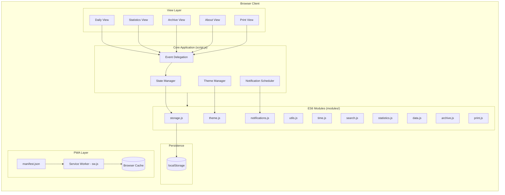

# Architecture

## System Diagram

## Data Flow

1. The user opens the app; `index.html` boots `script.js`, which hydrates state from `localStorage` via `modules/storage.js`.
2. Pointer or touch events on the time grid are caught by a single delegated listener on the table body, which routes to either the block-edit modal (tap) or the drag-select flow (drag).
3. State changes (create/edit/delete block, toggle task, change category) update the in-memory state and write through to `localStorage` with debouncing.
4. The renderer recomputes rowSpans in a single pass and updates the DOM; the current-time line and notification scheduler tick on a one-minute interval.
5. The service worker serves cached static assets immediately and refreshes them in the background, so the app continues to work offline.

## Component Descriptions

### `index.html`
- **Purpose**: Single document holding every view (daily, statistics, archive, about, print) toggled by visibility.
- **Location**: `index.html`
- **Key responsibilities**: Markup for all views, modal containers, registration of the service worker and manifest.

### `script.js`
- **Purpose**: Application orchestrator — event delegation, rendering, drag logic, modal lifecycle.
- **Location**: `script.js`
- **Key responsibilities**: Time-grid rendering with rowSpan, touch/mouse drag selection, recurring-block resolution at render time, current-time line ticker.

### `modules/`
- **Purpose**: Pure-function helpers extracted from `script.js` so they can be unit-tested or reused.
- **Location**: `modules/{storage,utils,time,search,statistics,data,archive,print,theme,notifications}.js`
- **Key responsibilities**: `storage.js` owns the `localStorage` schema; `time.js` parses and formats times; `archive.js` moves past days; `data.js` handles JSON/TXT import and export.

### `sw.js`
- **Purpose**: Offline support via a stale-while-revalidate cache.
- **Location**: `sw.js`
- **Key responsibilities**: Precache static assets on install, serve from cache and refresh in the background on fetch.

### `styles.css`
- **Purpose**: Theming and layout, including dark mode via CSS custom properties.
- **Location**: `styles.css`
- **Key responsibilities**: `:root` palette, `[data-theme="dark"]` override, responsive breakpoints for mobile layouts.

## External Integrations

| Service | Purpose | Notes |
|---------|---------|-------|
| GitHub Pages | Static hosting and HTTPS | Auto-deploy on push to `main` |
| Browser Notification API | 5-minute pre-block reminders | Only fires while a tab is open |
| Service Worker API | Offline cache | Stale-while-revalidate |

## Key Architectural Decisions

### Zero runtime dependencies
- **Context**: A planner that needs to work offline, install as a PWA, and stay buildable in five years without dependency maintenance.
- **Decision**: Vanilla JS with native ES modules, no bundler, no framework, no library at runtime.
- **Rationale**: Frameworks would add a transpile step and ~40 KB of runtime for what is mostly DOM and `localStorage` work. The trade-off is more hand-written code (e.g., a small `time.js` instead of a date library), but the resulting bundle is ~190 KB total with no upgrade treadmill.

### Single `script.js` plus extracted modules
- **Context**: `script.js` grew large (~3.7k lines) but moving everything into a build-required package layout would lose the no-build-step property.
- **Decision**: Keep `script.js` as the entry orchestrator; extract pure helpers (time math, search, statistics, storage I/O, theming) into `modules/` consumed via native ES module imports.
- **Rationale**: The browser loads ES modules directly with no bundler. Pure helpers can be reasoned about and replaced in isolation; the orchestration logic stays in one file because event handlers, render, and drag state are tightly coupled and splitting them would just add indirection.

### `localStorage` over IndexedDB
- **Context**: A few JSON arrays (blocks, archive, preferences) that comfortably fit in single-digit MB, with no query needs.
- **Decision**: Plain `localStorage` access wrapped by `modules/storage.js`.
- **Rationale**: Synchronous API keeps render and persistence code simple. IndexedDB's object stores and async API would be overhead with no payoff at this scale. The 5–10 MB quota is far above real usage.

### Event delegation on the table body
- **Context**: Time blocks are created and removed often; attaching a listener per block would leak as blocks come and go.
- **Decision**: One delegated `click`/`pointerdown`/`touchstart` listener on the table body that dispatches based on the event target.
- **Rationale**: Listener count is constant regardless of how many blocks exist. Newly rendered blocks need no setup. Removed blocks need no listener cleanup.

### Recurring blocks computed at render time, not stored per day
- **Context**: A recurring block could be stored as N copies (one per day) or once with a weekday set; the former duplicates state and bloats storage.
- **Decision**: Store a single block with `recurrenceDays: ["Mon","Wed",…]`. At render time, the daily view selects blocks whose `recurrenceDays` include the current weekday, then applies `carryOver` (tasks/notes from the previous occurrence) and `preserveTaskState` (whether checked tasks reset across days).
- **Rationale**: One source of truth in storage, plus a clean separation between the "template" (block definition) and per-day state (carry-over result, task checks).

### Stale-while-revalidate service worker
- **Context**: PWA needed to work fully offline but also pick up new deploys promptly.
- **Decision**: Serve from cache on first hit, then refresh the cache entry from the network in the background for the next load.
- **Rationale**: Users get instant boots without waiting on the network, and the next load sees the latest deploy without manual cache busting.

### CSS custom properties for theming
- **Context**: Dark mode needed to switch instantly, honor `prefers-color-scheme`, and avoid a flash of the wrong theme on first paint.
- **Decision**: All themable values live in `:root` custom properties, overridden under `[data-theme="dark"]`. The auto setting hooks `prefers-color-scheme`.
- **Rationale**: Theme switching is a single attribute change with no JS re-render. The auto setting falls out of a CSS media query, so there is no JS race that could cause a flash.
