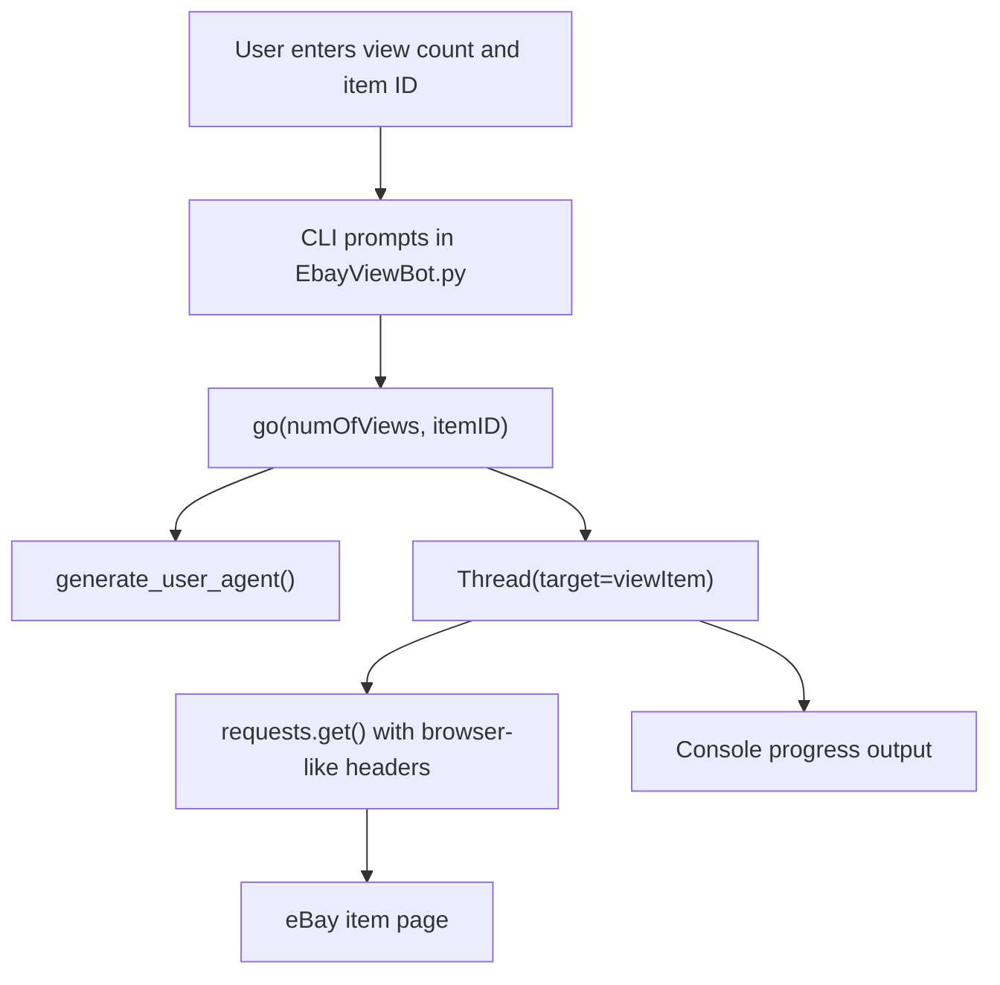

# Architecture

## System Diagram

## Component Descriptions

### CLI Entry Point
- **Purpose**: Collects the user-supplied request count and item ID.
- **Location**: `EbayViewBot.py`
- **Key responsibilities**: Prompt for runtime input, convert the requested count to an integer, and call the dispatcher.

### Request Dispatcher
- **Purpose**: Converts a requested count into a sequence of worker threads.
- **Location**: `EbayViewBot.py`, `go(numOfViews, itemID)`
- **Key responsibilities**: Generate a browser-style user agent per request, start a thread for each request, and add a short delay between thread launches.

### Request Worker
- **Purpose**: Sends one HTTP request to a target eBay item URL.
- **Location**: `EbayViewBot.py`, `viewItem(itemID, viewNum, useragent)`
- **Key responsibilities**: Build request headers, call `requests.get()`, and print a progress line for the completed request index.

## Data Flow

1. The user starts `EbayViewBot.py` from the command line.
2. The script asks for a number of requests and an eBay item ID.
3. `go()` loops over the requested count and creates one thread per request.
4. Each thread calls `viewItem()` with the item ID, request index, and generated user agent.
5. `viewItem()` sends an HTTP GET request to `https://www.ebay.com/itm/{itemID}` with browser-like headers.
6. The worker prints a simple progress message after the request call returns.

## External Integrations

| Service | Purpose | Notes |
|---------|---------|-------|
| eBay item pages | Target URL for HTTP GET requests | The script does not use an official eBay API and does not authenticate. Automated traffic should be used cautiously and responsibly. |
| `user_agent` package | Generates varied browser-style user-agent strings | Keeps header generation out of the project code. |

## Key Architectural Decisions

### Single-file script over package structure
- **Context**: The project is a small command-line experiment with one primary action.
- **Decision**: Keep the implementation in `EbayViewBot.py`.
- **Rationale**: A package layout would add ceremony without improving the core demonstration. A single file makes the request and threading behavior easy to inspect.

### Threads over synchronous looping
- **Context**: Repeated network requests are I/O-bound, so waiting for each request sequentially would make the script slower.
- **Decision**: Start a `Thread` for each request.
- **Rationale**: Threads are a simple fit for I/O-bound work in Python and avoid introducing a larger async framework for a tiny script.

### Generated user agents over a static header
- **Context**: A single hardcoded user agent would make every request look identical.
- **Decision**: Use `generate_user_agent()` for each dispatched request.
- **Rationale**: Delegating user-agent construction to a dependency keeps the code short while demonstrating per-request header variation.

### Direct HTML requests over an official API
- **Context**: The script is focused on page-request behavior rather than listing data or account-level actions.
- **Decision**: Request the public item page URL directly with `requests.get()`.
- **Rationale**: Direct HTTP keeps the example compact, but it also means the script has no API contract, no authenticated rate limit, and no structured response handling.
