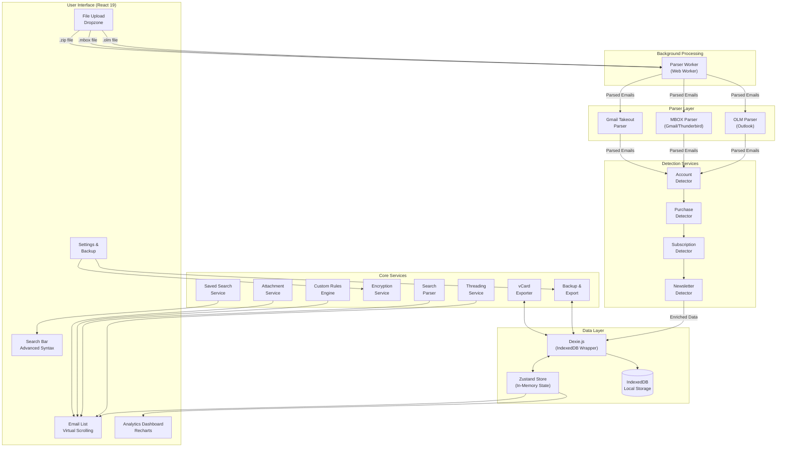

# Architecture

## System Overview

## Data Flow Architecture

## Key Architecture Decisions

### 1. Privacy-First Design

I made privacy the core architectural principle. All data processing happens entirely in the browser using client-side JavaScript. The application never sends email data to any server, which eliminates privacy concerns for users handling sensitive personal or business emails.

**Trade-off**: This limits some potential features like server-side full-text search or AI-powered categorization, but users trust the application more knowing their data never leaves their device.

### 2. IndexedDB with Dexie.js

I chose IndexedDB as the storage layer because it provides persistent local storage that can handle large datasets (tens of thousands of emails). Dexie.js wraps IndexedDB with a cleaner Promise-based API and adds features like:

- Compound indexes for efficient queries
- Schema versioning for migrations
- Bulk operations for faster imports

**Why not localStorage**: LocalStorage has a 5-10MB limit and is synchronous, which would freeze the UI during operations. IndexedDB can store hundreds of megabytes asynchronously.

### 3. Zustand for State Management

I selected Zustand over Redux or Context API for several reasons:

- Minimal boilerplate compared to Redux
- No provider wrapper needed (unlike Context)
- Built-in selectors prevent unnecessary re-renders
- Simple synchronization between IndexedDB and UI state

The store acts as an in-memory cache of the database, providing instant access to all data while keeping the UI responsive.

### 4. Virtual Scrolling with TanStack Virtual

For email archives with thousands of messages, I implemented virtual scrolling to render only visible items. This keeps memory usage constant regardless of dataset size and maintains 60fps scrolling performance.

### 5. Detection Pipeline

The detection services run as a pipeline during import rather than on-demand. This design:

- Front-loads computation during import (when users expect waiting)
- Makes subsequent browsing instant
- Allows for batch optimizations like duplicate purchase detection

### 6. Threading by Subject Normalization

Email threading uses a two-tier approach:

1. **Explicit thread IDs** from email headers when available
2. **Normalized subject matching** as fallback (strips Re:, Fwd:, etc.)

This handles both properly-threaded email clients and simple email exports that lack threading metadata.

### 7. Parser Isolation

Each email format (OLM, MBOX, Gmail Takeout) has its own dedicated parser. This separation:

- Keeps format-specific logic contained
- Makes it easy to add new formats
- Allows parallel development of parser improvements

### 8. Web Worker for Parsing

Large email archives are parsed in a dedicated Web Worker (`workers/parserWorker.ts`) to keep the main thread responsive. The worker handles file reading and parsing in the background, sending progress updates and parsed emails back to the UI thread via message passing. This prevents the browser from freezing during imports of large archives.

### 9. Extensible Services Architecture

Beyond the core detection pipeline, the application includes several supporting services:

- **customRulesEngine.ts** — User-defined filtering rules stored in localStorage
- **savedSearchService.ts** — Persists frequently used search queries
- **vcardExporter.ts** — Exports contacts in vCard 3.0 format
- **attachmentService.ts** — Handles attachment type detection and preview capabilities
- **backupService.ts** — Creates encrypted or unencrypted ZIP backups with selective export
- **encryptionService.ts** — AES-GCM encryption using Web Crypto API with PBKDF2 key derivation

## Database Schema Evolution

The schema evolved through 4 versions to support new features:

- **v1**: Basic emails, accounts, purchases, contacts, calendar events
- **v2**: Added folders table for email organization
- **v3**: Added composite indexes for query performance
- **v4**: Added subscriptions and newsletters tables

All migrations are handled automatically by Dexie's versioning system.
