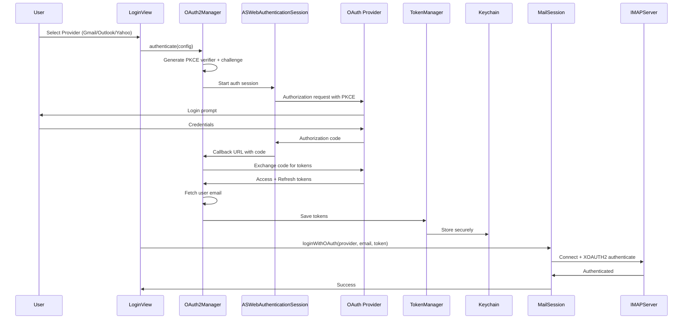

# Architecture

## System Overview

```mermaid
graph TB
    subgraph "iOS Application"
        subgraph "Presentation Layer"
            CV[ContentView]
            LV[LoginView]
            IV[InboxView]
            REV[RecentEmailsView]
            VCV[VerificationCodeView]
            AVCV[AllVerificationCodesView]
            MDV[MessageDetailView]
        end

        subgraph "Business Logic"
            MS[MailSession<br/>@MainActor ObservableObject]
            VT[VerificationTemplate<br/>Provider Detection]
        end

        subgraph "Authentication"
            O2M[OAuth2Manager<br/>PKCE Flow]
            O2C[OAuth2Configuration<br/>Provider Settings]
            TM[TokenManager<br/>Token Storage]
        end

        subgraph "Data Layer"
            KM[KeychainManager<br/>iOS Keychain API]
        end

        subgraph "External Dependencies"
            SM[SwiftMail<br/>IMAP Client]
        end
    end

    subgraph "External Services"
        GMAIL[Gmail IMAP<br/>imap.gmail.com]
        OUTLOOK[Outlook IMAP<br/>outlook.office365.com]
        YAHOO[Yahoo IMAP<br/>imap.mail.yahoo.com]
        OTHER[Other IMAP Servers]
    end

    subgraph "OAuth Providers"
        GAUTH[Google OAuth]
        MSAUTH[Microsoft OAuth]
        YAUTH[Yahoo OAuth]
    end

    CV --> LV
    CV --> IV
    CV --> REV
    CV --> VCV
    CV --> AVCV
    IV --> MDV
    REV --> MDV
    VCV --> MDV
    AVCV --> MDV

    LV --> O2M
    O2M --> O2C
    O2M --> GAUTH
    O2M --> MSAUTH
    O2M --> YAUTH
    O2M --> TM
    TM --> KM
    LV --> KM

    MS --> SM
    VCV --> VT
    AVCV --> VT

    SM --> GMAIL
    SM --> OUTLOOK
    SM --> YAHOO
    SM --> OTHER
```

## Authentication Flow



## Key Architectural Decisions

### 1. MVVM-ish Pattern with EnvironmentObject

I chose to use a centralized `MailSession` class as an `@EnvironmentObject` rather than strict MVVM with separate ViewModels for each view. This decision was made because:

- **Shared State**: Email client state (connection, messages, authentication) needs to be shared across multiple views
- **Simplicity**: A single source of truth reduces complexity for a single-purpose app
- **Real-time Updates**: `@Published` properties automatically update all observing views when data changes

### 2. Serial IMAP Operation Queue

I implemented a manual locking mechanism (`acquireImapLock`/`releaseImapLock`) for IMAP operations because:

- **IMAP Limitation**: The IMAP protocol does not handle concurrent operations well on a single connection
- **Preventing Race Conditions**: Multiple views (Inbox, Recent, Verification) might trigger fetches simultaneously
- **User Experience**: Prevents cryptic errors from concurrent command conflicts

### 3. Multi-layer Caching Strategy

I implemented caching at multiple levels:

- **Message Header Cache**: 30-second validity for verification searches
- **Full Message Cache**: 60-second validity for recent emails
- **UID-based Deduplication**: Prevents refetching already-loaded messages

This balances freshness with performance, especially important for the 15-second auto-refresh verification code feature.

### 4. OAuth2 with PKCE Over Basic Auth

I prioritized OAuth2 authentication because:

- **Security**: Modern email providers are deprecating password-based IMAP access
- **User Trust**: Users authenticate directly with their provider, never entering passwords in the app
- **Token Management**: Automatic refresh tokens keep users logged in without re-authentication
- **Compliance**: Required for Gmail API access and recommended for Microsoft

### 5. Template-based Verification Code Detection

I designed a flexible template system for code extraction because:

- **Extensibility**: New providers can be added without code changes to the detection logic
- **Accuracy**: Provider-specific patterns reduce false positives (e.g., not matching random 6-digit numbers in emails)
- **Priority Ordering**: More specific templates (Gmail Recovery) are checked before generic catch-all patterns

### 6. Native SwiftUI Without Third-party UI Libraries

I built the entire UI using native SwiftUI because:

- **Future-proofing**: Direct Apple framework support ensures long-term compatibility
- **Performance**: No additional overhead from abstraction layers
- **Learning**: This project was partly educational - using native APIs deepened my understanding of iOS development
