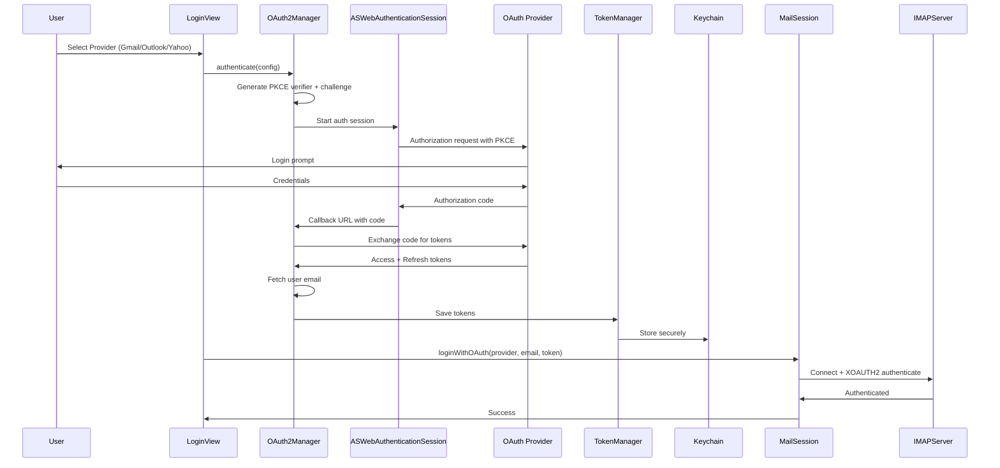

# Architecture

## System Overview

```mermaid
graph TB
    subgraph "iOS Application"
        subgraph "Presentation Layer"
            CV[ContentView<br/>splash + tabs]
            LV[LoginView]
            IV[InboxView]
            REV[RecentEmailsView]
            VCV[VerificationCodeView]
            AVCV[AllVerificationCodesView]
            MDV[MessageDetailView<br/>+ HTMLBodyView]
        end

        subgraph "Domain Logic (pure / testable)"
            VT[VerificationTemplate<br/>extract + color]
            MBD[MessageBodyDecoder<br/>base64 / QP / UTF-8]
        end

        subgraph "Session"
            MS[MailSession<br/>@MainActor ObservableObject]
            AS[AsyncSemaphore<br/>FIFO actor]
            CO[Constants<br/>timing values]
        end

        subgraph "Authentication"
            O2M[OAuth2Manager<br/>PKCE + token exchange]
            O2C[OAuth2Configuration<br/>endpoints + isConfigured]
            O2S[OAuth2Secrets<br/>gitignored client IDs]
            TM[TokenManager<br/>Keychain persistence]
        end

        subgraph "Data Layer"
            KM[KeychainManager<br/>this-device-only, no iCloud sync]
        end

        subgraph "External Dependencies"
            SM[SwiftMail<br/>IMAP / XOAUTH2]
            WK[WebKit<br/>WKWebView]
        end
    end

    subgraph "External Services"
        GMAIL[Gmail IMAP]
        OUTLOOK[Outlook IMAP]
        YAHOO[Yahoo IMAP]
        OTHER[Other IMAP Servers]
    end

    subgraph "OAuth Providers"
        GAUTH[Google OAuth]
        MSAUTH[Microsoft OAuth]
        YAUTH[Yahoo OAuth]
    end

    CV --> LV
    CV --> IV
    CV --> REV
    CV --> VCV
    CV --> AVCV
    IV --> MDV
    REV --> MDV
    VCV --> MDV
    AVCV --> MDV

    LV --> MS
    MS --> O2M
    O2M --> O2C
    O2C --> O2S
    O2M --> GAUTH
    O2M --> MSAUTH
    O2M --> YAUTH
    O2M --> TM
    TM --> KM
    LV --> KM

    MS --> AS
    MS --> SM
    MS --> CO

    MDV --> MBD
    MDV --> WK
    VCV --> VT
    AVCV --> VT

    SM --> GMAIL
    SM --> OUTLOOK
    SM --> YAHOO
    SM --> OTHER
```

## Authentication Flow

```mermaid
sequenceDiagram
    participant User
    participant LoginView
    participant OAuth2Manager
    participant ASWebAuth as ASWebAuthenticationSession
    participant Provider as OAuth Provider
    participant TokenManager
    participant Keychain
    participant MailSession
    participant IMAPServer

    User->>LoginView: Select Provider (Gmail/Outlook/Yahoo)
    LoginView->>OAuth2Manager: authenticate(config)
    OAuth2Manager->>OAuth2Manager: Generate PKCE verifier + challenge
    OAuth2Manager->>ASWebAuth: Start auth session
    ASWebAuth->>Provider: Authorization request with PKCE
    Provider->>User: Login prompt
    User->>Provider: Credentials
    Provider->>ASWebAuth: Authorization code
    ASWebAuth->>OAuth2Manager: Callback URL with code
    OAuth2Manager->>Provider: Exchange code for tokens
    Provider->>OAuth2Manager: Access + Refresh tokens
    OAuth2Manager->>OAuth2Manager: Fetch user email
    OAuth2Manager->>TokenManager: Save tokens
    TokenManager->>Keychain: Store securely
    LoginView->>MailSession: loginWithOAuth(provider, email, token)
    MailSession->>IMAPServer: Connect + XOAUTH2 authenticate
    IMAPServer->>MailSession: Authenticated
    MailSession->>LoginView: Success
```

## Key Architectural Decisions

### 1. MVVM-ish Pattern with EnvironmentObject

I chose to use a centralized `MailSession` class as an `@EnvironmentObject` rather than strict MVVM with separate ViewModels for each view. This decision was made because:

- **Shared State**: Email client state (connection, messages, authentication) needs to be shared across multiple views
- **Simplicity**: A single source of truth reduces complexity for a single-purpose app
- **Real-time Updates**: `@Published` properties automatically update all observing views when data changes

### 2. AsyncSemaphore for IMAP Serialization

IMAP protocol doesn't tolerate concurrent commands on a single connection, but the app has four tabs (Inbox, Recent, Gmail Codes, All Codes) plus auto-refresh timers that can all trigger fetches independently. I built a small `AsyncSemaphore` actor (`emailer/AsyncSemaphore.swift`, ~25 lines) that gives proper FIFO mutual exclusion through `wait()` / `signal()`:

- **No busy-waiting**: `wait()` suspends via `CheckedContinuation` until a slot is available — zero CPU overhead under contention.
- **Actor-isolated**: Both `wait()` and `signal()` are serialized by the Swift runtime, so there's no race between the check-and-set or between concurrent signal callers.
- **No external dependency**: A purpose-built ~25-line primitive is simpler than pulling in swift-async-algorithms for this single use case.
- **Surgical**: `MailSession` stays `@MainActor` (SwiftUI-friendly); only the lock primitive lives outside MainActor.

All five IMAP entry points (`loadInbox`, `fetchRecentEmails`, `fetchEmailsWithSubject`, `markEmailAsRead`, `markEmailAsReadByUID`) use the same `await imapLock.wait()` + `defer { Task { await imapLock.signal() } }` pattern.

### 3. Multi-layer Caching Strategy

I implemented caching at multiple levels:

- **Message Header Cache**: 30-second validity for verification searches
- **Full Message Cache**: 60-second validity for recent emails
- **UID-based Deduplication**: Prevents refetching already-loaded messages

This balances freshness with performance, especially important for the 15-second auto-refresh verification code feature.

### 4. OAuth2 with PKCE Over Basic Auth

I prioritized OAuth2 authentication because:

- **Security**: Modern email providers are deprecating password-based IMAP access
- **User Trust**: Users authenticate directly with their provider, never entering passwords in the app
- **Token Management**: Automatic refresh tokens keep users logged in without re-authentication
- **Compliance**: Required for Gmail API access and recommended for Microsoft

### 5. Template-based Verification Code Detection

I designed a flexible template system for code extraction because:

- **Extensibility**: New providers can be added without code changes to the detection logic
- **Accuracy**: Provider-specific patterns reduce false positives (e.g., not matching random 6-digit numbers in emails)
- **Priority Ordering**: More specific templates (Gmail Recovery) are checked before generic catch-all patterns

### 6. Native SwiftUI Without Third-party UI Libraries

The entire UI is native SwiftUI. Where I needed UIKit-specific functionality I bridged with `UIViewRepresentable` — most notably `HTMLBodyView` wrapping `WKWebView` for HTML email rendering. No third-party UI libraries are pulled in. The trade-off is occasional `UIViewRepresentable` boilerplate; the benefit is direct alignment with Apple's framework direction and no dependency surface for UI components.

### 7. HTML Email Rendering via WKWebView (JavaScript Off)

Real-world transactional emails — Apple receipts, GitHub notifications, marketing — are HTML with embedded CSS and inline images. Plain `Text(htmlBody)` shows raw markup, which is unusable. I render HTML in `HTMLBodyView` (a `UIViewRepresentable` wrapping `WKWebView`):

- **Best fidelity**: WKWebView renders CSS, layout, and inline images exactly as the email expects. `NSAttributedString(data:options:[.documentType:.html])` was the lighter alternative but mangles anything beyond basic newsletters.
- **JavaScript disabled**: `WKWebpagePreferences.allowsContentJavaScript = false` — arbitrary email HTML cannot execute scripts in the WebView.
- **No base URL**: `loadHTMLString(html, baseURL: nil)` — relative URLs in the email don't resolve, blocking another tracking vector.
- **Text short-circuit**: emails with no HTML body fall back to `Text(decodedBody)` so the WebView is only paid for when needed.

Remote `` loading is allowed today; a `WKContentRuleList` to block remote resource loads (and the tracking pixels they carry) is on the roadmap.

### 8. Pure Decoders Extracted from Views

`MessageBodyDecoder` (`emailer/MessageBodyDecoder.swift`) holds the base64 / quoted-printable / UTF-8 logic that used to live inline in `MessageDetailView`. `VerificationTemplate.extract(subject:from:bodies:)` plays the same role for verification-code extraction. Both are pure static functions, so:

- **Views are display-only**: `MessageDetailView` and the two verification views call into the decoders/extractors instead of containing regex or `Data(base64Encoded:)` themselves.
- **Decode happens off MainActor**: `MessageDetailView.loadFullMessage` runs `MessageBodyDecoder.decode(_:)` in `Task.detached(priority: .userInitiated) { … }.value` so large multi-part HTML emails don't stall the main thread.
- **Easy unit testing**: The test suite (`emailerTests`) exercises decoders and extractors with string fixtures — no SwiftMail mocking required, no view instantiation.

### 9. Typed Errors with Provider-Specific Cases

Both `MailSessionError` (in MailSession.swift) and `OAuth2Error` (in OAuth2Manager.swift) are `LocalizedError`-conforming enums with cases that name the actual failure mode:

- `MailSessionError.notLoggedIn`, `.inboxNotFound`, `.messageMissingUID`, `.serverNotConnected`
- `OAuth2Error.entropyFailure(status:)`, `.userinfoMissingEmail`, `.tokenExchangeFailed(detail:)`, etc.

This replaces the alternative of `NSError(domain: "com.emailer", code: N, userInfo: [NSLocalizedDescriptionKey: "…"])` literals, which scatter stringly-typed error metadata throughout the codebase. Typed errors let `do { try await … } catch MailSessionError.notLoggedIn { … }` work at call sites and surface meaningful messages to the user via `localizedDescription`.

### 10. Per-Developer Secrets via Gitignored `OAuth2Secrets.swift`

OAuth client IDs and redirect schemes live in `emailer/Auth/OAuth2Secrets.swift`, which is **gitignored**. `OAuth2Config.swift` (committed) reads `OAuth2Secrets.gmailClientId`, `.outlookRedirectScheme`, etc. — endpoints and scopes stay in the committed config since they're provider-public. Fork users create their own `OAuth2Secrets.swift` from a README template; the placeholder-detection in `OAuth2Configuration.isConfigured` automatically hides provider buttons whose client IDs are still `YOUR_*` placeholders. CI substitutes its own placeholder so the build still compiles without exposing anyone's real credentials.

### 11. Test Suite + CI

The `emailerTests` target uses Swift Testing (`@Test` functions) and `@testable import emailer`. 30 unit tests cover the testable surface: `VerificationTemplate` positive + negative regex cases per provider, `MessageBodyDecoder` for base64 with/without whitespace, `KeychainManager` round-trip + accessibility-flag assertions, `OAuth2Configuration.isConfigured` / `expectedBundleIdentifier` logic, `AsyncSemaphore` concurrency stress, `Date.timeAgo` formatter branches, and PKCE verifier randomness. GitHub Actions runs the suite on every push to `main` and every PR via `.github/workflows/test.yml`.
