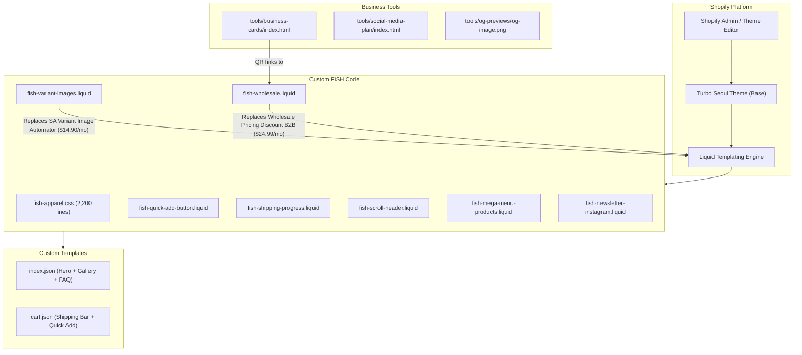

# Architecture Overview

## System Diagram

## Custom Component Descriptions

### Variant Image Filtering (`fish-variant-images.liquid`)
- **Purpose:** Filter product gallery photos by selected color variant
- **Replaces:** SA Variant Image Automator ($14.90/month on Shopify Basic, 4.9★) or Variant Image Wizard + Swatch ($4.99–$7.99/month)
- **How it works:** Reads image filenames (e.g., "gators-corduroy-angle.jpg"), matches them against the selected variant's handleized color name, hides non-matching images, and reorders the Flickity carousel. Prioritizes "angle" shots first.
- **Integration:** Loaded globally via `theme.liquid`, activates on any page with a product gallery

### Wholesale System (`fish-wholesale.liquid`)
- **Purpose:** Password-protected B2B catalog with order builder
- **Replaces:** Wholesale Pricing Discount B2B ($24.99/month), B2B Wholesale Hub ($39/month), or SparkLayer ($49/month with 50-order cap)
- **How it works:** Client-side SHA-256 password validation against a Shopify page metafield. On success, renders the full product catalog with 50% wholesale pricing, quantity selectors per variant, real-time order summary, and a contact form that emails the structured order.
- **Integration:** Standalone section, loaded via `/pages/wholesale` template

### Quick Add Button (`fish-quick-add-button.liquid`)
- **Purpose:** One-click add to cart from cart page recommendations
- **Replaces:** Theme's Quick View modal on cart page only
- **How it works:** Conditionally rendered instead of the theme's `quick-shop-button` when `template.name == 'cart'`. Uses `fetch('/cart/add.js')` and reloads.
- **Integration:** Conditional render in `product-details.liquid`

### Shipping Progress Bar (`fish-shipping-progress.liquid`)
- **Purpose:** Drive higher average order value
- **How it works:** Liquid calculates items in cart vs. threshold (3 hats). Renders a progress bar with messaging. Turns green when threshold is met.
- **Integration:** Rendered via custom-liquid section at top of cart template

### Scroll Header (`fish-scroll-header.liquid`)
- **Purpose:** Maximize mobile screen space
- **How it works:** `requestAnimationFrame` loop tracks scroll direction. Adds/removes CSS classes to fix/hide header with 200px threshold.
- **Integration:** Loaded globally via `theme.liquid`

### Mega Menu Products (`fish-mega-menu-products.liquid`)
- **Purpose:** Show live product grid in navigation dropdown
- **How it works:** Loops through 'all' collection, renders product cards with images and names in a grid layout.
- **Integration:** Rendered inside modified `mega-menu.liquid` snippet

### Newsletter + Instagram (`fish-newsletter-instagram.liquid`)
- **Purpose:** Homepage email capture + social follow CTA
- **How it works:** Two-column layout with Shopify's native `` on the left and Instagram link on the right.
- **Integration:** Rendered via custom-liquid section on homepage

## Data Flow

### Wholesale Order Flow
1. Retailer visits `/pages/wholesale?pass=fishwholesale2026`
2. Password extracted from URL or entered manually
3. SHA-256 hash compared against page metafield
4. On match: product catalog renders with wholesale pricing
5. Retailer selects quantities per variant
6. Real-time order summary updates (items, prices, totals)
7. Retailer fills contact form (name, email, phone, address)
8. Submit posts to Shopify contact form with tag "wholesale"
9. Email arrives with structured order details

### Variant Filtering Flow
1. Customer lands on product page
2. `fish-variant-images.liquid` JS loads and waits for Flickity
3. Customer selects a color swatch
4. JS handleizes the color name ("Gators Corduroy" → "gators-corduroy")
5. All gallery images are checked against the prefix
6. Non-matching images hidden, matching images shown
7. Flickity carousel reinitialized with filtered set
8. "Angle" images prioritized to front

## Key Architectural Decisions

### Custom Code Over Apps
- **Context:** Shopify apps are easy but expensive ($5-100/mo each) and add JS bloat
- **Decision:** Write custom Liquid/JS for features we'd otherwise pay for
- **Rationale:** One-time dev effort vs. perpetual subscription. Custom code is faster (no third-party scripts), cheaper, and fully under our control

### fish- Prefix Convention
- **Context:** Theme has 50+ existing snippets, easy to lose track of custom vs. default
- **Decision:** All custom files prefixed with `fish-`
- **Rationale:** Instantly identifiable in file listings, safe during theme updates (theme updates won't overwrite `fish-*` files)

### Client-Side Wholesale Auth
- **Context:** Need password-protected wholesale page without a paid app
- **Decision:** SHA-256 hash comparison on client side
- **Rationale:** The password isn't a security boundary (wholesale pricing is just a contact form, not actual checkout). Client-side is simpler and doesn't require a backend proxy. The hash prevents casual password discovery in source code.
