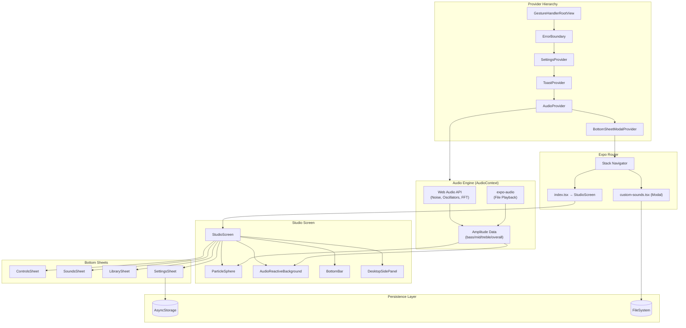

# Architecture Overview

## System Diagram

## Component Descriptions

### StudioScreen
- **Purpose**: The primary app screen that orchestrates all UI elements
- **Location**: `components/studio/StudioScreen.tsx`
- **Key responsibilities**: Manages particle settings state, coordinates bottom sheet lifecycle, handles responsive layout switching (mobile sheets vs desktop side panel at 900px breakpoint), animates visualization when sheets open/close, orchestrates save creation flow with thumbnail generation

### ParticleSphere
- **Purpose**: The core particle visualization engine
- **Location**: `components/ParticleSphere.tsx`
- **Key responsibilities**: Fibonacci sphere point distribution, SVG circle rendering with depth sorting, Reanimated rotation animation at 60fps, optional physics simulation (gravity, magnetism, flocking), audio-reactive size/wobble/trail modifications, pan gesture for manual rotation

### AudioProvider
- **Purpose**: Cross-platform audio state management and playback engine
- **Location**: `lib/AudioContext.tsx`
- **Key responsibilities**: Manages 35+ sound layers across 5 categories, provides unified play/stop/volume API, handles Web Audio API synthesis (noise, oscillators, FM, binaural beats) on web, handles expo-audio file playback on native, runs real-time amplitude analysis (FFT on web, simulated on native), manages custom sounds and soundscapes, supports 3-band EQ and spatial audio (web only)

### SettingsProvider
- **Purpose**: App-wide settings state with persistence
- **Location**: `lib/SettingsContext.tsx`
- **Key responsibilities**: Loads/saves app settings from AsyncStorage, provides optimistic updates, wraps haptic feedback with respect to user preferences

### Bottom Sheets (Controls, Sounds, Library, Settings)
- **Purpose**: Secondary UI panels using peek/expanded states
- **Location**: `components/sheets/`
- **Key responsibilities**: Each sheet has a compact "peek" view (visible at partial height) and full "expanded" content, uses custom `SheetContentWrapper` with animated cross-fade transitions, coordinated via `activeSheet` state to ensure only one is open at a time

### AudioReactiveBackground
- **Purpose**: Full-screen SVG background that responds to audio
- **Location**: `components/AudioReactiveBackground.tsx`
- **Key responsibilities**: Renders radial gradient glow and color-shifting rectangles, scales/fades based on amplitude data, adapts colors to active soundscape's baseColors

### BottomBar
- **Purpose**: Persistent navigation and quick controls
- **Location**: `components/studio/BottomBar.tsx`
- **Key responsibilities**: Horizontal preset chip rows (visual + audio), sheet-opening icon buttons, master volume slider, frosted-glass blur effect, responsive offset when desktop panel is open

### DesktopSidePanel
- **Purpose**: Desktop-optimized layout for screens >= 900px
- **Location**: `components/studio/DesktopSidePanel.tsx`
- **Key responsibilities**: Replaces bottom sheets with a 380px sliding side panel, contains same four panel contents (Controls, Sounds, Library, Settings), animated enter/exit with Reanimated

## Data Flow

1. **Audio playback**: User toggles a sound → `AudioProvider` creates a Web Audio node (web) or expo-audio player (native) → sound begins playing with configured volume and EQ
2. **Amplitude analysis**: Every 50ms, the audio engine samples frequency data → FFT analysis (web) or category-based estimation (native) → `AudioAmplitude` state updates → components re-render
3. **Visual reactivity**: `ParticleSphere` and `AudioReactiveBackground` read `amplitude` from `useAudio()` → particle size scales with bass, wobble with mid, trails with treble → background glow intensity tracks overall amplitude
4. **Settings persistence**: User adjusts a particle slider → state updates immediately → `saveCurrentSettings` fires asynchronously to AsyncStorage
5. **Save creation**: User taps save → name modal appears → `generateThumbnailSVG` creates static SVG string → `saveCreation` persists settings + thumbnail to AsyncStorage

## External Integrations

| Service | Purpose | Documentation |
|---------|---------|---------------|
| Expo SDK 54 | Cross-platform runtime and build system | [docs.expo.dev](https://docs.expo.dev) |
| EAS Build | Cloud builds for iOS and Android | [docs.expo.dev/eas](https://docs.expo.dev/build/introduction/) |
| Vercel | Web deployment hosting | [vercel.com/docs](https://vercel.com/docs) |
| Freesound.org | CC-licensed ambient sound sources | [freesound.org](https://freesound.org) |
| BBC Sound Effects | Nature sound recordings (RemArc License) | [sound-effects.bbcrewind.co.uk](https://sound-effects.bbcrewind.co.uk) |

## Key Architectural Decisions

### Dual Audio Rendering Strategy
- **Context**: The app needs both procedural sound generation and file playback across web and native platforms
- **Decision**: Web Audio API for web (synthesis + real FFT), expo-audio for native (file playback + simulated amplitude)
- **Rationale**: Web Audio API enables real-time noise generation, oscillator synthesis, and actual frequency analysis that isn't possible with expo-audio. Native platforms get reliable background audio and low-latency file playback. The amplitude simulation on native provides a good-enough visual experience without requiring native FFT libraries.

### SVG-Based Rendering Over Three.js
- **Context**: The visualization needed to render hundreds of particles with depth, color, and animation
- **Decision**: React Native SVG with Reanimated instead of Three.js/WebGL
- **Rationale**: SVG renders consistently across all three platforms without GL context issues. Reanimated provides 60fps animations on the UI thread. Three.js dependencies remain in `package.json` from an earlier prototype but are unused. The SVG approach keeps the bundle smaller and avoids WebGL compatibility issues on older devices.

### Bottom-Sheet-First Mobile UI
- **Context**: The app needs to show complex controls without obscuring the visualization
- **Decision**: All secondary UI lives in `@gorhom/bottom-sheet` with peek/expanded states and a custom cross-fade transition system
- **Rationale**: Bottom sheets let the visualization remain visible while interacting with controls. The peek state shows the most-used controls (quick sliders, soundscape selector) without expanding. The custom `SheetContentWrapper` with `useSheetTransition` provides smooth opacity/scale interpolation that avoids flash artifacts from conditional rendering.

### Fibonacci Sphere Distribution
- **Context**: Particles need to be distributed evenly on a sphere surface
- **Decision**: Golden angle distribution (`π × (3 - √5)`) implemented identically in three places: live render, thumbnail generator, and card previews
- **Rationale**: Fibonacci distribution produces the most visually even point distribution on a sphere (no clustering at poles like latitude/longitude grids). Duplicating the algorithm ensures visual consistency — a saved creation's thumbnail matches exactly what the user sees in the live view.

### AsyncStorage Key Namespacing
- **Context**: Multiple data types need to be persisted without conflicts
- **Decision**: All storage keys prefixed with `flux_`. Export/import operations filter on this prefix.
- **Rationale**: Prevents collisions with other AsyncStorage consumers. Makes bulk export/import safe — only Flux data is touched. Enables clean data reset without affecting other app storage.
