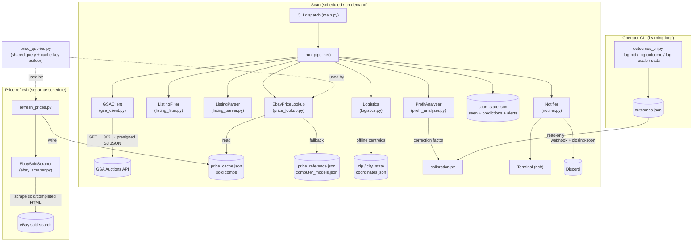

# Architecture

## System Diagram

## Component Descriptions

### CLI dispatch
- **Purpose**: One entry point for the scan and the operator subcommands.
- **Location**: `gsa_profit_finder/main.py`
- **Key responsibilities**: Routes `log-bid` / `log-outcome` / `log-resale` / `stats` / `doctor` to their handlers; everything else runs the scan with its flags (`--dry-run`, `--recheck`, `--min-profit`, `--history`, `-v`).

### GSA client
- **Purpose**: Pull every active auction lot in one request.
- **Location**: `gsa_profit_finder/gsa_client.py`
- **Key responsibilities**: Authenticated request to the GSA Auctions v2 endpoint (key sent as an `X-Api-Key` header), following the gateway's `303` redirect to a presigned S3 JSON document; defensive handling of timeouts, HTTP errors, rate limiting, and non-JSON bodies.

### Listing filter and spec parser
- **Purpose**: Reduce thousands of mixed lots to computers, then turn terse, ALL-CAPS surplus text into structured specs.
- **Location**: `gsa_profit_finder/listing_filter.py`, `gsa_profit_finder/listing_parser.py`
- **Key responsibilities**: Tiered keyword matching (brand → category → primary → component); regex extraction of manufacturer, model, CPU/Intel generation, RAM, storage size/type, GPU, form factor, quantity, missing parts, and condition, each with sanity bounds.

### Pricing engine (cache + scraper + refresh)
- **Purpose**: Price the whole unit and major parts from real eBay *sold* comps without an API.
- **Location**: `gsa_profit_finder/ebay_scraper.py`, `price_cache.py`, `refresh_prices.py`, `price_lookup.py`, `price_queries.py`
- **Key responsibilities**: A standalone refresh job scrapes eBay's public sold/completed search (rotating user agents, retry/backoff, challenge detection that returns nothing rather than a fabricated price), trims outliers, and writes a JSON cache. The scan reads that cache and falls back to a curated local reference plus a model knowledge base. A single shared module builds both the search query and the cache key so the reader and writer can never drift apart.

### Profit analyzer
- **Purpose**: Decide whether a lot is worth bidding on, in *the operator's* terms.
- **Location**: `gsa_profit_finder/profit_analyzer.py`
- **Key responsibilities**: Compare whole-unit vs. part-out resale, apply missing-part and condition penalties, subtract eBay fees, transport cost, and a learned calibration factor, compute ROI on total outlay, and emit BUY / WATCH / SKIP. Fee/shipping/threshold values are configuration, not constants.

### Logistics
- **Purpose**: Turn a lot's pickup location into a real acquisition cost.
- **Location**: `gsa_profit_finder/logistics.py`, geo data in `data/zip_coordinates.json` and `data/city_state_coordinates.json`
- **Key responsibilities**: Offline haversine distance between the operator's home ZIP and the lot's city/state (bundled US centroid data, no paid geocoding); a round-trip drive cost for nearby lots or per-unit freight for far ones; graceful fall back to flat shipping when a location can't be resolved.

### Scan state
- **Purpose**: Remember what has been analyzed and which alerts have fired.
- **Location**: `gsa_profit_finder/scan_state.py`, `data/scan_state.json`
- **Key responsibilities**: Single-writer JSON store of seen lots (dedup), per-lot raw prediction snapshots, and alert flags; atomic writes; never written during a dry run.

### Learning loop
- **Purpose**: Compare predictions against reality and self-correct.
- **Location**: `gsa_profit_finder/outcomes.py`, `calibration.py`, `outcomes_cli.py`, `data/outcomes.json`
- **Key responsibilities**: Operator-written bid/win/resale log; a clamped median correction factor over paired (predicted, actual) rows past a minimum sample size; outcome stats. The scan reads outcomes read-only.

### Notifier
- **Purpose**: Surface actionable deals in time to act.
- **Location**: `gsa_profit_finder/notifier.py`
- **Key responsibilities**: Rich terminal tables; optional Discord embeds for BUYs with comps, location/distance/logistics cost, ROI, days-left, and a direct bid link; a second "closing soon" nudge for a still-qualifying BUY near its end, deduped so it fires at most once.

## Data Flow

1. The scan builds a calibration factor from the read-only outcomes log and constructs each pipeline stage.
2. `GSAClient` fetches all active lots in one call; `ListingFilter` keeps computers.
3. Previously seen lots are skipped (unless `--recheck`) using the JSON scan state.
4. For each new lot: parse specs → enrich from the model knowledge base → price from the sold-comp cache (local reference as fallback) → compute location-aware logistics cost → compute profit and a recommendation, scaled by the calibration factor.
5. Results render as a terminal table; BUYs go to Discord, with a closing-soon nudge for lots near their end. Scan state is updated (outside dry runs).
6. Separately, the refresh job scrapes eBay sold comps and rewrites the price cache; the operator logs outcomes through the CLI.

## External Integrations

| Service | Purpose | Notes |
|---------|---------|-------|
| GSA Auctions API (`api.gsa.gov`) | Source of all auction lots | Key via `X-Api-Key` header; endpoint `303`-redirects to a presigned S3 JSON document with the full active set |
| eBay sold/completed search | Real resale price signal | Scraped HTML (no API/keys); rotating user agents, retry/backoff, challenge detection; only feeds a cache |
| Discord webhook | Deal alerts | Optional; fires for BUYs and a closing-soon nudge |
| GitHub Actions | Unattended scheduling | A scan workflow and a price-refresh workflow that commit state/cache back to the repo |

## Key Architectural Decisions

### Decouple price-gathering from the scan
- **Context**: Resale accuracy depends on scraping, which is slower and less reliable than the rest of the pipeline, yet the scan must never fail to produce alerts.
- **Decision**: A separate refresh job scrapes sold comps into a cache; the scan only reads that cache.
- **Rationale**: A failed or rate-limited scrape degrades to slightly staler cache data instead of breaking the scan or, worse, producing a bad BUY. The cache also accretes coverage over time and lets scans run fast and offline.

### Scraped sold comps over an API with an active-listing proxy
- **Context**: The needed signal is *sold* prices; an asking-price feed over-values lots, and a paid/keyed API adds a dependency and rate limits.
- **Decision**: Scrape eBay's public sold/completed results and trim outliers; retire the active-listing pricing path and its flat discount factor.
- **Rationale**: Sold comps are the real money signal and need no key. Challenge pages return *nothing* rather than a fabricated number, so a blocked scrape can never masquerade as a price.

### Single-writer JSON state over SQLite
- **Context**: State must persist across ephemeral scheduled runs and be writable from three independent places — the scan, the refresh job, and the operator's outcome logging.
- **Decision**: Three JSON files, each with exactly one writer, committed back from automation.
- **Rationale**: JSON diffs cleanly in version control and the single-writer rule eliminates the binary-merge conflicts a shared SQLite file would cause between local outcome logging and the scheduled jobs.

### Store the raw prediction so calibration can't oscillate
- **Context**: The correction factor is median(actual ÷ predicted). If the stored prediction were the already-calibrated value, the factor would feed back on itself and swing between runs.
- **Decision**: Persist the *uncalibrated* resale estimate as the prediction snapshot; apply the factor only to the live decision.
- **Rationale**: Keeps the factor a stable measurement of raw-model error, so it converges instead of oscillating.

### Centralize the query and cache-key builder
- **Context**: A reader/writer key mismatch would silently mean the cache never hits and the whole pricing feature dies quietly.
- **Decision**: One module builds both the eBay search query and its normalized cache key; the scan and the refresh job both call it.
- **Rationale**: Makes a key drift structurally impossible rather than a latent bug, and it's directly covered by an end-to-end cache-hit test.

### ROI on total outlay, not bid
- **Context**: Many lots open at a `$0` high bid, and those are often the best deals.
- **Decision**: Margin is profit divided by total cash outlay (bid + transport + fees), not by bid.
- **Rationale**: Dividing by bid forces a free-start lot to a `0%` margin and disqualifies it; total outlay is well-defined for zero-bid lots and is the honest measure of money at risk.

### Offline centroid geocoding over a paid API
- **Context**: Acquisition cost depends on distance, but lots give only city/state and a paid geocoder is an unwanted dependency.
- **Decision**: Bundle compact US ZIP and city/state centroid datasets and compute haversine distance locally.
- **Rationale**: Distance here is a downgrade signal, not turn-by-turn routing, so centroid precision is enough — and it keeps the tool free, deterministic, and testable without network access.
