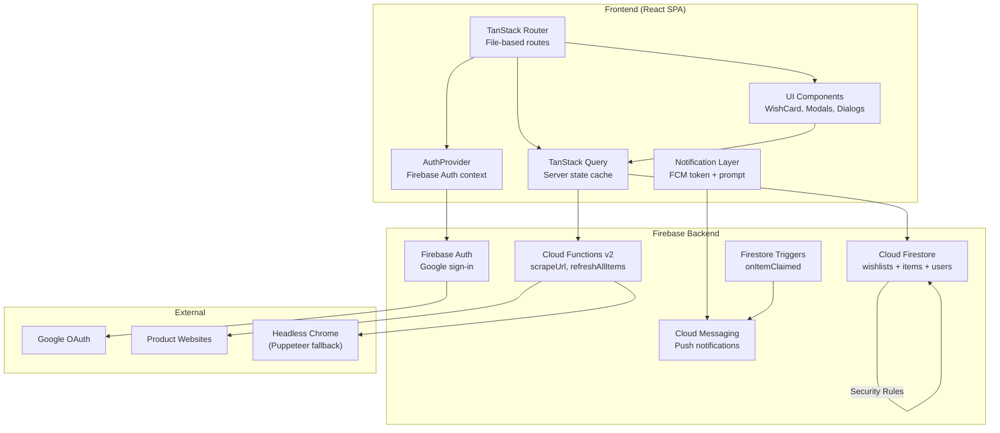

# Architecture Overview

## System Diagram

## Component Descriptions

### TanStack Router (File-based Routes)
- **Purpose**: Client-side routing with type-safe params
- **Location**: `src/routes/`
- **Key responsibilities**: Page rendering, route guards via AuthGuard, URL param extraction ($listId, $shareSlug)

### TanStack Query (Server State)
- **Purpose**: Async data fetching, caching, and mutation with automatic invalidation
- **Location**: `src/hooks/`
- **Key responsibilities**: Firestore reads via query hooks, write operations via mutations, optimistic cache invalidation on create/update/delete

### AuthProvider
- **Purpose**: Wraps the app in Firebase Auth context, exposes user state and signInWithGoogle
- **Location**: `src/lib/auth.tsx`
- **Key responsibilities**: `onAuthStateChanged` listener, Google popup sign-in with error handling, user object distribution via React context

### Firestore CRUD Helpers
- **Purpose**: Thin abstraction over Firestore SDK calls
- **Location**: `src/lib/firestore.ts`
- **Key responsibilities**: 11 functions — createWishlist, getUserWishlists, getWishlistBySlug, updateWishlist, deleteWishlist, addItemToWishlist, addManualItemToWishlist, getWishlistItems, updateItemMetadata, updateItem, deleteItem

### Cloud Functions
- **Purpose**: Server-side operations that can't run in the browser
- **Location**: `functions/src/`
- **Key functions**:
  - `scrapeUrl` — URL validation, fetch with retries + exponential backoff, HTML parsing via Cheerio, Puppeteer headless browser fallback for JS-rendered pages
  - `refreshAllItems` — Bulk re-scrape all items across a user's wishlists, batched in groups of 10
  - `onItemClaimed` — Firestore trigger that sends push notifications when an item is claimed

### Notification Layer
- **Purpose**: FCM push notification setup and token management
- **Location**: `src/lib/notifications.ts` + `src/components/NotificationPrompt.tsx`
- **Key responsibilities**: Request permission, obtain FCM token, store tokens in Firestore `users` collection, handle foreground messages, iOS PWA install guidance

### UI Components
- **Purpose**: Reusable presentation components
- **Location**: `src/components/`
- **Key components**: WishCard (full product card), ItemMiniCard (compact horizontal scroll card), ItemDetailModal (full detail view on click), AddItemModal (URL input + manual entry + scrape preview), ClaimItemDialog (claim with anonymity + notes), StarRating (5-star priority), ShareDialog (public toggle + copy link), NotificationPrompt (push opt-in), CreateListDialog, Navbar, EmptyState, AuthGuard

## Data Flow

### Adding an Item (URL)
1. User pastes a product URL into AddItemModal
2. `useScrapeUrl` mutation calls the `scrapeUrl` Cloud Function via `httpsCallable`
3. Cloud Function fetches the page HTML with retries + exponential backoff
4. Cheerio parses HTML (JSON-LD > OG > meta > CSS selectors > URL fallback); if no title found, falls back to Puppeteer headless browser
5. Modal displays scraped preview; user confirms
6. `useAddItem` mutation calls `addItemToWishlist` which writes to Firestore subcollection `wishlists/{id}/items`
7. TanStack Query invalidates the items cache, triggering a re-fetch

### Adding an Item (Manual)
1. User switches to manual entry tab in AddItemModal
2. Enters title, price, store name, notes, and optional image URL
3. `useAddManualItem` mutation calls `addManualItemToWishlist` (url: null, scrapedAt: null)
4. Cache invalidation triggers re-fetch

### Sharing a List
1. Owner toggles `isPublic` via ShareDialog, which calls `updateWishlist`
2. Dialog shows the shareable URL: `/shared/{shareSlug}`
3. Visitors hit the shared route, which calls `getWishlistBySlug`
4. Firestore security rules allow read access when `isPublic == true`

### Claiming an Item (Gift Surprise)
1. Viewer on shared page clicks "I'll get this" on an item, opening ClaimItemDialog
2. Viewer optionally toggles anonymous mode and adds a note
3. `updateItem` writes `isPurchased`, `purchasedBy`, `purchasedByName`, `purchasedByPhoto`, `purchasedAnonymously`, and `purchaseNote`
4. Security rules restrict shared viewers to only updating claim-related fields
5. The `onItemClaimed` Firestore trigger fires, sending a push notification to the list owner via FCM
6. The owner sees claim details (name/photo/note) unless the claimer chose anonymity

### Push Notifications
1. On dashboard load, `NotificationPrompt` checks if user has granted notification permission
2. If not, prompts the user; on iOS Safari, shows a guide to install the PWA first
3. On enable: requests permission, gets FCM token, stores token in `users/{uid}` document
4. When an item is claimed, the `onItemClaimed` trigger reads the owner's FCM tokens and sends a web push
5. Stale tokens are automatically cleaned up on send failure

### Item Refresh
1. Owner clicks refresh on a WishCard, triggering `useRefreshItem`
2. Re-scrapes the URL via the `scrapeUrl` Cloud Function
3. Updates only changed fields via `updateItemMetadata`
4. Bulk refresh via `refreshAllItems` processes all items in batches of 10

## External Integrations

| Service | Purpose |
|---------|---------|
| Firebase Auth | Google OAuth sign-in |
| Cloud Firestore | Document database for wishlists, items, and user FCM tokens |
| Cloud Functions v2 | Server-side link scraping, bulk refresh, claim notifications |
| Cloud Messaging (FCM) | Web push notifications for item claims |
| Puppeteer | Headless Chrome fallback for JS-rendered product pages |
| Vercel | Frontend hosting with SPA rewrites |
| Vercel Analytics | Usage tracking |
| Google Fonts | Playfair Display + DM Sans |

## Key Architectural Decisions

### Subcollection for Items
- **Context**: Items belong to a specific wishlist
- **Decision**: Store items as a subcollection (`wishlists/{id}/items`) rather than a top-level collection
- **Rationale**: Natural hierarchy, simpler security rules, queries scoped to parent automatically

### Server-Side Scraping with Puppeteer Fallback
- **Context**: Need to extract product info from arbitrary URLs, including JS-rendered pages
- **Decision**: Cloud Function with Cheerio as primary parser, Puppeteer headless browser as fallback when no title is extracted
- **Rationale**: Cheerio is fast and lightweight for most pages; Puppeteer handles SPAs and JS-heavy sites. Fetch includes retries with exponential backoff for resilience

### Share Slug Instead of Document ID
- **Context**: Need shareable URLs for public wishlists
- **Decision**: Generate a random 8-character slug stored on the wishlist document
- **Rationale**: Short, human-friendly URLs; doesn't expose Firestore document IDs; easy to query by slug

### Multi-Tier Scraping Fallback
- **Context**: Product pages have inconsistent metadata formats
- **Decision**: JSON-LD structured data > Open Graph tags > Twitter cards > standard meta tags > CSS price selectors > URL hostname heuristic
- **Rationale**: JSON-LD is the richest source when available; OG is widely supported; CSS selectors catch prices missed by metadata; URL parsing provides a baseline for any page

### FCM for Push Notifications
- **Context**: Want to notify list owners when items are claimed
- **Decision**: Firebase Cloud Messaging with Firestore trigger (`onDocumentUpdated`) on item claim
- **Rationale**: Integrates natively with Firebase stack, supports web push, Firestore triggers eliminate polling, stale token cleanup keeps the system healthy

### Dashboard Horizontal Scroll with Expand
- **Context**: Users may have many lists with many items; need a compact overview
- **Decision**: Show mini-cards in a horizontal scroll per list, with a "View all" toggle to expand into a full card grid
- **Rationale**: Compact by default so you can scan all lists quickly; expandable for when you need the full view with actions
