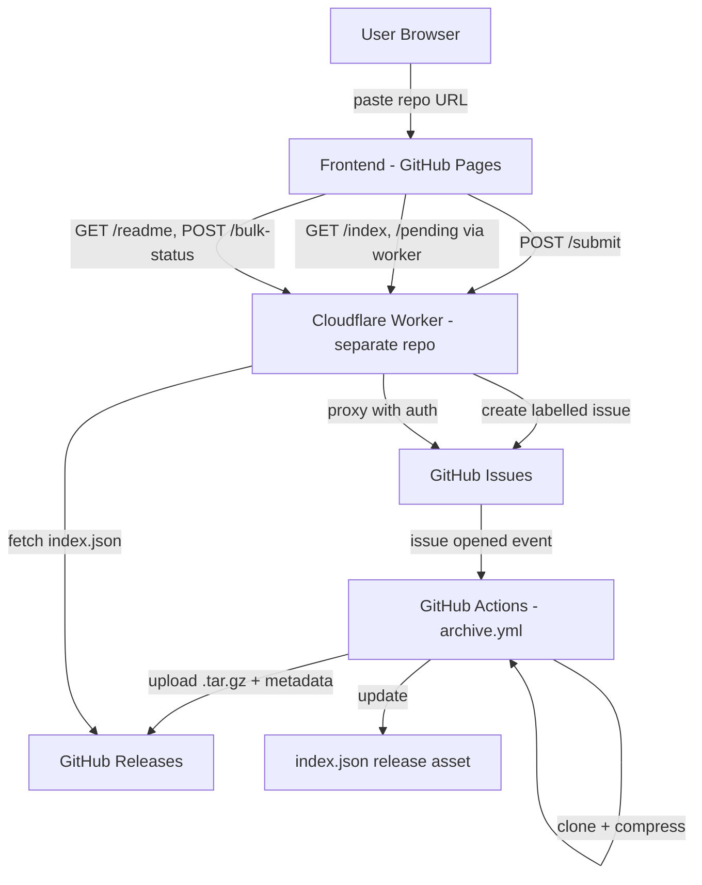

# Architecture

## System Overview

Git-Archiver Web is a serverless application with three independent tiers communicating through GitHub's API and a single shared `index.json` manifest. The Cloudflare Worker API lives in a separate repository ([Git-Archiver-Worker](https://github.com/Technical-1/Git-Archiver-Worker)); this repo is the frontend and the archive engine.



## Components

### Frontend (`frontend/`)
- **Purpose**: Static single-page app for submitting and browsing archives
- **Stack**: Vanilla JS (no framework, no build step), HTML, CSS
- **Hosting**: GitHub Pages, deployed via `pages.yml`
- **Key files**: `index.html`, `js/app.js` (UI logic + rendering), `js/api.js` (worker/GitHub client), `js/utils.js` (URL parsing, date and markdown helpers)
- **Tests**: `frontend/test/` — Vitest unit tests for the pure helpers, Playwright browser smoke tests under `test/e2e/`

### Cloudflare Worker (separate repo)
- **Purpose**: API proxy that keeps the GitHub token server-side and avoids CORS
- **Location**: [Git-Archiver-Worker](https://github.com/Technical-1/Git-Archiver-Worker)
- **Consumed endpoints**: `/submit`, `/bulk-submit`, `/index`, `/readme`, `/status`, `/bulk-status`, `/pending`

### Archive Engine (`.github/workflows/archive.yml`)
- **Purpose**: Clone, compress, and publish repository snapshots
- **Trigger**: GitHub issue opened with the `archive-request` label
- **Output**: a GitHub Release per archive (`.tar.gz`, `metadata.json`, extracted `README.md`)

## Data Flow

1. User pastes a GitHub URL into the frontend
2. Frontend calls the worker's `/submit` endpoint
3. Worker validates, rate-limits, and creates a labelled GitHub issue
4. The issue triggers `archive.yml`
5. The workflow clones the repo, creates a `.tar.gz`, and publishes a Release
6. The workflow updates the master `index.json`
7. Frontend reads `index.json` and the pending queue (both proxied by the worker) to display archives, and resolves every visible repo's live source status in one batched `/bulk-status` call

## Key Architectural Decisions

### Issue-driven archive triggering
- **Context**: A static frontend needs to trigger server-side work without running a server
- **Decision**: The worker creates a labelled GitHub issue; GitHub Actions reacts to it
- **Rationale**: Free, auditable (each request is a visible issue), and decouples submission from processing. The alternative — a long-running backend — would defeat the zero-server goal.

### Worker as token proxy in its own repo
- **Context**: The GitHub token must never reach the browser, GitHub's API has CORS restrictions, and the backend has a deploy lifecycle independent of the static site
- **Decision**: Route all authenticated GitHub calls through a Cloudflare Worker, kept in a separate repository with its own CI
- **Rationale**: Keeps secrets server-side, raises the effective rate limit from 60/hr to 5,000/hr, centralizes caching, and lets the worker deploy on its own cadence without touching the Pages deploy

### Shell-injection-safe workflow interpolation
- **Context**: `archive.yml` consumes an attacker-controlled repository description from the GitHub API
- **Decision**: Pass untrusted values through `env:` and reference them as quoted shell variables, never inlining `${{ }}` expressions inside `run:` blocks; write multi-line step outputs with a heredoc delimiter
- **Rationale**: A description containing shell metacharacters would otherwise execute arbitrary code on the runner with a write-scoped token. A regression test (`scripts/test/ci-injection.test.sh`) locks the behaviour in.

### GitHub Releases as storage
- **Context**: Needed durable, free storage for potentially large `.tar.gz` files plus a single queryable manifest
- **Decision**: Store each archive as a GitHub Release with assets, and keep one `index` release holding the master `index.json`
- **Rationale**: Free, durable, CDN-backed, each release independently addressable, and the single index asset is cheap to fetch and filter client-side
```