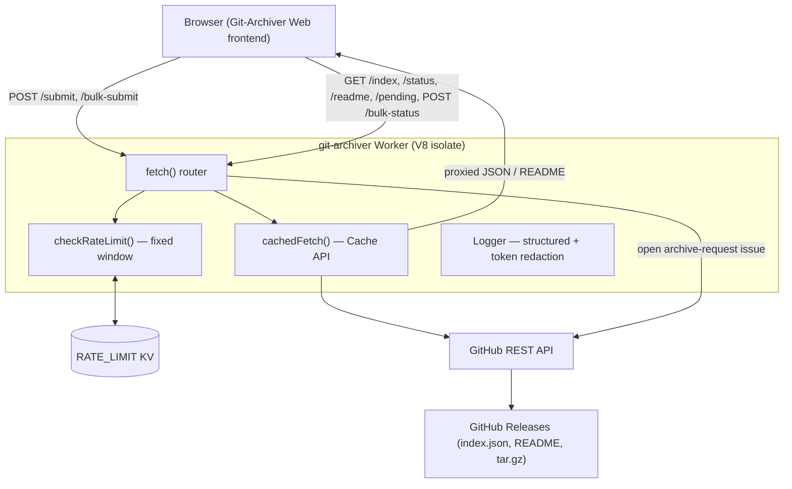

# Architecture

## System Diagram



## Component Descriptions

### Request router
- **Purpose**: Single entry point that dispatches each method+path to a handler and stamps every response with an `X-Request-ID`.
- **Location**: `src/index.js` — `export default { fetch }`
- **Key responsibilities**: CORS preflight, routing the 8 endpoints, uniform error/404 handling, request-scoped logging.

### Rate limiter
- **Purpose**: Per-IP, per-endpoint abuse protection backed by Cloudflare KV.
- **Location**: `src/index.js` — `checkRateLimit()`
- **Key responsibilities**: Fixed-window counting keyed on `rate:{endpoint}:{ip}:{windowId}`; emits `X-RateLimit-*` headers; **fails closed** (denies) on KV outage for write/abuse-sensitive endpoints.

### Cached fetch
- **Purpose**: Cut GitHub API calls and dodge browser CORS on Release-asset redirects.
- **Location**: `src/index.js` — `cachedFetch()`
- **Key responsibilities**: Reads from the Cloudflare Cache API, fetches on miss, re-caches with an allowlisted header set, and defers the write with `ctx.waitUntil()` so it survives isolate teardown.

### Status helper
- **Purpose**: Resolve whether a source repo is still public / archived / deleted / DMCA'd.
- **Location**: `src/index.js` — `getRepoStatus()`, shared by `/status` (single) and `/bulk-status` (batched).

### Logger
- **Purpose**: Structured JSON logs that never leak secrets.
- **Location**: `src/index.js` — `Logger` class
- **Key responsibilities**: Redacts `ghp_`/`gho_`/bearer tokens and sensitive keys, truncates to bound log-injection.

## Data Flow

1. A visitor submits a repo URL on the frontend; the browser calls `POST /submit`.
2. The worker rate-limits the IP, validates the URL against GitHub naming rules, and verifies the repo exists, is public, and is under the size cap via the GitHub API (using the server-side token).
3. It checks for an existing open request (exact owner/repo match) and a same-day release to avoid duplicates, then opens a labelled `archive-request` issue — which triggers the archive workflow in the companion repo.
4. Read traffic (`/index`, `/readme`, `/status`, `/pending`, `/bulk-status`) is served through the authenticated, cached proxy so the browser never hits GitHub directly and never sees the token.

## External Integrations

| Service | Purpose | Notes |
|---------|---------|-------|
| GitHub REST API | Repo validation, issue creation, Release/asset reads | Authenticated with a server-side PAT; raises the effective limit from 60/hr (anon) to 5,000/hr |
| Cloudflare KV (`RATE_LIMIT`) | Distributed per-IP rate-limit counters | Fixed-window; TTL = window + buffer; fail-closed on error |
| Cloudflare Cache API | Response caching for read endpoints | Per-endpoint TTL; deferred writes via `ctx.waitUntil` |

## Key Architectural Decisions

### Worker as a token-holding proxy, not a direct client
- **Context**: The frontend is a static site with no backend; calling GitHub directly from the browser is unauthenticated (60 req/hr/IP) and exposes any token.
- **Decision**: Route all GitHub access through the worker, which holds the PAT as a Cloudflare secret.
- **Rationale**: Keeps the credential off the client, lifts the rate ceiling to 5,000/hr, and centralizes caching/validation. The cost is one extra hop, paid back by cache hits.

### Batched `/bulk-status` instead of one request per card
- **Context**: The archive listing renders up to 50 cards, each needing a live source-status badge. One `/status` call per card blows the 30/min limit and ~20 badges silently fail.
- **Decision**: A single `POST /bulk-status` resolves many repos in one rate-limited request, fanning out internally with `Promise.all`.
- **Rationale**: Turns 50 metered calls into 1, so a full render stays well under budget. `getRepoStatus()` is shared with the single-repo path to avoid divergence.

### Fail-closed rate limiting, fail-open duplicate checks
- **Context**: KV can be briefly unavailable. Different endpoints have opposite "safe" defaults under uncertainty.
- **Decision**: When KV errors, rate limiting **denies** (prevents abuse during an outage); duplicate/pre-existing-request checks **allow** (a rare duplicate beats blocking every legitimate submit).
- **Rationale**: The safe failure mode depends on what the check protects — abuse vs. availability — so the two are deliberately opposite.

### Exact owner/repo matching for duplicate detection
- **Context**: A naive substring match treats `foo/bar` as already-queued when `foo/bar-baz` is in the queue.
- **Decision**: Parse the canonical `url:` line from the issue body (falling back to the title) and compare the exact owner/repo pair.
- **Rationale**: Eliminates prefix-collision false positives that would wrongly reject valid submissions.

### Deferred cache writes with `ctx.waitUntil`
- **Context**: A fire-and-forget `cache.put()` can be dropped when the isolate is torn down right after the response returns, making the cache unreliable.
- **Decision**: Wrap the put in `ctx.waitUntil()` so the runtime keeps the isolate alive until the write completes.
- **Rationale**: Restores the intended cache-hit rate at no latency cost to the response.
```