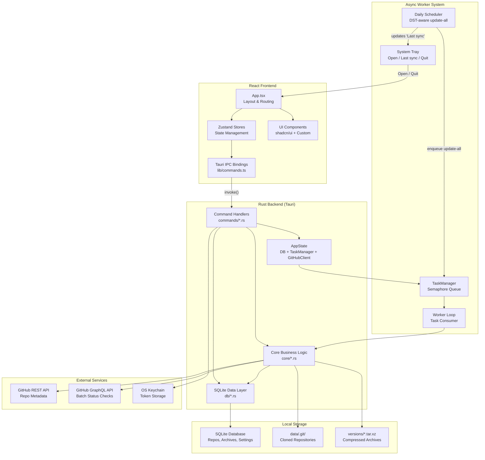
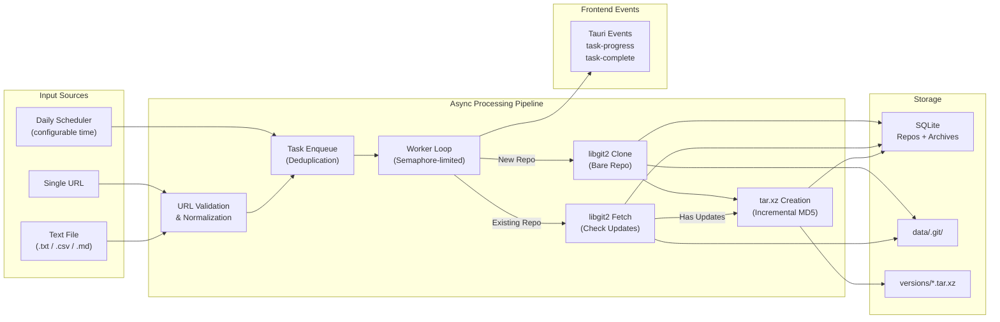
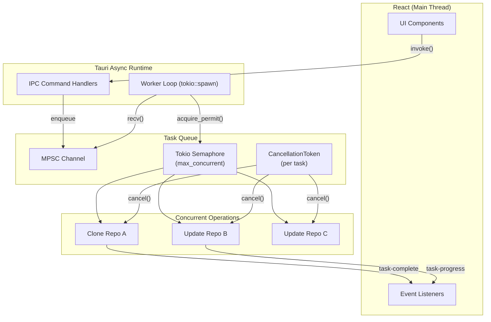

# Git Archiver Architecture

## System Overview



## Data Flow Architecture



## Component Responsibilities

### Rust Backend

#### Command Handlers (`commands/`)
- **`repos.rs`**: Add, list, delete repositories. Bulk import from `.txt` / `.csv` / `.md` files. Import path is canonicalized and constrained to the user's home directory with an extension allowlist to block renderer-coerced reads of arbitrary files.
- **`tasks.rs`**: Enqueue clone/update tasks via TaskManager. Update-all triggers batch processing. Stop-all cancels in-flight tasks via per-task cancellation tokens.
- **`archives.rs`**: List archives for a repository, extract to a target directory, delete individual archives, and pull README text from either the current bare clone or a stored archive for the in-app README viewer.
- **`settings.rs`**: Load/save app settings (data directory, concurrency, daily sync time). Manage GitHub token via OS keychain. Check API rate limits. Pushes new sync times into the scheduler via a `tokio::watch` channel so changes apply without restart.

#### Core Business Logic (`core/`)
- **`git.rs`**: Clone and fetch operations using libgit2. Bare repository support with credential callbacks for authenticated access.
- **`github_api.rs`**: REST API for individual repo info. GraphQL batch queries for up to 100 repos per request. Rate limit checking. Input sanitization against GraphQL injection.
- **`archive.rs`**: Create/extract `.tar.xz` archives. Incremental archives using file hash comparison. Tar-slip path traversal protection on extraction.
- **`hasher.rs`**: MD5 directory hashing for incremental archive detection. Excludes `.git/` directories.
- **`task_manager.rs`**: MPSC channel-based task queue with tokio semaphore for concurrency control. Per-task cancellation tokens. Deduplication prevents duplicate clone/update operations.
- **`worker.rs`**: Long-running async loop that consumes tasks from the channel. Acquires semaphore permits, executes operations, emits Tauri events for frontend progress updates. Health-checks an existing bare clone before reuse so a corrupt local directory falls back to a fresh clone instead of failing fetches.
- **`scheduler.rs`**: DST-aware daily scheduler using `tokio::select!` over a sleep timer and a `watch::Receiver<Option<NaiveTime>>`. Handles spring-forward gaps by shifting forward one hour and fall-back ambiguity by picking the earlier instant; sleeps until the next firing or wakes immediately when the user changes the sync time.
- **`url.rs`**: GitHub URL validation, normalization (lowercase, strip trailing slash/`.git`), and owner/repo extraction. Rejects percent-encoded path traversal attempts.

#### Database Layer (`db/`)
- **`migrations.rs`**: Schema versioning with incremental migrations. Creates repos, archives, file_hashes, and settings tables.
- **`repos.rs`**: CRUD operations for repositories with status filtering and metadata updates.
- **`archives.rs`**: Archive record management with cascade delete when repos are removed.
- **`file_hashes.rs`**: Per-repo file hash storage for incremental archive diffing.
- **`settings.rs`**: Key-value settings with allowlist validation.

### React Frontend

#### State Management (`stores/`)
- **Zustand stores**: Centralized state for repositories, archives, settings, and UI preferences. Async actions call Tauri IPC commands.

#### Key Components
- **`repo-table/`**: TanStack Table-based repository list with column sorting, status filtering, row selection, and context menu actions.
- **`add-repo-bar.tsx`**: URL input with single-add and bulk import (file picker) support.
- **`activity-log.tsx`**: Scrollable log that listens to Tauri events for real-time operation feedback.
- **`status-bar.tsx`**: Displays active task count and GitHub API rate limit status.
- **`onboarding-tour.tsx`**: React Joyride wrapper that runs a first-launch spotlight tour over real DOM targets (`data-tour-id` attributes on the add bar, settings cog, and row actions). State persisted via a dedicated Zustand `tour-store`.
- **`dialogs/`**: Settings dialog (data directory, concurrency, daily sync time, GitHub token, "Show tutorial again"), archive viewer with extract/delete, and README viewer for both live clones and archived snapshots.

## Key Architecture Decisions

### 1. Rust/Tauri Rewrite (v2.0.0)
The original Python/PyQt5 application was rewritten in Rust with a Tauri v2 shell and React frontend. This provides native performance, cross-platform binaries (~5-7MB), built-in auto-updater, and OS keychain integration. The trade-off was increased development complexity, but the result is a significantly more robust and distributable application.

### 2. SQLite over JSON
The v1.x app used a JSON file as its database, which was prone to corruption and required manual recovery tools. SQLite provides ACID transactions, proper schema migrations, cascade deletes, and concurrent-safe access without any of those issues.

### 3. libgit2 over Git CLI
Using `git2` (Rust bindings for libgit2) instead of shelling out to `git` CLI eliminates the external dependency, provides better error handling, and enables credential callbacks for token-based authentication without environment variable manipulation.

### 4. Async Task Queue with Semaphore
Rather than spawning unbounded threads, the worker system uses a tokio semaphore to limit concurrent operations (configurable 1-10). Tasks flow through an MPSC channel with deduplication, and each task gets a cancellation token for graceful stop-all support.

### 5. Incremental Archives with MD5 Hashing
Carried over from v1.x — each archive stores MD5 hashes of all files in the database. Subsequent archives only include changed files, achieving 70-90% space savings for frequently updated repositories.

### 6. OS Keychain for Token Storage
GitHub tokens are stored in the OS keychain (macOS Keychain, Windows Credential Manager, Linux Secret Service) via the `keyring` crate, rather than in a plaintext config file. This is both more secure and follows platform conventions.

### 7. Stay-Resident Tray App Instead of Quit-on-Close
Closing the window calls `api.prevent_close()` and hides the window instead of quitting; on macOS the activation policy flips to `Accessory` so the dock icon disappears. The system tray menu becomes the persistent surface, with a live "Last sync: …" item updated by the scheduler. The trade-off was added complexity (a custom exit path for the tray Quit item, since the global `ExitRequested` handler unconditionally prevents exit), but for an archive tool that needs to fire scheduled syncs in the background, requiring the user to keep the window open would defeat the purpose.

### 8. DST-Aware Daily Scheduler Using `tokio::select!` and `watch`
The daily auto-sync needed two properties that a naive `sleep_until` loop can't provide: instant reactivity when the user changes the sync time, and correct behavior across DST transitions. The implementation uses `tokio::select!` to race a `sleep` against a `watch::Receiver`, so settings changes preempt the sleep and reschedule. DST is handled explicitly in `local_naive_to_instant`: ambiguous fall-back times pick the earlier instant (so a 1:30 sync fires once), and nonexistent spring-forward times shift forward by one hour into the post-gap zone.

### 9. Statically Linked liblzma for macOS Hardened Runtime
Notarized macOS builds with Hardened Runtime can't load the dynamic `liblzma.dylib` shipped by Homebrew (the OS resolver rejects the unsigned dylib at runtime). The fix was `xz2 = { version = "0.1", features = ["static"] }`, which compiles liblzma into the binary instead of linking dynamically. This trades a slightly larger binary for an archive feature that actually works on signed, distributed builds.

## Concurrency Model



## Database Schema

```
repos: id, url, owner, name, status, description, is_private, local_path, last_cloned, last_updated, created_at
archives: id, repo_id (FK), file_path, file_size, file_count, archive_type, created_at
file_hashes: id, repo_id (FK), file_path, hash, updated_at
settings: key, value
```

Settings keys are allowlisted in `db/settings.rs`: `data_dir`, `archive_format`, `max_concurrent_tasks`, and `sync_time` (HH:MM string or null). The GitHub token is deliberately not a settings row — it lives in the OS keychain instead.
