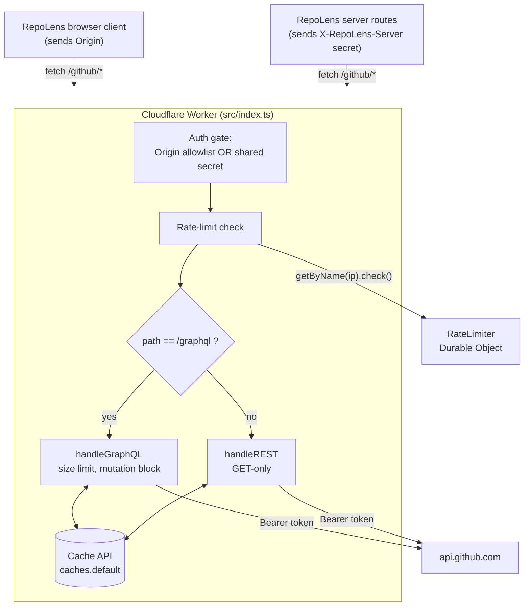

# Architecture

## System Diagram

## Component Descriptions

### Worker entry / router
- **Purpose**: Single fetch handler that authenticates, rate-limits, routes, and proxies every request to GitHub with a server-held token.
- **Location**: `src/index.ts`
- **Key responsibilities**: CORS preflight, origin allowlist vs. shared-secret auth, per-IP rate-limit invocation, REST/GraphQL dispatch, response shaping (CORS headers re-applied per request, `X-Cache`/`X-RateLimit-Remaining`).

### RateLimiter Durable Object
- **Purpose**: A single, globally authoritative request counter per client IP.
- **Location**: `src/rate-limiter.ts`
- **Key responsibilities**: `check()` performs an atomic read-modify-write of an in-memory counter (hydrated from storage in the constructor), persists it, and sets an alarm at the window's end; `alarm()` deletes the IP's storage so idle clients leave no footprint.

### Response cache
- **Purpose**: Cut GitHub API calls and latency for repeated reads.
- **Location**: `caches.default` usage in `src/index.ts` (`readFromCache`/`writeToCache`)
- **Key responsibilities**: Stores upstream JSON keyed by a synthetic GET URL; CORS headers are deliberately *not* cached and are re-applied per request so one cached entry serves any allowed origin.

## Data Flow

1. A request hits `/github/...`. `OPTIONS` is answered immediately for allowed origins.
2. The worker authorizes the request: an allowlisted `Origin` (browser) **or** a constant-time match on the `X-RepoLens-Server` shared secret (server callers with no Origin).
3. `RATE_LIMITER.getByName(clientIP).check()` increments the per-IP counter; over the limit returns `429` with `Retry-After`.
4. The path routes to `handleGraphQL` (POST only, size-limited, mutations rejected) or `handleREST` (GET only).
5. On a cache hit, the stored body is returned with fresh CORS headers. On a miss, the worker calls GitHub with the `Bearer` token, caches a successful response off the critical path via `ctx.waitUntil`, and returns it.

## External Integrations

| Service | Purpose | Notes |
|---------|---------|-------|
| GitHub REST + GraphQL API | The upstream the proxy fronts | Authenticated with a read-only PAT held as a Worker secret; 5,000 req/hr |
| Cloudflare Durable Objects | Per-IP rate-limit state | SQLite-backed class; deterministic routing via `getByName` |
| Cloudflare Cache API | Edge response caching | `Cache-Control: max-age=300`; self-expiring |

## Key Architectural Decisions

### Durable Object for rate limiting, not an in-memory Map
- **Context**: Workers run across many short-lived V8 isolates worldwide; module-level state is per-isolate and ephemeral.
- **Decision**: Route each IP to one `RateLimiter` Durable Object via `getByName(ip)` and keep the counter there.
- **Rationale**: A per-isolate `Map` gives every isolate its own near-zero counter, so a global cap is trivially bypassed and cache hit rates are erratic. A Durable Object is single-threaded and globally addressable, so the read-modify-write is atomic and the limit is actually enforced. KV was rejected for the counter because its eventual consistency lets bursts slip through.

### Cache API for responses, with CORS kept out of the cache
- **Context**: Cached entries must be reusable across different allowed origins, but `Access-Control-Allow-Origin` is per-request.
- **Decision**: Cache only the upstream payload (plus `Link`), and re-apply CORS headers when serving.
- **Rationale**: Baking the requesting origin into the cached response would either leak the wrong origin or force a separate cache entry per origin. Storing the origin-agnostic body keeps one entry valid for every caller.

### Two auth paths: origin allowlist and a server shared secret
- **Context**: Browser callers send an `Origin`; server-side callers (SSR routes, OG image generation) send none, so CORS alone can't authorize them.
- **Decision**: Allow either an allowlisted `Origin` or a `crypto.subtle.timingSafeEqual` match on a secret header, with the secret stored as a Worker secret.
- **Rationale**: A hardcoded secret would ship in any client that imports it and defeats the allowlist entirely; a Worker secret compared in constant time keeps server access gated without a timing side-channel.

### Read-only enforced at the edge, not just by token scope
- **Context**: The product only ever reads public data, but a permissive proxy could be abused to reach other endpoints or mutations.
- **Decision**: Restrict REST to `GET`, reject GraphQL `mutation` operations, and cap GraphQL body size before parsing.
- **Rationale**: Enforcing read-only in the worker holds even if the upstream token's scope is ever widened, and validating size before parsing closes a cheap memory-exhaustion vector.
