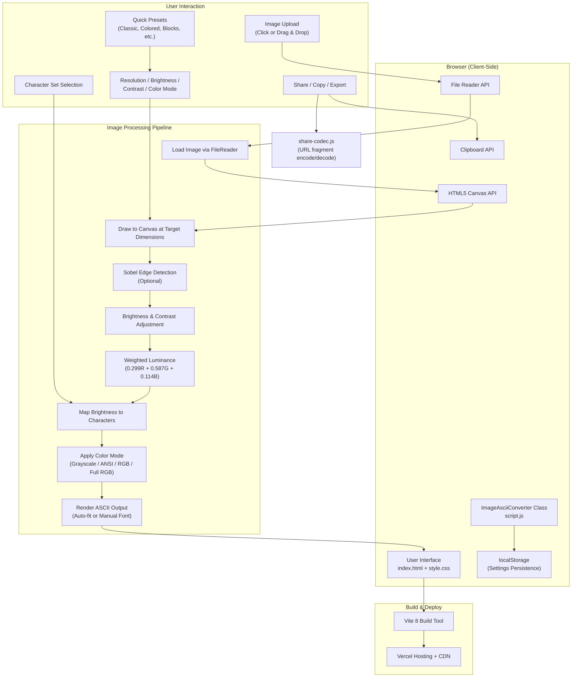
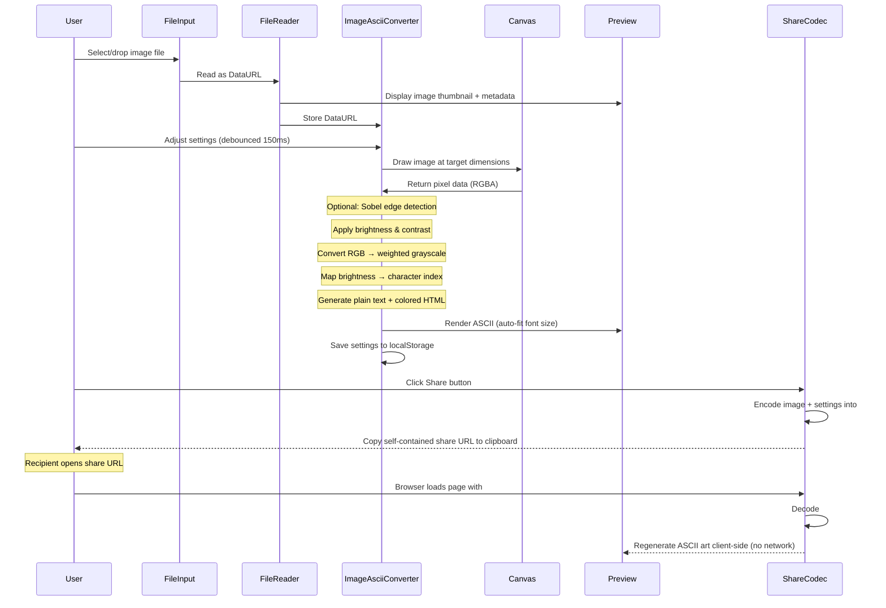

# Architecture Overview

## System Diagram

## Data Flow

## Component Descriptions

### ImageAsciiConverter Class (`src/script.js`)
- **Purpose**: Stateful UI orchestrator — owns the current image, settings, caches, and all DOM event wiring, and delegates the heavy lifting to the pure modules below
- **Key responsibilities**: File upload handling and validation, debounced conversion with ordering guards, auto-fit font sizing, settings persistence via localStorage, and wiring the share/copy/export controls
- **Pattern**: A single stateful class around DOM-free function modules (the same pattern `ascii-core.js` established), so each concern is independently testable

### Image Processor (`src/image-processor.js`)
- **Purpose**: Pure image→ASCII compute, lifted out of the UI class so it is unit-testable directly
- **Key responsibilities**: Draw the decoded image to the canvas at the clamped target size and read back pixels (`drawToImageData`), and convert an RGBA buffer to `{ text, html, colors }` (`pixelsToAscii`) including the color-budget grayscale fallback; owns the character-set table

### Export Manager (`src/export-manager.js`)
- **Purpose**: Build downloadable artifacts from a converted result
- **Key responsibilities**: TXT and standalone-HTML blobs, the PNG canvas (with the per-cell advance model so non-monospace charsets don't overflow, and the browser canvas-size guard), and the deferred-revoke download helper

### Share Manager (`src/share-manager.js`)
- **Purpose**: Construct the self-contained share URL
- **Key responsibilities**: Combine origin/path with the `share-codec` payload into the `#s=` link; clipboard and button UX stay in the orchestrator

### UI Manager (`src/ui-manager.js`)
- **Purpose**: Pure create-mode markup builder plus the style presets
- **Key responsibilities**: Return the create-mode HTML string from the current settings (no DOM access, so the markup is assertable in tests) and own the `PRESETS` table

### Share Codec (`src/share-codec.js`)
- **Purpose**: Client-side encode/decode of share payloads into URL fragments (`#s=`)
- **Key responsibilities**: Encode downscaled image + settings into a base64url URL fragment, decode and validate incoming `#s=` fragments, drive view-mode entry when a share link is opened

### ASCII Core (`src/ascii-core.js`)
- **Purpose**: Pure, DOM-free conversion algorithms — the same code the test suite imports, so a regression in the production hot path fails the unit tests
- **Key responsibilities**: Brightness/contrast adjustment, weighted luminance, character ramp mapping, ANSI 256-color quantization, Sobel edge detection, pure HTML escape (avoids per-character DOM allocations on the color-render hot path), and three shared cell helpers — `prepareGlyphs` (grapheme-aware ramp), `colorCellStyle` (the single source of truth for a cell's color, consumed by both the on-screen `` and the PNG-export color buffer), and `lineToCells` (grapheme-aware split that keeps emoji whole and colors column-aligned during PNG export)

### Settings Schema (`src/settings-schema.js`)
- **Purpose**: Authoritative settings schema, defaults, and validation/clamping
- **Key responsibilities**: Define all setting keys with types and bounds, clamp/validate values from localStorage or share payloads, used by both main converter and share codec. Also owns the cross-cutting render-budget guards: `MAX_DIMENSION` (canvas clamp) and `MAX_COLOR_CELLS` / `isColorRenderTractable` (per-pixel-`` cell budget)

### Main Entry (`index.html`)
- **Purpose**: HTML shell with critical inline CSS for loading state, loads `script.js` as ES module
- **Key responsibilities**: Provides `#app` mount point, shows loading spinner during module load

### Styles (`src/style.css`)
- **Purpose**: Full application layout and component styling
- **Key responsibilities**: Sidebar + main content flexbox layout, dark theme with CSS variables, responsive breakpoints at 900px and 480px, custom scrollbar and range input styling

## Key Architectural Decisions

### 1. Client-Side Image Processing
I chose to implement all image processing entirely in the browser using the HTML5 Canvas API.
- **Privacy**: User images never leave their device
- **Performance**: No network latency for conversions; results appear instantly
- **Cost**: No server infrastructure for the core conversion
- **Simplicity**: The conversion logic is self-contained in a single class

### 2. Client-Side URL Sharing
Sharing is entirely client-side via URL fragment encoding (`#s=`). The downscaled image and settings are encoded into a self-contained URL; opening the link regenerates the ASCII art without any network request. This removes server costs, eliminates share expiry, and works offline.

### 3. Class-Based State Management
I encapsulated all application state in the `ImageAsciiConverter` class with localStorage persistence. This avoids framework dependencies while keeping state organized and recoverable across sessions.

### 4. No Framework Dependency
I deliberately avoided React, Vue, or other frameworks because:
- The application has a single view with manageable complexity
- The final JavaScript bundle stays extremely lightweight
- Anyone can read and modify the code without framework knowledge

### 5. Debounced Real-Time Updates
I implemented a 150ms debounce on all setting changes to balance responsiveness with performance. This prevents excessive re-renders during rapid slider movements while keeping the feel interactive.

### 6. Dual Color Output Pipeline With a Single Color Source of Truth
The converter generates both plain text and colored HTML in a single pass. This enables:
- Grayscale mode using `textContent` (fast, no DOM overhead)
- Color modes using per-character `` elements with inline styles
- Export functions can choose the appropriate format without re-conversion

The on-screen renderer and the PNG exporter are two independent consumers of the conversion result, and they used to re-derive each cell's color separately — which let them disagree (ANSI mode showed the quantized 6×6×6 cube color on screen but exported the raw pixel RGB, and the PNG exporter indexed text by UTF-16 code unit so emoji custom charsets split and their colors misaligned). Both paths now read one `colorCellStyle()` result per cell and iterate glyphs through one grapheme-aware `lineToCells()` helper, so the preview and the exported PNG are guaranteed identical by construction rather than by two code paths happening to agree.

A 500k-cell budget (`MAX_COLOR_CELLS`) guards the per-character `` path: above the budget, both the HTML build in `pixelsToAscii` and the render step in `renderAscii` fall back to text-only output with a one-shot toast. This prevents the 4M-node DOM (~150 MB) that 2000×2000 color rendering would otherwise produce from OOMing mobile Safari.

### 7. Auto-Fit Font Sizing
Rather than requiring users to manually set font sizes, the "Fit to Container" mode calculates the optimal font size based on the viewport dimensions and ASCII grid size. This ensures the output always fills the available space.

### 8. Ordering Guarantees for an Async, Debounced Pipeline
Conversion is async (it awaits an image decode) and is driven by debounced slider input, so a newer conversion can start before an older one finishes. Without a guard, a slow earlier decode can resolve *after* a faster later one and overwrite the fresh output with stale art. Each run captures a monotonic `_convertToken` and bails after the await if a newer run has superseded it — the same pattern the upload path uses to drop late `FileReader`/`Image` callbacks. Separately, every debounce used to re-decode the full-resolution source (up to the 50 MB upload limit) before drawing the small ASCII canvas; `_getDecodedImage` now caches the decoded `Image` keyed by its data URL, so re-decoding happens only when the source image actually changes.

### 9. Focused Modules Around a Stateful Orchestrator
The conversion, export, share-URL, and markup logic started life inside one large class. I split them into DOM-free function modules (`image-processor.js`, `export-manager.js`, `share-manager.js`, `ui-manager.js`) following the pattern `ascii-core.js` already set, leaving `ImageAsciiConverter` as a thin stateful orchestrator that owns the image, settings, caches, and event wiring.
- **Testability**: `pixelsToAscii` is now imported and asserted directly instead of being reachable only through the DOM. The orchestrator itself gained jsdom characterization tests (settings restore, view-mode share decoding, the convert pipeline, and the export-button enable/disable lifecycle) backed by a small canvas stub — the UI layer had no automated coverage before
- **Boundaries**: Each module takes explicit arguments and returns plain data (blobs, a `{ text, html, colors }` object, a URL string), so the orchestrator stays the single owner of state and DOM

### 10. Validating Uploads at the Boundary
The upload path accepts raster images and rejects SVG up front — it has no reliable intrinsic raster size and is a known canvas/`Image()` attack surface, and the share codec already excludes it, so the two boundaries now match. It also rejects any decode that reports zero intrinsic dimensions before showing a success state, so a malformed file fails with one clear message instead of a misleading "loaded" toast followed by a draw-time error. Custom character sets are capped by code point rather than UTF-16 code unit, so the cap can never truncate mid-emoji and leave a broken half-glyph.

## Component Responsibilities

| Component | Responsibility |
|-----------|---------------|
| `index.html` | Entry point, critical CSS, loading state |
| `src/script.js` | ImageAsciiConverter — stateful UI orchestrator |
| `src/image-processor.js` | Canvas draw + `pixelsToAscii` ({text, html, colors}); charset table |
| `src/export-manager.js` | TXT / HTML / PNG artifact builders + download helper |
| `src/share-manager.js` | Builds the `#s=` share URL |
| `src/ui-manager.js` | Create-mode markup builder + style presets |
| `src/ascii-core.js` | Pure conversion algorithms (shared with the test suite) |
| `src/share-codec.js` | URL share payload codec (encode/decode `#s=` fragment) |
| `src/settings-schema.js` | Settings schema, defaults, clamp/validate, render-budget constants |
| `src/style.css` | Layout, theming, responsive design |
| `vite.config.js` | Build configuration, asset handling |
| `vercel.json` | Deployment settings, CSP/security headers |

## Limitations

- **Large images**: Very high-resolution source images may cause brief processing delays during initial load
- **Color mode performance**: RGB/Full RGB/ANSI modes generate a `` per character. Above the 500k-cell budget (`MAX_COLOR_CELLS` in `settings-schema.js`), the renderer falls back to grayscale text and shows a one-shot toast — without this guard, a 2000×2000 color grid would allocate ~4M DOM nodes and OOM mobile Safari
- **Share URL length**: The encoder caps the `#s=` fragment at ~2 MB so it remains pasteable in browser address bars and most chat apps. Very high-resolution shares that would exceed the cap fail with a toast prompting the user to lower the resolution slider before retrying
- **PNG export size**: Browser canvases have a per-dimension maximum (~32000 px). At very high grid resolutions combined with large fonts, the PNG export refuses upfront with a toast that names the two settings the user can lower (resolution / font size) instead of failing silently
- **No animation**: GIF files extract a single frame only
- **Mobile typing**: Custom character input can be awkward on mobile keyboards
