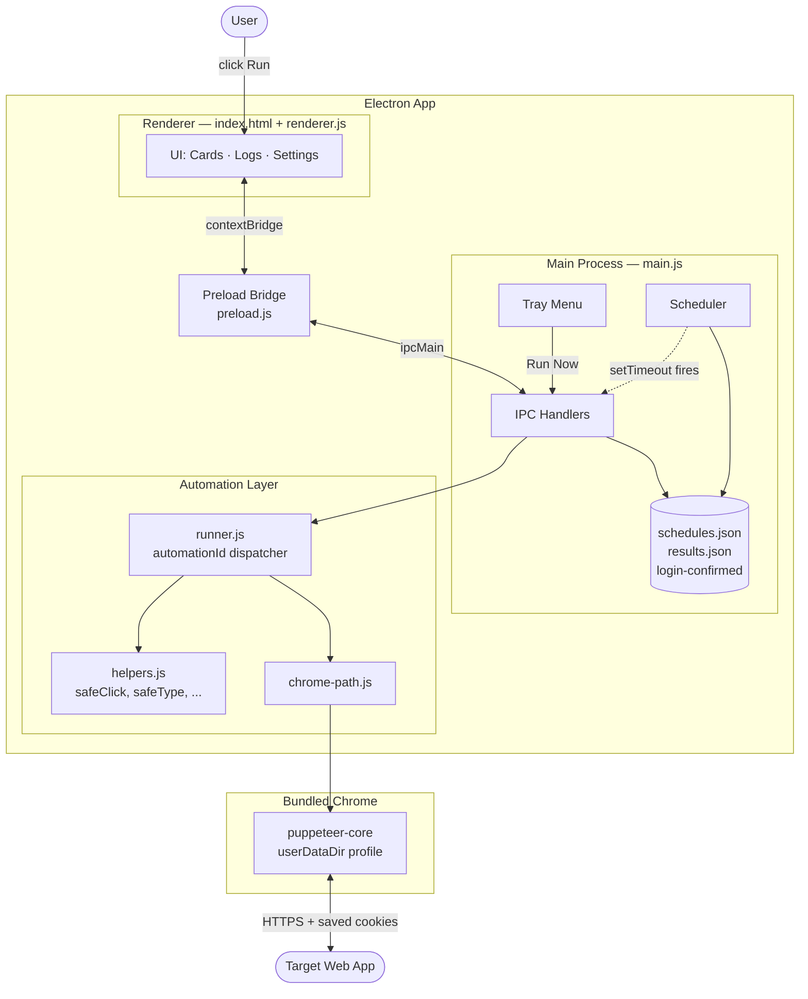

# Architecture

## System Diagram

## Component Descriptions

### Main process (`main.js`)
- **Purpose**: Owns the OS-level surface — windows, tray icon, notifications, scheduling, and persistence
- **Location**: `main.js`
- **Key responsibilities**:
  - Creates the `BrowserWindow` with `contextIsolation: true` and `nodeIntegration: false`
  - Builds the tray menu showing each automation's next-run time and last result
  - Holds the `setTimeout` handles for all scheduled runs (rebuilt at startup from `schedules.json`)
  - Implements all `ipcMain.handle` endpoints (run, schedule CRUD, login flow, screenshot dir picker, login data clearing)

### Renderer (`renderer.js` + `index.html`)
- **Purpose**: Stateless UI — talks to the main process exclusively through the preload bridge
- **Location**: `renderer.js`, `index.html`
- **Key responsibilities**:
  - Renders the three automation rows, settings panel, and live log stream
  - Renders three result card formats (status badge, count badges, weekly time-grid) depending on the automation's result shape
  - Subscribes to `automation-log` and `auth-required` IPC events for streaming logs and auth state changes

### Preload bridge (`preload.js`)
- **Purpose**: Whitelisted API exposed to the renderer via `contextBridge`
- **Location**: `preload.js`
- **Key responsibilities**: Hides `ipcRenderer` from the renderer's window scope; exposes one explicit function per IPC channel so the renderer never sees raw Node APIs

### Runner (`automation/runner.js`)
- **Purpose**: Dispatcher and Puppeteer lifecycle owner for the three automations
- **Location**: `automation/runner.js`
- **Key responsibilities**:
  - Looks up the automation by id in a `{ [automationId]: fn }` map
  - Launches `puppeteer-core` against the bundled Chrome binary with a persistent `userDataDir` so cookies survive between runs
  - Closes any extra pages the user-data-dir's restored session might bring along, leaving exactly one fresh tab
  - Catches a sentinel `AUTH_REQUIRED` error and propagates it to the main process, which deletes the login marker and tells the renderer to drop back to the login screen

### Helpers (`automation/helpers.js`)
- **Purpose**: A small site-agnostic Puppeteer toolkit so each automation reads as a sequence of intent-named steps
- **Location**: `automation/helpers.js`
- **Key responsibilities**: Five primitives — `safeClick`, `safeType`, `waitAndGet`, `screenshot`, `scroll` — each of which waits for the selector first and throws a useful error if it's missing. This is the API a new automation is meant to be written against.

### Chrome path resolver (`modules/chrome-path.js`)
- **Purpose**: Finds the correct Chrome binary in either dev or packaged mode without making the runner aware of where the app is installed
- **Location**: `modules/chrome-path.js`
- **Key responsibilities**:
  - In a packaged build, walks `process.resourcesPath/chrome/` looking for the platform-specific executable name (including macOS `.app` bundle traversal)
  - In dev mode, checks `chrome-local/` first then falls back to the Puppeteer cache dir
  - Returns `undefined` if nothing is found, letting the caller surface a clear error rather than silently launching the wrong browser

## Data Flow

A scheduled run, step by step:

1. App starts → `scheduleAllRuns()` reads `schedules.json` and creates a `setTimeout` per enabled automation, computing `next - now` ms from each schedule's `startDate`, `time`, and `recurrence`
2. The timer fires → `triggerRun(automationId, manual=false)` is called from the main process
3. `runner.run()` resolves the bundled Chrome path, calls `puppeteer.launch()` with `userDataDir` pointing at the app's user-data directory + `chrome-profile` subfolder
4. The dispatcher invokes the site-specific function which navigates, waits for selectors, scrapes the DOM, and either confirms an action or returns structured data
5. The result is written to `results.json` keyed by `automationId`
6. The tray menu rebuilds with the new status; a native `Notification` fires; the next `setTimeout` is scheduled

A manual run from the renderer is identical except the entry point is the `run-automation` IPC handler instead of a timer.

The login flow (`runLoginFlow`) is a separate path: launches Chrome **non-headless**, polls for the auth provider's sign-in input selector to disappear (signals login complete), waits for cookies to flush to disk, then writes the `login-confirmed` marker file.

## External Integrations

| Service | Purpose | Notes |
|---------|---------|-------|
| Chrome for Testing | Browser to drive | Pinned version downloaded by `scripts/download-chrome.js` and bundled into the installer via `electron-builder`'s `extraResources` |
| Apple notary service | macOS code-signing + notarization | Hooked into electron-builder's `afterSign` via `scripts/notarize.js`; credentials read from env (`APPLE_ID`, `APPLE_APP_SPECIFIC_PASSWORD`, `APPLE_TEAM_ID`) |
| GitHub Releases | Distribution channel | `.github/workflows/release.yml` builds Windows and Linux on tag push and uploads via `GH_TOKEN` |

## Key Architectural Decisions

### Bundling Chrome inside the installer instead of using system Chrome
- **Context**: The automations need a known browser version with deterministic DOM behavior. End users shouldn't have to install Chrome separately, and version drift between Puppeteer's expected build and whatever the user has installed produces silent breakage
- **Decision**: Ship a pinned Chrome for Testing build inside the app via `electron-builder`'s `extraResources`. `scripts/download-chrome.js` runs as a prebuild step and populates `chrome-local/<platform>/`
- **Rationale**: Increases installer size by ~150 MB but eliminates an entire class of "works on my machine" support burden. The alternative — depending on `puppeteer` proper, which downloads its own Chromium at install time — wouldn't work because that download isn't bundled by electron-builder, only the JS deps

### Single persistent `userDataDir` across all runs
- **Context**: Re-authenticating before every automation is a non-starter — half the value is that runs are fully unattended on a schedule. Cookies need to survive between Chrome launches
- **Decision**: Point Puppeteer's `userDataDir` at `app.getPath('userData')/chrome-profile`. All automations share this profile; the login flow writes a `login-confirmed` marker file separate from the cookies themselves
- **Rationale**: Chrome handles cookie persistence; we just have to give it a stable place to write. The marker file lets the UI distinguish "never logged in" from "session expired" — they look the same to Puppeteer (both land on the auth page) but only the latter needs the inline error path

### `setTimeout`-based scheduler instead of cron / OS task scheduler
- **Context**: We want recurring runs without asking the user to install crontab entries or learn launchd plists
- **Decision**: Schedule next run with `setTimeout` from the main process. `getNextRun` walks forward in `recurrence`-ms steps from `startDate` until it's in the future. Schedules persist to `schedules.json` so the timers are recreated at every startup
- **Rationale**: Trade-off accepted: this only fires when the app is running. The tray icon keeps the app resident so this is acceptable for the use case, and it avoids the much larger blast radius of installing OS-level scheduled tasks (which need elevated permissions on Windows and survive uninstall). Future versions could add an OS-scheduler escape hatch behind a flag if needed

### Detect expired sessions via a sentinel error from the runner
- **Context**: A scheduled headless run can't show a sign-in dialog. When cookies expire we need to bail cleanly and prompt re-login on the user's next interactive visit, not freeze on the sign-in page forever
- **Decision**: `runner.js` probes for the auth provider's sign-in field selector right after the initial page load. If present, it throws `Error('AUTH_REQUIRED: …')`. Main process catches the prefix, deletes the `login-confirmed` marker, emits an `auth-required` IPC event, and surfaces the window
- **Rationale**: A clean sentinel-error pattern beats trying to model auth state across IPC. The runner stays stateless; the only thing the main process has to know is "did the error message start with AUTH_REQUIRED?"

### Site-agnostic helper layer between Puppeteer and the automations
- **Context**: Each automation needs to wait-for-then-click, wait-for-then-type, take screenshots, etc. Inlining `page.waitForSelector` + `page.click` + try/catch into every step turns the automations into noise
- **Decision**: `automation/helpers.js` exposes five primitives that each (a) wait for the selector with a default 15s timeout, (b) re-throw a clear "selector not found: X" error, (c) accept an opts bag for overrides. The automations read as a list of named intent steps with no try/catch
- **Rationale**: Honest scope — these aren't a "framework," they're the obvious refactor of the five operations that show up in every automation. Anything more exotic is straight Puppeteer because the `page` is passed through to the automation function

### Two-process Electron with a context-bridge whitelist
- **Context**: The renderer renders user-uploaded data (log lines, scraped results) and writes to disk indirectly through IPC. A misstep here is a remote-code-execution vector
- **Decision**: `contextIsolation: true`, `nodeIntegration: false`, and `preload.js` exposes exactly the IPC channels the renderer needs as named methods on a `window.api` object. CSP header pinned to `default-src 'self'`
- **Rationale**: Standard Electron hardening, but it constrained the design in useful ways — every renderer→main interaction is an explicit IPC channel that I'd had to think about
