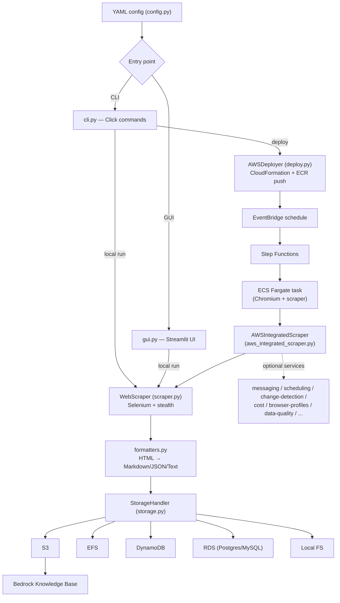

# Architecture

## System Diagram

## Component Descriptions

### Core scraper
- **Purpose**: Fetch pages with a real browser, defeat bot detection, and convert HTML to clean text/Markdown.
- **Location**: `kendra_who/scraper.py` (`WebScraper`)
- **Key responsibilities**: Selenium/Chromium driver setup with stealth fingerprinting, breadth-first crawl with per-URL depth tracking, content extraction, and output handoff to the formatters.

### Configuration
- **Purpose**: Single typed source of truth for a scrape job.
- **Location**: `kendra_who/config.py` (`Config` dataclasses)
- **Key responsibilities**: Parse and validate YAML, model crawler/auth/storage/scheduling/AWS sections, and apply CLI overrides.

### Storage layer
- **Purpose**: Persist scraped content to whichever backend a deployment uses, behind one interface.
- **Location**: `kendra_who/storage.py` (`StorageHandler` + `Local`/`S3`/`EFS`/`DynamoDB`/`RDS` handlers, `get_storage_handler` factory)
- **Key responsibilities**: A uniform `save`/`save_json`/`save_structured` contract, byte-accurate writes for binary files, identifier-safe SQL for the RDS backend, and connection lifecycle management.

### AWS orchestrator
- **Purpose**: Run a scrape with the full set of AWS integrations when deployed.
- **Location**: `kendra_who/aws_integrated_scraper.py` (`AWSIntegratedScraper`)
- **Key responsibilities**: Wrap `WebScraper`, then conditionally wire in ~14 optional services (messaging, scheduling, change detection, cost tracking, data quality, browser profiles, and more), each gated on configuration.

### Deployment
- **Purpose**: Stand up the serverless pipeline in an AWS account.
- **Location**: `kendra_who/deploy.py` (`AWSDeployer`)
- **Key responsibilities**: Build and push the container image to ECR, create the CloudFormation stack (ECS cluster/task, S3, Step Functions, EventBridge, SNS, IAM), and manage status/logs/teardown.

### Interfaces
- **Purpose**: Let users drive the tool by command line or visually.
- **Location**: `kendra_who/cli.py` (Click), `kendra_who/gui.py` and `gui_*.py` (Streamlit)

## Data Flow

1. A user describes a job in YAML (or builds it in the GUI), naming start URLs, crawl depth, storage backend, and optional schedule.
2. For a local run, `WebScraper` launches stealth Chromium, crawls breadth-first to the configured depth, and extracts page content.
3. `formatters.py` converts each page to Markdown/JSON/HTML/Text.
4. The selected `StorageHandler` writes the output (e.g. clean Markdown to S3).
5. When deployed, EventBridge triggers Step Functions on a schedule, which runs the scraper as an ECS Fargate task; S3 output feeds a Bedrock Knowledge Base.

## External Integrations

| Service | Purpose | Notes |
|---------|---------|-------|
| S3 | Primary content store; Bedrock KB source | Storage-class configurable; bytes written verbatim |
| Bedrock Knowledge Base | Downstream consumer of scraped Markdown | Integrated by writing to its S3 source bucket |
| DynamoDB | Structured records, change-detection state, job metadata | PartiQL helpers for queries |
| RDS (Postgres/MySQL) | SQL-queryable storage backend | Credentials via Secrets Manager or env vars |
| ECS Fargate | Runs the containerized scraper on schedule | No always-on servers |
| Step Functions / EventBridge | Workflow orchestration and scheduling | Cron/rate expressions |
| ECR | Hosts the scraper container image | Login performed without a shell |
| STS | Resolves the caller's account ID for ARNs | Cached per service instance |
| Secrets Manager | RDS and proxy credentials | Avoids credentials in config |
| SNS | Run notifications and alerts | Email/topic configurable |

## Key Architectural Decisions

### Real browser with stealth over a headless HTTP fetcher
- **Context**: The target it replaces gets blocked by modern anti-bot systems and can't render JavaScript SPAs.
- **Decision**: Drive real Chromium through Selenium with fingerprint hardening (WebDriver property removal, plugin/runtime mocking, randomized user agents, configurable delays) in `scraper.py`.
- **Rationale**: A requests-based crawler is cheaper but is trivially detected and renders no JS. Paying the cost of a real browser is what makes the content actually retrievable. I run it on Fargate so that cost is only incurred per scheduled run.

### One storage interface, five backends
- **Context**: Different deployments want different sinks — S3 for Bedrock, DynamoDB for structured queries, RDS for SQL, local for development.
- **Decision**: A single `StorageHandler` contract with a `get_storage_handler` factory (`storage.py`), so the scraper never knows which backend it's writing to.
- **Rationale**: Keeps the crawl logic backend-agnostic and makes adding a sink a localized change. The trade-off is a lowest-common-denominator interface, which I kept deliberately small (`save`/`save_json`/`save_structured`).

### Bytes-through storage to preserve binary fidelity
- **Context**: Downloaded files include PDFs and images, not just text. Decoding bytes to a string and letting a backend re-encode them as UTF-8 silently corrupts them.
- **Decision**: `save()` accepts `Union[str, bytes]`; every backend writes bytes verbatim (binary file mode for Local/EFS, raw `Body` for S3) and only encodes when handed a `str`.
- **Rationale**: Correctness for binary payloads matters more than a tidy string-only signature. The type union localizes the branching to the write path.

### Strict identifier allow-listing for dynamic SQL
- **Context**: The RDS backend builds an `INSERT` whose columns come from the scraped record's keys, so identifiers are effectively external input.
- **Decision**: Validate every table/column name against a strict allow-list and raise on anything that isn't a plain identifier, then dialect-quote it (`storage.py`).
- **Rationale**: Parameter binding covers values but not identifiers. Rejecting suspicious identifiers outright is safer than trying to sanitize them, and a hard failure surfaces bad data instead of silently dropping fields.

### Fail-fast service initialization
- **Context**: The orchestrator wires in many optional AWS services; a credential or permission error used to be swallowed, so a job could run "successfully" with notifications or change detection silently disabled.
- **Decision**: A single `_init_service(name, configured, factory)` helper (`aws_integrated_scraper.py`): unconfigured services are skipped, but a *configured* service that fails to initialize logs a full traceback and aborts the run.
- **Rationale**: Silent degradation is the worst failure mode for an unattended scheduled job. Failing loudly at startup is cheaper to diagnose than discovering days later that alerts never fired.

### Account-portable ARNs via STS
- **Context**: Hardcoding a wildcard in the account-ID position of constructed ARNs produces ARNs AWS rejects, breaking deploys.
- **Decision**: Resolve the real account ID once via STS `GetCallerIdentity` and cache it per service instance, substituting it into every constructed ARN (`aws_scheduling.py`, `aws_batch_enhanced.py`).
- **Rationale**: It makes the deploy work in any account without configuration, and the single cached call has negligible cost.
