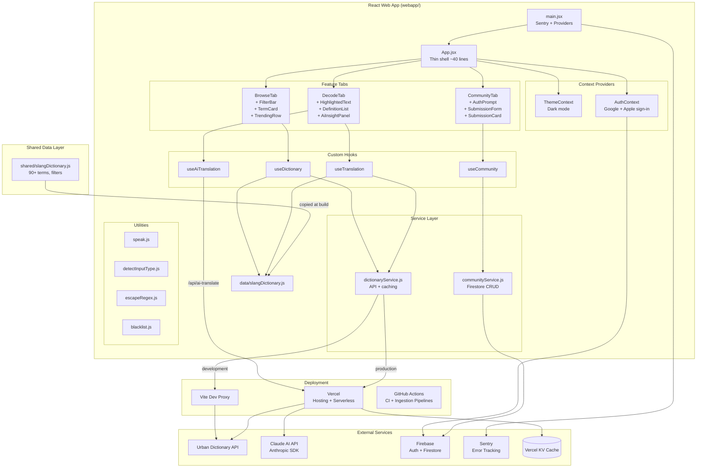

# Architecture Overview

## System Diagram

## Component Descriptions

### App.jsx (Application Shell)
- **Purpose**: Thin orchestration shell that renders the header, tab bar, and active tab
- **Location**: `webapp/src/App.jsx` (~40 lines)
- **Key responsibilities**:
  - Manages active tab state (decode, browse, community)
  - Calls `useDictionary` once and passes data down
  - Renders the footer with live term count

### main.jsx (Entry Point)
- **Purpose**: Bootstraps the app with providers and error boundary
- **Location**: `webapp/src/main.jsx`
- **Key responsibilities**:
  - Initializes Sentry (production only)
  - Wraps app in ThemeProvider → AuthProvider → Sentry.ErrorBoundary

### DecodeTab (Smart Translation)
- **Purpose**: Primary feature — decodes slang from text, sentences, or conversations
- **Location**: `webapp/src/components/Decode/DecodeTab.jsx`
- **Key responsibilities**:
  - Detects input type (term, sentence, or conversation) via `detectInputType`
  - Orchestrates local translation (`useTranslation`) and AI translation (`useAiTranslation`) in parallel
  - Renders highlighted text with clickable slang terms and scrollable definitions
  - Displays AI insight panel alongside dictionary results

### BrowseTab (Dictionary Browser)
- **Purpose**: Filterable, searchable dictionary with trending terms
- **Location**: `webapp/src/components/Browse/BrowseTab.jsx`
- **Key responsibilities**:
  - Renders FilterBar for era/origin/type filtering
  - Shows TermCards with pronunciation, examples, and audio playback
  - Displays TrendingRow with Urban Dictionary trending words

### CommunityTab (User Submissions)
- **Purpose**: Community-driven term submissions with voting
- **Location**: `webapp/src/components/Community/CommunityTab.jsx`
- **Key responsibilities**:
  - Shows AuthPrompt for unauthenticated users (Google/Apple sign-in)
  - Renders SubmissionForm for adding new terms (with blacklist filtering)
  - Displays SubmissionCards with upvote/downvote (Firestore transactions)
  - Enforces daily submission limits (5/day per user)

### ThemeContext (Dark Mode)
- **Purpose**: Toggle between light and dark themes
- **Location**: `webapp/src/context/ThemeContext.jsx`
- **Key responsibilities**:
  - Persists preference to localStorage
  - Respects OS `prefers-color-scheme` on first visit
  - Adds/removes `dark` class on `<html>` for Tailwind dark mode

### AuthContext (Firebase Authentication)
- **Purpose**: Manages user authentication state
- **Location**: `webapp/src/context/AuthContext.jsx`
- **Key responsibilities**:
  - Google and Apple sign-in via Firebase popup
  - User-friendly error messages for common auth failures
  - Provides `user`, `signInWithGoogle`, `signInWithApple`, `signOut`

### dictionaryService.js (API Layer)
- **Purpose**: Unified API for slang lookups with multi-tier caching
- **Location**: `webapp/src/services/dictionaryService.js`
- **Key responsibilities**:
  - Looks up terms: local dictionary first, then client cache, then Urban Dictionary API
  - Fetches popular/trending words (cached in localStorage for 7 days)
  - Provides text-matching utility for finding terms in user input

### communityService.js (Firestore Layer)
- **Purpose**: CRUD operations for community submissions and voting
- **Location**: `webapp/src/services/communityService.js`
- **Key responsibilities**:
  - Submit terms with duplicate detection and daily rate limiting
  - Atomic vote transactions (upvote/downvote with counter updates)
  - Real-time subscriptions to pending and approved submissions via `onSnapshot`

### slangDictionary.js (Shared Data)
- **Purpose**: Single source of truth for all slang data
- **Location**: `shared/slangDictionary.js`
- **Key responsibilities**:
  - Exports `slangDictionary` (90+ terms with definition, example, wrongUsage, era, origin, type, pronunciation)
  - Exports filter option arrays (`tabs`, `eras`, `origins`, `types`)

## Data Flow

### Decode Flow
1. User enters text in the decode tab
2. `detectInputType` classifies input as term, sentence, or conversation
3. For conversations: `annotateConversation` processes each line, wrapping detected slang in brackets
4. For terms/sentences: `translateText` checks local dictionary (sorted by length, longest first), then Urban Dictionary API
5. Simultaneously, `useAiTranslation` sends the input to the Claude AI endpoint for contextual analysis
6. Results rendered in a two-column layout: highlighted text + definitions (left), AI insight (right)

### Browse Flow
1. User searches with debounced input in the browse tab
2. Local dictionary filtered by search query + era/origin/type filters
3. If no local matches and search > 2 chars, queries Urban Dictionary API
4. Results shown as TermCards with local matches and Urban Dictionary results separated

### Community Flow
1. User authenticates via Google or Apple sign-in (Firebase popup)
2. Submission form validates input and checks blacklist
3. `communityService.submitTerm` checks for duplicates, enforces daily limit, writes to Firestore
4. `subscribeToPending` provides real-time updates via Firestore `onSnapshot`
5. Voting uses Firestore transactions to atomically update vote doc + submission counters

## External Integrations

| Service | Purpose | Documentation |
|---------|---------|---------------|
| Urban Dictionary API | Live slang lookups, trending words, daily automated ingestion | `https://api.urbandictionary.com/v0/` |
| Claude AI (Anthropic) | Contextual slang analysis and cultural insights | `@anthropic-ai/sdk` via Vercel serverless |
| Firebase Auth | Google and Apple sign-in for community features | `firebase/auth` |
| Firebase Firestore | Community submissions storage, voting, real-time sync | `firebase/firestore` |
| Vercel KV | Server-side caching for API responses in production | `@vercel/kv` package |
| Vercel Hosting | Static hosting + serverless API proxy functions | `vercel.json` config |
| Sentry | Production error tracking and performance monitoring | `@sentry/react` |
| Web Speech API | Text-to-speech pronunciation of slang terms | Browser built-in |

## Key Architectural Decisions

### Feature-Scoped Component Architecture
- **Context**: The app grew from a single-file component to multiple features (decode, browse, community)
- **Decision**: Organize components into feature directories (Decode/, Browse/, Community/, Layout/) with co-located logic
- **Rationale**: Each feature is self-contained; hooks encapsulate business logic while components handle rendering. App.jsx stays thin (~40 lines) as a pure orchestration shell

### Dual Translation Engine (Dictionary + AI)
- **Context**: Local dictionary provides curated definitions but can't explain context, cultural nuances, or evolving usage
- **Decision**: Run dictionary lookup and Claude AI translation in parallel for every decode request
- **Rationale**: Dictionary results appear instantly (cached locally); AI results stream in shortly after, providing deeper cultural context. Users get the best of both worlds without waiting

### Firebase for Community Features
- **Context**: Community submissions need authentication, real-time updates, and atomic voting
- **Decision**: Firebase Auth (Google + Apple) + Firestore with transaction-based voting
- **Rationale**: Firestore's `onSnapshot` provides real-time submission feeds without polling. Transactions ensure vote counts stay consistent. Firebase Auth handles OAuth complexity

### Multi-tier Caching Strategy
- **Context**: Urban Dictionary API has rate limits; Claude API calls are expensive; need fast responses
- **Decision**: Four cache layers: Vercel KV (server, production), in-memory Map (client runtime), localStorage (client persistent, 7-day TTL for popular words, 20-entry LRU for AI results)
- **Rationale**: Minimizes API calls while keeping data reasonably fresh; graceful degradation if any layer is unavailable

### Automated Dictionary Growth (Ingestion Pipelines)
- **Context**: The static dictionary needs to grow over time from two sources — Urban Dictionary trending terms and community submissions
- **Decision**: Two daily GitHub Actions workflows that fetch/filter terms, insert them into `shared/slangDictionary.js`, sync to `webapp/src/data/`, and open PRs for human review
- **Rationale**: PRs (not direct commits) keep a human in the loop. Scripts use `JSON.stringify()` for all UD content to prevent code injection, `--body-file` for shell safety, and atomic writes (tmp + rename) for corruption resistance

### Vite Dev Proxy for API Calls
- **Context**: Urban Dictionary API doesn't support CORS from localhost; Claude API needs server-side keys
- **Decision**: Proxy API calls through Vite's dev server during development; use Vercel serverless functions in production
- **Rationale**: Same client-side code works in both environments; no CORS issues; API keys stay server-side
