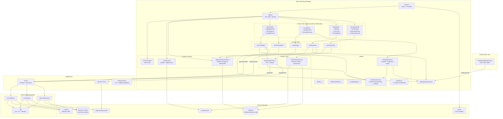

# Architecture Overview

## System Diagram

```mermaid
flowchart TD
    subgraph SharedData["Shared Data Layer"]
        SD[shared/slangDictionary.js<br/>100+ terms, filters]
    end

    subgraph WebApp["React Web App (webapp/)"]
        Entry[main.jsx<br/>Sentry + Providers] --> App[App.jsx<br/>Thin shell ~40 lines]

        subgraph Contexts["Context Providers"]
            Theme[ThemeContext<br/>Dark mode]
            Auth[AuthContext<br/>Google + Apple sign-in]
            Approved[ApprovedTermsContext<br/>Single onSnapshot subscription]
        end

        subgraph Tabs["Feature Tabs (kept mounted via TabPanels)"]
            Decode[DecodeTab<br/>+ HighlightedText<br/>+ DefinitionList<br/>+ AiInsightPanel]
            Encode[EncodeTab<br/>+ VariationCard<br/>+ EncodeGlossary]
            Browse[BrowseTab<br/>+ FilterBar<br/>+ TermCard<br/>+ TrendingRow]
            Community[CommunityTab<br/>+ AuthPrompt<br/>+ SubmissionForm<br/>+ SubmissionCard]
        end

        subgraph Hooks["Custom Hooks"]
            useTranslation[useTranslation]
            useAiTranslation[useAiTranslation]
            useEncode[useEncode]
            useDictionary[useDictionary]
            useCommunity[useCommunity]
        end

        subgraph Services["Service Layer"]
            DictService[dictionaryService.js<br/>API + caching]
            CommService[communityService.js<br/>Firestore CRUD + transactions]
        end

        subgraph Utils["Utilities"]
            Speak[speak.js]
            Detect[detectInputType.js]
            Escape[escapeRegex.js]
            FindTerms[findTermsInText.js<br/>Shared word-boundary matcher]
            MergeGloss[mergeGlossary.js<br/>Curated + AI glossary merge]
            Blacklist[blacklist.js<br/>+ Unicode confusables]
        end

        LocalDict[data/slangDictionary.js]
    end

    subgraph Serverless["Vercel API (webapp/api/)"]
        AIFunc[ai-translate.js]
        EncodeFunc[ai-encode.js]
        UDFunc[urban-dictionary.js]
        ApiLib[_lib/<br/>cors + kv + rate-limit]
        AIFunc --> ApiLib
        EncodeFunc --> ApiLib
        UDFunc --> ApiLib
    end

    subgraph ExternalAPIs["External Services"]
        UD[Urban Dictionary API]
        Claude[LLM API<br/>Anthropic SDK]
        FirebaseAuth[Firebase Auth]
        Firestore[(Firestore<br/>+ firebase/firestore.rules)]
        SentryAPI[Sentry<br/>Error Tracking]
        KV[(Vercel KV Cache<br/>+ rate-limit counters)]
    end

    subgraph Hosting["Deployment"]
        Vercel[Vercel<br/>Hosting + Serverless]
        ViteProxy[Vite Dev Proxy]
        GHA[GitHub Actions<br/>ci-v2 + ingestion pipelines]
    end

    SD -->|copied at build| LocalDict

    App --> Theme
    App --> Auth
    App --> Approved
    App --> Decode
    App --> Encode
    App --> Browse
    App --> Community

    Decode --> useTranslation
    Decode --> useAiTranslation
    Encode --> useEncode
    Encode --> MergeGloss
    Browse --> useDictionary
    Community --> useCommunity

    useTranslation --> FindTerms
    useTranslation --> DictService
    useTranslation --> LocalDict
    MergeGloss --> FindTerms
    MergeGloss --> LocalDict
    useDictionary --> DictService
    useDictionary --> LocalDict
    useDictionary --> Approved
    useCommunity --> CommService
    useCommunity --> Approved
    DictService --> FindTerms

    DictService -->|production| Vercel
    DictService -->|development| ViteProxy
    useAiTranslation -->|/api/ai-translate| Vercel
    useEncode -->|/api/ai-encode| Vercel
    Vercel --> AIFunc
    Vercel --> EncodeFunc
    Vercel --> UDFunc
    CommService --> FirebaseAuth
    CommService --> Firestore
    Auth --> FirebaseAuth
    Approved --> Firestore
    AIFunc --> Claude
    AIFunc --> KV
    EncodeFunc --> Claude
    EncodeFunc --> KV
    UDFunc --> UD
    UDFunc --> KV
    ViteProxy --> UD
    Entry --> SentryAPI
```

## Component Descriptions

### App.jsx (Application Shell)
- **Purpose**: Thin orchestration shell that renders the header, tab bar, and active tab
- **Location**: `webapp/src/App.jsx`
- **Key responsibilities**:
  - Manages active tab state (decode, encode, browse, community)
  - Declares the panel list and hands it to `TabPanels`, which keeps each visited tab mounted so its state survives switching tabs
  - Calls `useDictionary` once and passes data down
  - Renders the footer with live term count

### TabPanels (Tab State Persistence)
- **Purpose**: Render tab panels while preserving each one's state across tab switches
- **Location**: `webapp/src/components/Layout/TabPanels.jsx`
- **Key responsibilities**:
  - Mounts a panel the first time its tab becomes active, then keeps it mounted (hidden via `display:none`) instead of unmounting — so a panel's typed input, results, and filters survive navigating away and back
  - Never renders a tab that hasn't been visited, so lazy-loaded panels keep their separate code-split chunks and load on demand
  - Wraps each panel in its own `Suspense` boundary so a first-visit chunk load only shows a spinner in that panel's area

### main.jsx (Entry Point)
- **Purpose**: Bootstraps the app with providers and error boundary
- **Location**: `webapp/src/main.jsx`
- **Key responsibilities**:
  - Initializes Sentry (production only)
  - Wraps app in ThemeProvider → AuthProvider → Sentry.ErrorBoundary

### DecodeTab (Smart Translation)
- **Purpose**: Primary feature — decodes slang from text, sentences, or conversations
- **Location**: `webapp/src/components/Decode/DecodeTab.jsx`
- **Key responsibilities**:
  - Detects input type (term, sentence, or conversation) via `detectInputType`
  - Orchestrates local translation (`useTranslation`) and AI translation (`useAiTranslation`) in parallel
  - Renders highlighted text with clickable slang terms and scrollable definitions
  - Displays AI insight panel alongside dictionary results

### EncodeTab (Reverse Translation)
- **Purpose**: The inverse of decode — rewrites plain adult English into current kid slang
- **Location**: `webapp/src/components/Encode/EncodeTab.jsx`
- **Key responsibilities**:
  - Sends the input to `useEncode`, which calls the `/api/ai-encode` serverless function and returns three slang-intensity variations (light → medium → full Gen Alpha) plus a glossary
  - Renders each variation as a `VariationCard` with a copy-to-clipboard button and an escalating colour accent that conveys the intensity spectrum
  - Builds the displayed glossary with `mergeGlossary`, which detects curated-dictionary terms in the output (so they carry vetted definitions) and folds in the model's own glossary for everything else; `EncodeGlossary` caps the list at six with a "Show all" toggle
  - Scrolls to results only once they arrive, since encode has no synchronous output to anchor to

### BrowseTab (Dictionary Browser)
- **Purpose**: Filterable, searchable dictionary with trending terms
- **Location**: `webapp/src/components/Browse/BrowseTab.jsx`
- **Key responsibilities**:
  - Renders FilterBar for era/origin/type filtering
  - Shows TermCards with pronunciation, examples, and audio playback
  - Displays TrendingRow with Urban Dictionary trending words

### CommunityTab (User Submissions)
- **Purpose**: Community-driven term submissions with voting
- **Location**: `webapp/src/components/Community/CommunityTab.jsx`
- **Key responsibilities**:
  - Shows AuthPrompt for unauthenticated users (Google/Apple sign-in)
  - Renders SubmissionForm for adding new terms (with blacklist filtering)
  - Displays SubmissionCards with upvote/downvote (Firestore transactions)
  - Enforces daily submission limits (5/day per user)

### ThemeContext (Dark Mode)
- **Purpose**: Toggle between light and dark themes
- **Location**: `webapp/src/context/ThemeContext.jsx`
- **Key responsibilities**:
  - Persists preference to localStorage
  - Respects OS `prefers-color-scheme` on first visit
  - Adds/removes `dark` class on `<html>` for Tailwind dark mode

### AuthContext (Firebase Authentication)
- **Purpose**: Manages user authentication state
- **Location**: `webapp/src/context/AuthContext.jsx`
- **Key responsibilities**:
  - Google and Apple sign-in via Firebase popup
  - User-friendly error messages for common auth failures
  - Provides `user`, `signInWithGoogle`, `signInWithApple`, `signOut`

### ApprovedTermsContext (Single Subscription)
- **Purpose**: Owns the only `onSnapshot` subscription for approved community submissions
- **Location**: `webapp/src/context/ApprovedTermsContext.jsx`
- **Key responsibilities**:
  - Subscribes once via `subscribeToApproved` at mount
  - Exposes the live list to both `useDictionary` (for merging into `allTerms`) and `useCommunity` (for the community feed) so they share a single Firestore listener instead of opening one each

### findTermsInText.js (Shared Term Matcher)
- **Purpose**: One canonical implementation for matching slang terms in arbitrary text
- **Location**: `webapp/src/utils/findTermsInText.js`
- **Key responsibilities**:
  - Sorts candidate terms longest-first so multi-word phrases match before their constituent words ("no cap" beats "no")
  - Word-boundary regex with claimed-range tracking so partial matches inside other terms don't double-count ("rizz" inside "rizzler" is rejected)
  - Used by both `useTranslation` (local dictionary path) and `dictionaryService` (Urban Dictionary path)

### mergeGlossary.js (Encode Glossary Builder)
- **Purpose**: Assemble the glossary shown under the encode results from two sources of differing trust
- **Location**: `webapp/src/utils/mergeGlossary.js`
- **Key responsibilities**:
  - Runs `findTermsInText` over the generated variation texts to detect curated-dictionary terms, which carry vetted definitions and are listed first
  - Folds in the encode model's own glossary for any slang not in the dictionary, deduping case-insensitively so the curated definition always wins
  - Tolerates malformed model output (non-object entries, missing fields) without throwing

### dictionaryService.js (API Layer)
- **Purpose**: Unified API for slang lookups with multi-tier caching
- **Location**: `webapp/src/services/dictionaryService.js`
- **Key responsibilities**:
  - Looks up terms: local dictionary first, then client cache, then Urban Dictionary API
  - Fetches popular/trending words (cached in localStorage for 7 days)
  - Provides text-matching utility for finding terms in user input

### communityService.js (Firestore Layer)
- **Purpose**: CRUD operations for community submissions and voting
- **Location**: `webapp/src/services/communityService.js`
- **Key responsibilities**:
  - Submit terms with duplicate detection and daily rate limiting
  - Atomic vote transactions (upvote/downvote with counter updates)
  - Real-time subscriptions to pending and approved submissions via `onSnapshot`

### slangDictionary.js (Shared Data)
- **Purpose**: Single source of truth for all slang data
- **Location**: `shared/slangDictionary.js`
- **Key responsibilities**:
  - Exports `slangDictionary` (100+ terms with definition, example, wrongUsage, era, origin, type, pronunciation)
  - Exports filter option arrays (`tabs`, `eras`, `origins`, `types`)

### webapp/api/_lib/ (Shared API Helpers)
- **Purpose**: One implementation each for the cross-cutting concerns every serverless function needs
- **Location**: `webapp/api/_lib/cors.js`, `kv.js`, `rate-limit.js`
- **Key responsibilities**:
  - `cors.js` — single `ALLOWED_ORIGINS` array; production domain changes require editing one file
  - `kv.js` — returns the real Vercel KV client in prod and a no-op stub in tests; `isReal` flag lets callers gate KV-specific paths
  - `rate-limit.js` — per-IP token bucket using KV `INCR`/`EXPIRE` with an in-memory fallback that self-prunes; trims `x-forwarded-for` whitespace; anonymous requests share an `unknown` bucket rather than bypassing the limit

### firebase/firestore.rules (Server-Side Integrity)
- **Purpose**: Last line of defence on community-data integrity; the client-side transaction logic can't be trusted alone
- **Location**: `firebase/firestore.rules` (tested by `firebase/__tests__/firestore.rules.test.js`)
- **Key responsibilities**:
  - Vote-counter writes are restricted to the `upvotes`/`downvotes`/`netScore` keys, each delta bounded to ±1, and `netScore` must equal `upvotes − downvotes` after the write
  - Submissions require `activeTermLower == termLower` on create — clearing `activeTermLower` server-side marks a slug resubmittable after rejection/merge
  - Per-user counter doc enforces the 5-submissions-per-UTC-day cap; same-day increments must add exactly 1, new-day writes must reset to 1
  - Vote subcollection reads are owner-only; aggregate counts stay public via the parent submission doc
  - Delete is denied except via the admin SDK used by the merge workflow

## Data Flow

### Decode Flow
1. User enters text in the decode tab
2. `detectInputType` classifies input as term, sentence, or conversation
3. For conversations: `annotateConversation` processes each line, wrapping detected slang in brackets
4. For terms/sentences: `translateText` checks local dictionary (sorted by length, longest first), then Urban Dictionary API
5. Simultaneously, `useAiTranslation` sends the input to the LLM endpoint for contextual analysis
6. Results rendered in a two-column layout: highlighted text + definitions (left), AI insight (right)

### Encode Flow
1. User types a plain-English phrase in the encode tab
2. `useEncode` checks its in-memory and localStorage caches, then POSTs to `/api/ai-encode` on a miss
3. The serverless function calls Claude with a system prompt that injects the curated dictionary's terms and definitions, asking for three intensity-graded rewrites plus a glossary, and validates/whitelists the response shape before caching it
4. `mergeGlossary` cross-references the returned variations against the local dictionary so curated terms get vetted definitions; the rest come from the model's glossary
5. Results render as three `VariationCard`s (left) with the glossary alongside (right), capped at six terms with a "Show all" toggle

### Browse Flow
1. User searches with debounced input in the browse tab
2. Local dictionary filtered by search query + era/origin/type filters
3. If no local matches and search > 2 chars, queries Urban Dictionary API
4. Results shown as TermCards with local matches and Urban Dictionary results separated

### Community Flow
1. User authenticates via Google or Apple sign-in (Firebase popup)
2. Submission form validates input and checks blacklist
3. `communityService.submitTerm` checks for duplicates, enforces daily limit, writes to Firestore
4. `subscribeToPending` provides real-time updates via Firestore `onSnapshot`
5. Voting uses Firestore transactions to atomically update vote doc + submission counters

## External Integrations

| Service | Purpose | Documentation |
|---------|---------|---------------|
| Urban Dictionary API | Live slang lookups, trending words, daily automated ingestion | `https://api.urbandictionary.com/v0/` |
| Anthropic Claude Haiku 4.5 | Contextual slang analysis on decode (`ai-translate`) and slang generation on encode (`ai-encode`) | `@anthropic-ai/sdk` via Vercel serverless |
| Firebase Auth | Google and Apple sign-in for community features | `firebase/auth` |
| Firebase Firestore | Community submissions storage, voting, real-time sync, server-enforced integrity rules | `firebase/firestore` |
| Firebase Emulator | Drives the Firestore rules unit tests in CI | `firebase-tools` + `@firebase/rules-unit-testing` |
| Vercel KV | Server-side response cache + per-IP rate-limit counters | `@vercel/kv` package |
| Vercel Hosting | Static hosting + serverless API proxy functions | `vercel.json` config |
| Sentry | Production error tracking and performance monitoring | `@sentry/react` |
| Web Speech API | Text-to-speech pronunciation of slang terms | Browser built-in |

## Key Architectural Decisions

### Feature-Scoped Component Architecture
- **Context**: The app grew from a single-file component to multiple features (decode, browse, community)
- **Decision**: Organize components into feature directories (Decode/, Browse/, Community/, Layout/) with co-located logic
- **Rationale**: Each feature is self-contained; hooks encapsulate business logic while components handle rendering. App.jsx stays thin (~40 lines) as a pure orchestration shell

### Dual Translation Engine (Dictionary + AI)
- **Context**: Local dictionary provides curated definitions but can't explain context, cultural nuances, or evolving usage
- **Decision**: Run dictionary lookup and an LLM translation in parallel for every decode request
- **Rationale**: Dictionary results appear instantly (cached locally); AI results stream in shortly after, providing deeper cultural context. Users get the best of both worlds without waiting

### Encode as a Separate Endpoint with a Dictionary-Anchored Prompt
- **Context**: The reverse direction (plain English → slang) can't reuse the decode pipeline — the local dictionary is a forward index with no "meaning → slang" lookup, and the response shape (intensity-graded variations + glossary) differs from decode's. Output also needs to be accurate to current slang *and* link back to vetted definitions where possible
- **Decision**: A dedicated `webapp/api/ai-encode.js` function with its own system prompt that injects the curated dictionary's terms and definitions to steer the model toward linkable terms, its own cache namespace (`enc:`) and rate-limit bucket (`enc-rate`), and response validation that reconstructs each variation/glossary entry from only its declared fields before caching
- **Rationale**: Keeping encode out of the proven decode handler avoids mode-branching two different contracts through one function and isolates its cache/limits so the two features can't collide. The field-whitelisting validation means a malformed or adversarial model response can never poison the 30-day KV cache. The shared `_lib/` helpers are reused, so the new endpoint adds a prompt and a validator, not new CORS/KV/rate-limit code

### Persisting Tab State Without Breaking Code-Splitting
- **Context**: Tabs were rendered conditionally and unmounted on switch, discarding their state — typing in decode, glancing at encode, and returning wiped the decode input. The naive fix (render everything always) would eagerly bundle every tab and defeat the lazy-loaded code-split chunks
- **Decision**: `TabPanels` tracks which tabs have been visited, mounts a tab on first visit, and thereafter keeps it mounted but hidden (`display:none`) rather than unmounting; never-visited tabs are still not rendered
- **Rationale**: React preserves the state of a mounted-but-hidden subtree, so switching away and back is lossless with no re-fetch or re-render flash — while unvisited tabs keep their separate chunks and load on demand. The behaviour is locked down by unit tests asserting unvisited tabs don't mount and visited tabs retain their state

### Firebase for Community Features
- **Context**: Community submissions need authentication, real-time updates, and atomic voting
- **Decision**: Firebase Auth (Google + Apple) + Firestore with client-side transaction voting
- **Rationale**: Firestore's `onSnapshot` provides real-time submission feeds without polling. Client-side transactions ensure vote counts stay consistent without adding Cloud Functions cold starts to the voting path. Firebase Auth handles OAuth complexity

### Firestore Rules as the Integrity Backstop
- **Context**: A client-side transaction can keep counters consistent under honest concurrent voters, but a malicious client can still write arbitrary values directly to Firestore — the transaction logic isn't part of the trust boundary
- **Decision**: Move integrity guarantees into `firebase/firestore.rules`: vote-counter deltas bounded to ±1; `netScore == upvotes − downvotes` enforced post-write; submission daily cap (5/UTC-day) and `activeTermLower` dedup invariant checked at the rules layer; vote-doc reads restricted to the owner
- **Rationale**: The rules become the contract — the client transaction merely satisfies them. Rules are unit-tested against the Firestore emulator (`npm run test:rules`) so a regression that loosens an invariant fails CI

### One onSnapshot for Approved Community Terms
- **Context**: Both `useDictionary` (merging community-approved terms into `allTerms`) and `useCommunity` (rendering the community feed) needed the same approved-submissions stream and each opened its own listener
- **Decision**: Lift the subscription into `ApprovedTermsContext`, mount it once at the app root, and consume from both call sites via `useApprovedTerms()`
- **Rationale**: Halves the Firestore listener count, eliminates duplicate-result races between the two hooks, and removes the need for any in-hook caching

### Shared API Helpers (`webapp/api/_lib/`)
- **Context**: CORS, KV access, and rate-limiting each appeared in both serverless functions with subtly different copies; a fix in one place often missed the other
- **Decision**: Extract `cors.js` (single `ALLOWED_ORIGINS` array), `kv.js` (real-or-stub KV with an `isReal` flag for tests), and `rate-limit.js` (per-IP KV bucket with in-memory fallback) under `webapp/api/_lib/`, and route every handler through them
- **Rationale**: Domain changes touch one file, the rate limiter handles KV outages by falling back to memory instead of erroring, and tests can swap in the fake KV without monkey-patching modules

### Unified Term-Matching Helper
- **Context**: `useTranslation` and `dictionaryService` both scanned text for slang terms with near-identical but slightly different regex logic, and bugs in one (e.g. "rizz" matching inside "rizzler") didn't get fixed in the other
- **Decision**: Extract `webapp/src/utils/findTermsInText.js` — word-boundary alternation regex, longest-first sort, claimed-range tracking — and call it from both paths
- **Rationale**: One place to fix term-overlap bugs; the helper is independently unit-tested so the matching contract is locked down

### Multi-tier Caching Strategy
- **Context**: Urban Dictionary has tight rate limits; LLM calls are billed per token; the UI needs fast responses
- **Decision**: Four cache layers: Vercel KV (server, production), in-memory Map (client runtime), localStorage (client persistent, 7-day TTL for popular words, 20-entry LRU for AI results)
- **Rationale**: Minimizes API calls while keeping data reasonably fresh; graceful degradation if any layer is unavailable

### Automated Dictionary Growth (Ingestion Pipelines)
- **Context**: The static dictionary needs to grow over time from two sources — Urban Dictionary trending terms and community submissions
- **Decision**: Two daily GitHub Actions workflows that fetch/filter terms, insert them into `shared/slangDictionary.js` via the shared `scripts/lib/dict-utils.js` parser, sync to `webapp/src/data/`, and open PRs for human review
- **Rationale**: PRs (not direct commits) keep a human in the loop. Scripts use `JSON.stringify()` for all UD content to prevent code injection, `--body-file` for shell safety, and atomic temp-file writes for corruption resistance

### Vite Dev Proxy for API Calls
- **Context**: Urban Dictionary doesn't support CORS from localhost, and the Anthropic API needs server-side keys
- **Decision**: Proxy API calls through Vite's dev server during development; use Vercel serverless functions in production
- **Rationale**: Same client-side code works in both environments; no CORS issues; API keys stay server-side
