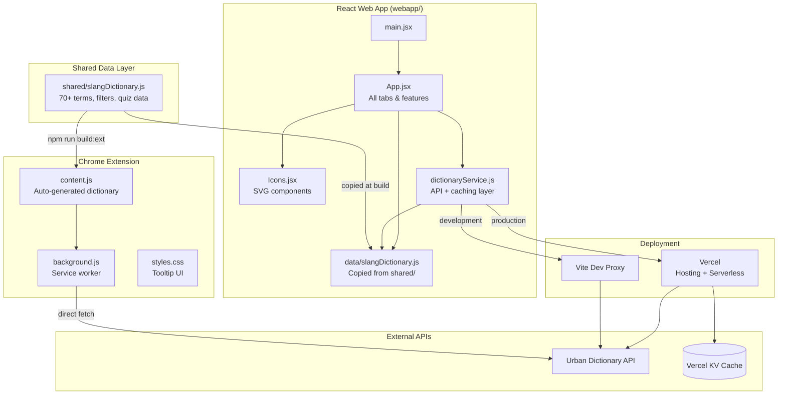

# Architecture Overview

## System Diagram

## Component Descriptions

### App.jsx (Main Application)
- **Purpose**: Single-file React component containing all application features
- **Location**: `webapp/src/App.jsx`
- **Key responsibilities**:
  - Manages all application state (translations, quiz, dictionary filters, chat)
  - Renders tab navigation and conditionally renders each feature section
  - Orchestrates local dictionary lookups and Urban Dictionary API calls
  - Handles text-to-speech pronunciation via Web Speech API

### dictionaryService.js (API Layer)
- **Purpose**: Unified API for slang lookups with multi-tier caching
- **Location**: `webapp/src/services/dictionaryService.js`
- **Key responsibilities**:
  - Looks up terms: local dictionary first, then client cache, then Urban Dictionary API
  - Fetches popular/trending words (cached in localStorage for 7 days)
  - Fetches random words from Urban Dictionary (not cached, fresh each call)
  - Provides text-matching utility for finding Urban Dictionary terms in user input

### slangDictionary.js (Shared Data)
- **Purpose**: Single source of truth for all slang data
- **Location**: `shared/slangDictionary.js`
- **Key responsibilities**:
  - Exports `slangDictionary` (70+ terms with definition, example, wrongUsage, era, origin, type, pronunciation)
  - Exports `adultToKid` mapping for reverse translation
  - Exports `fakeSlang` array for the Real or Fake quiz mode
  - Exports filter option arrays (`tabs`, `eras`, `origins`, `types`)

### Chrome Extension (background.js + content.js)
- **Purpose**: Provides on-page slang translation via text selection tooltips
- **Location**: `chrome-extension/`
- **Key responsibilities**:
  - `content.js`: Monitors text selection, checks against embedded dictionary, shows tooltip
  - `background.js`: Service worker that handles Urban Dictionary API calls for unknown terms
  - Caches API results in-memory for 24 hours

## Data Flow

### Translation Flow (Web App)
1. User enters text in the translate tab
2. App checks input against local dictionary (sorted by term length, longest first)
3. If Urban Dictionary trending words are loaded, checks those too
4. If no matches found, queries Urban Dictionary API (full phrase first, then individual words)
5. Results displayed with source badges (Local vs Urban Dictionary)

### Dictionary Lookup Flow
1. User searches in dictionary tab with debounced input (500ms)
2. Local dictionary filtered by search + era/origin/type filters
3. If no local matches and search > 2 chars, queries Urban Dictionary API
4. Results shown in two sections: local matches and Urban Dictionary result

### Chrome Extension Flow
1. User selects text on any webpage
2. Content script checks selection against embedded dictionary
3. If found locally, shows tooltip immediately
4. If not found, sends message to background service worker
5. Background worker queries Urban Dictionary API, caches result, responds
6. Content script displays tooltip with definition

## External Integrations

| Service | Purpose | Documentation |
|---------|---------|---------------|
| Urban Dictionary API | Live slang lookups, trending words, random words | `https://api.urbandictionary.com/v0/` |
| Vercel KV | Server-side caching for API responses in production | `@vercel/kv` package |
| Vercel Hosting | Static hosting + serverless API proxy functions | `vercel.json` config |
| Web Speech API | Text-to-speech pronunciation of slang terms | Browser built-in |

## Key Architectural Decisions

### Single-file App Component
- **Context**: The app has 6 tabs but relatively simple per-tab logic
- **Decision**: Keep everything in `App.jsx` rather than splitting into separate route/component files
- **Rationale**: Reduces file switching overhead for a project of this size; state is shared across tabs (e.g., popular words used in both translate and quiz)

### Shared Dictionary with Build-time Sync
- **Context**: Both the web app and Chrome extension need the same slang data
- **Decision**: Single `shared/slangDictionary.js` file synced to both apps via build scripts
- **Rationale**: Prevents data drift between platforms; single source of truth makes adding terms trivial

### Multi-tier Caching Strategy
- **Context**: Urban Dictionary API has rate limits; need fast responses
- **Decision**: Three cache layers: Vercel KV (server, production), in-memory Map (client runtime), localStorage (client persistent, 7-day TTL for popular words)
- **Rationale**: Minimizes API calls while keeping data reasonably fresh; graceful degradation if KV is unavailable

### Vite Dev Proxy for API Calls
- **Context**: Urban Dictionary API doesn't support CORS from localhost
- **Decision**: Proxy API calls through Vite's dev server during development; use Vercel serverless functions in production
- **Rationale**: Same client-side code works in both environments; no CORS issues; clean separation of concerns
