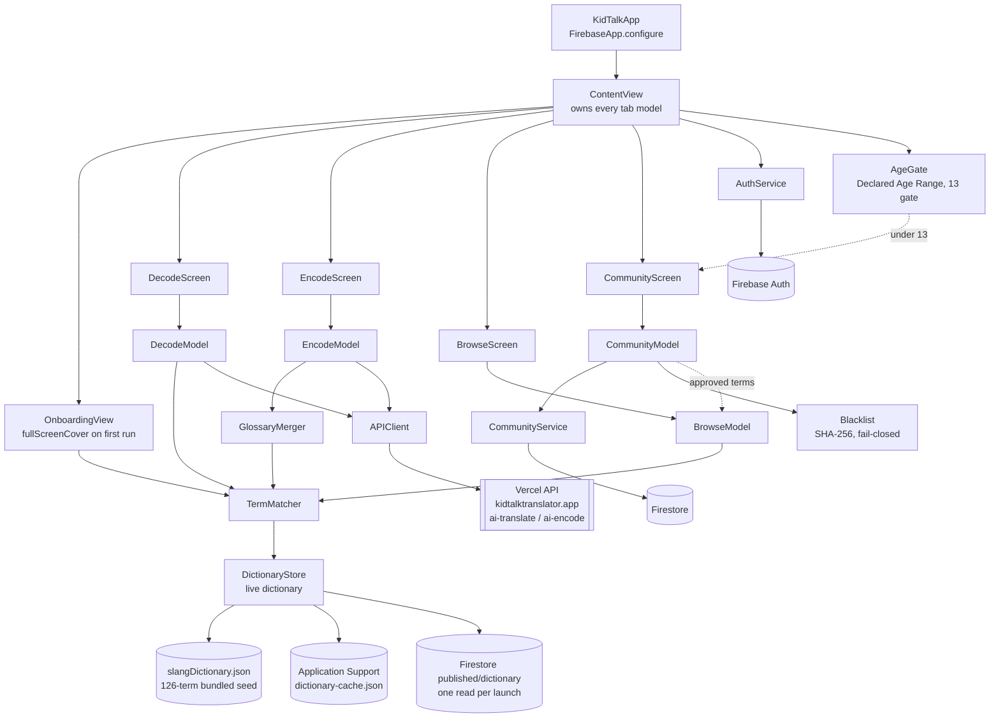

# Architecture

## System Diagram

## Component Descriptions

### TermMatcher
- **Purpose**: Find dictionary terms inside arbitrary text — the core of the whole app
- **Location**: `KidTalk/Services/TermMatcher.swift`
- **Key responsibilities**:
  - Sort candidates longest-first, then claim character ranges so `no cap` wins over `no`
  - Match on ASCII word boundaries so `rizz` hits in "he has rizz" but not "rizzler"
  - Return results longest-term-first, deduplicated by lowercase term

### AgeGate
- **Purpose**: Keep under-13 users out of Community, the app's only social feature
- **Location**: `KidTalk/Services/AgeGate.swift`, `KidTalk/Views/Community/CommunityScreen.swift`
- **Key responsibilities**:
  - On first visit to Community, asks Apple's Declared Age Range API (iOS 26+) with a 13 age gate
  - If the shared range's upper bound is below 13, Community shows "Community is for ages 13 and
    up" instead of the feed, voting and submitting; the rest of the app is unaffected
  - Declining to share, iOS before 26, and an unavailable API do not lock Community; a definite
    answer is remembered in `UserDefaults` so the system sheet never repeats

### Tab view models
- **Purpose**: Hold each tab's state for the lifetime of the app so switching tabs never discards work
- **Location**: `KidTalk/ViewModels/{Decode,Encode,Browse,Community}Model.swift`
- **Key responsibilities**: `@Observable @MainActor` classes constructed once in `ContentView` and
  passed down, rather than created inside the tab views where SwiftUI would tear them down

### CommunityService
- **Purpose**: All Firestore reads and writes for user-submitted terms
- **Location**: `KidTalk/Services/CommunityService.swift`
- **Key responsibilities**:
  - Submission inside a single transaction: duplicate check, daily-cap counter with a UTC-day
    reset, then the write — so two rapid submissions can't both pass the cap
  - Voting with a pre-read short-circuit, then a transaction adjusting the vote doc and the ±1
    counters together
  - Snapshot listeners for the pending and approved feeds

### Blacklist
- **Purpose**: Screen submissions without shipping a list of slurs in the binary
- **Location**: `KidTalk/Services/Blacklist.swift`
- **Key responsibilities**: normalize (NFKC → cross-script confusables → leet → strip separators →
  collapse repeats), then SHA-256 each word and the whole string against 17 bundled hashes

### OnboardingState
- **Purpose**: Decide whether the first-run tutorial shows
- **Location**: `KidTalk/ViewModels/OnboardingState.swift`
- **Key responsibilities**: read/write one flag; take `UserDefaults` by injection so tests exercise
  the real write against a throwaway suite

## Data Flow

1. The user pastes text into Decode and taps the button.
2. `DecodeModel` captures the text at tap time, classifies it (newline → conversation; ≤3 words →
   term; else sentence) and runs `TermMatcher` against the live dictionary (bundled seed, or a
   newer published version already cached on disk) — synchronous, offline, sub-millisecond.
3. If nothing matched, it shows a "No slang detected" row. There is no remote fallback, so a miss
   makes no network request.
4. In parallel, it calls `/api/ai-translate` for the AI Insight panel, served first from a
   two-tier LRU cache (memory + `UserDefaults`, capped at 20).
5. Matched terms render as highlighted spans; tapping one scrolls to its definition.

## External Integrations

| Service | Purpose | Notes |
|---------|---------|-------|
| Vercel API | AI decode, AI encode | Shared with the web app at `kidtalktranslator.app`; per-IP rate limits (20 per hour each) enforced server-side |
| Firebase Auth | Sign in with Apple, Google | Apple is native `ASAuthorization`; Google is the native GoogleSignIn SDK, exchanging its ID token for a Firebase credential |
| Firebase Firestore | Community submissions, votes, reports, blocks, and the published dictionary | Integrity enforced by security rules, not client code; one published-dictionary read per launch |
| Cloud Functions | Publishes the dictionary, auto-approves at 25 verified upvotes, alerts on reports, unpublishes removed terms | Server-side so content updates never require an app release |
| Declared Age Range | Community age gate (13) | iOS 26+ only; system sheet shown once, answer remembered |

## Key Architectural Decisions

### Sync the dictionary from Firestore; bundle only a seed
- **Context**: The dictionary grows from community approvals and curation, and it has to exist in
  a React app and a Swift app. Shipping it only in the bundle would mean an App Store release for
  every vocabulary change.
- **Decision**: Firestore holds the terms; a debounced Cloud Function publishes one versioned
  document; each client reads that document exactly once per launch, live-swaps any strictly-newer
  version, and caches it (Application Support on iOS, localStorage on web). The bundled JSON —
  still generated from the web repo by `scripts/export-dictionary.mjs` — is only the first-launch
  seed, and a unit test pins its term count so a truncated regeneration fails loudly.
- **Rationale**: One document read per launch keeps cost flat regardless of dictionary size, the
  strictly-increasing version makes rollback safety explicit, and clients reject malformed or
  gutted payloads — so a bad publish degrades to "stale", never to "broken". Offline launches fall
  back cache → seed, so the app is never wordless.

### Reproduce JavaScript's regex semantics rather than Swift's
- **Context**: The matcher had to return byte-identical results to the web implementation.
- **Decision**: Replace `\b` with explicit ASCII lookarounds, `(?<![a-zA-Z0-9_])…(?![a-zA-Z0-9_])`.
- **Rationale**: `NSRegularExpression`'s `\b` is Unicode-aware; JavaScript's is ASCII-only. They
  disagree next to accented characters — "rizz" matches inside "caférizz" on the web but would not
  on iOS with a naive port. A regression test pins the behaviour.

### Own every tab's model at the root
- **Context**: The web app keeps all four tab panels mounted so switching tabs preserves state.
- **Decision**: Construct the four `@Observable` models in `ContentView` and inject them.
- **Rationale**: SwiftUI's `TabView` keeps views alive, but state created *inside* a view is not
  guaranteed to survive; hoisting it makes the lifetime explicit and matches the web behaviour
  exactly. It also gives Decode access to Browse's trending terms (a random sample of the local
  dictionary, not an external feed), which the web does the same way.

### Built-in dictionary only, no third-party fallback
- **Context**: Unmatched terms used to fall back to Urban Dictionary through the web app's proxy,
  but Urban Dictionary's terms allow API access only with express permission, which the project
  never had.
- **Decision**: Removed the fallback on both platforms. Decode shows "No slang detected" on a miss
  and Browse shows a no-results card; neither makes a network request.
- **Rationale**: Every dictionary answer is curated or community-approved, Decode is fully offline
  by construction, and the AI Insight panel and community submissions still cover the long tail.

### Age-gate Community without locking out adults who decline
- **Context**: Community is a user-generated feed, and the App Store age rating declares it
  disabled for users under 13.
- **Decision**: `AgeGate` asks the Declared Age Range API with a 13 gate and locks Community only
  when the shared range says the user is under 13. Declined, unavailable and pre-iOS 26 all pass.
- **Rationale**: The app's audience is adults. Treating every "Don't Share" as under 13 would break
  Community for the people it is built for, while a shared under-13 range is a definite signal.
  Decode, Encode and Browse stay available either way.

### Firebase SDK over the Firestore REST API
- **Context**: The community layer needs transactions, live snapshots and token refresh.
- **Decision**: Take the Firebase iOS SDK through SPM.
- **Rationale**: The REST API supports transactions, but reimplementing snapshot listeners and auth
  token refresh would be a large amount of subtle code for a smaller binary. The SDK also ships its
  own privacy manifests, which the App Store now requires.

### Sign builds by default in the dev script
- **Context**: The reference project this workflow came from builds unsigned for speed.
- **Decision**: Sign simulator builds unless `KIDTALK_UNSIGNED=1` is set.
- **Rationale**: An unsigned build has no application identifier, so Firebase Auth's keychain reads
  fail with `errSecMissingEntitlement` and the signed-in session vanishes on relaunch. Measured:
  one keychain error per launch unsigned, zero signed. Speed isn't worth a dev loop that silently
  can't test auth.
