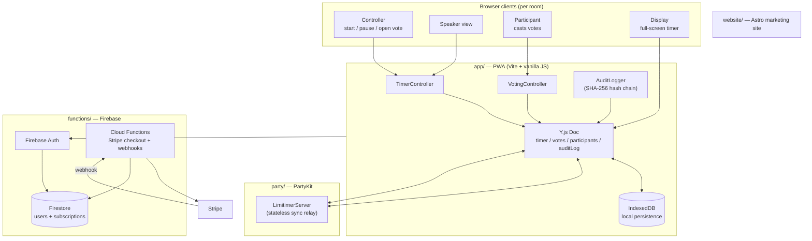

# Architecture

Limitimer Pro is a four-workspace npm monorepo. The product is a real-time speaker timer and audience voting system that replaces dedicated hardware (DSAN Limitimer-style countdown displays) and per-event electronic voting kits. State is held entirely in client-side Y.js (CRDT) documents — there is no authoritative application server, only a thin WebSocket relay.

## System Diagram

## Workspaces

| Workspace | Stack | Role |
|-----------|-------|------|
| `app/` | Vite, vanilla JS, Y.js, y-indexeddb | The PWA: timer UI, voting UI, audit log, auth, four role-based screens |
| `party/` | PartyKit (Cloudflare Workers) | Stateless WebSocket relay — broadcasts Y.js sync messages between peers in a room |
| `functions/` | Firebase Functions (Node 20), Stripe SDK | Stripe Checkout session creation, customer portal, webhook handler that updates Firestore tier |
| `website/` | Astro + Tailwind | Marketing / pricing / docs site (separate deploy) |

## Component descriptions

### `app/js/yjs-setup.js`
- **Purpose**: Creates the per-room Y.js document, wires up IndexedDB persistence and the PartyKit sync provider, and exposes the shared maps and arrays the controllers read/write.
- **Shared types**: `room`, `timer`, `presets`, `votes`, `voteResponses`, `participants`, `auditLog`.

### `app/js/timer-controller.js`
- **Purpose**: Drives the countdown. Stores duration, status, and color in the Y.js `timer` map so every connected device sees the same state.
- **Threshold logic**: Green → Yellow at the configurable yellow threshold (default 120s), Yellow → Red at the red threshold (default 60s), Red → Black at expiry.

### `app/js/voting-controller.js`
- **Purpose**: Manages vote lifecycle (`draft` → `open` → `closed`), quorum tracking, anonymous (SHA-256 hashed voter ID) and recorded modes, and result tallying.
- **Feature gating**: Recorded mode and quorum enforcement are paid-tier features and call `enforceFeature(...)` from `subscription.js`.

### `app/js/audit-logger.js`
- **Purpose**: Append-only event log with a per-entry SHA-256 hash that includes the previous entry's hash — a simple tamper-evident chain so the controller can prove no events were dropped or reordered.
- **Output**: Exposes a CSV export gated behind the audit-export feature flag.

### `app/js/sync-provider.js`
- **Purpose**: Custom Y.js network provider over PartyKit. Encodes/decodes the standard Y.js sync protocol (sync step 1/2, update, awareness) and emits connection status events.

### `party/index.ts`
- **Purpose**: PartyKit room handler. On binary messages (Y.js sync frames) it broadcasts to every other connection in the room. On text messages it dispatches a tiny control protocol (`ping`/`pong`, `request_sync`, `room_meta`).
- **Stateless by design**: The server never reads or stores Y.js state; clients are the source of truth.

### `functions/index.js`
- **Purpose**: Creates Stripe Checkout sessions on user request, hosts the customer-portal redirect, and verifies Stripe webhook signatures to update each user's `tier` / `subscriptionStatus` in Firestore.

## Data flow — opening a vote

1. Controller fills in the create-vote modal in `main.js#handleCreateVoteSubmit`.
2. `VotingController.createVote()` writes a new entry into the Y.js `votes` map.
3. The Y.js update flows through `sync-provider.js` → PartyKit → every other peer in the room.
4. Each peer's Y.js observer fires, `main.js#handleVoteCreated` re-renders the participant card and controller results bar.
5. Participants tap an option; `submitVote()` writes their response into `voteResponses` (anonymous mode hashes the voter ID first via `utils.hashVote`).
6. `AuditLogger.log()` appends a `VOTE_CREATED` / `VOTE_CAST` / `VOTE_CLOSED` entry; the new entry's hash chains to the previous hash.

## External integrations

| Service | Purpose | Notes |
|---------|---------|-------|
| Firebase Auth | Email/password and Google sign-in | Only the controller role really needs auth; participants can join anonymously |
| Firestore | User profile, tier, subscription status | Security rules block clients from mutating tier fields directly |
| Stripe | Subscription billing (Free / Pro / Organization / Enterprise) | Webhook updates Firestore via the Admin SDK |
| PartyKit | WebSocket sync relay | One room per `roomCode`; the relay is stateless |

## Key architectural decisions

### CRDT-first, no application server
- **Constraint**: A meeting timer + vote is useless if the network blips. Local devices must keep working and reconcile when reconnected.
- **Options**: (a) traditional REST + WebSocket server with authoritative state, (b) Firestore real-time, (c) Y.js CRDT replicated peer-to-peer through a relay.
- **Choice**: Y.js documents synced over PartyKit, persisted locally with IndexedDB.
- **Why**: CRDT merges are conflict-free without server arbitration, IndexedDB persistence handles refreshes and short disconnects transparently, and PartyKit gives me a free-tier WebSocket relay without operating a backend.

### Vanilla JS in the app
- **Constraint**: The bundle ships to phones and conference-room laptops; the UI is mostly four screens of buttons and a giant timer.
- **Options**: React/Vue/Svelte, or vanilla JS with Vite.
- **Choice**: Vanilla ES modules with Vite as the dev/build tool.
- **Why**: The interaction surface is small and dominated by Y.js observers, not view state. Skipping a framework keeps the bundle lean and the data flow obvious.

### Append-only audit log with hash chain
- **Constraint**: Boards and HOAs need to be able to prove vote results weren't edited after the fact.
- **Options**: Trust the Y.js log; sign every entry server-side; chain hashes client-side.
- **Choice**: Client-side SHA-256 chain — each entry's hash includes the previous hash.
- **Why**: Anyone with the exported log can re-hash and detect tampering without me running a notarization service. It's not legally binding crypto, but it's a strong "we'd notice" signal at zero infra cost.

### Stripe billing in Firebase Functions, gating in the client
- **Constraint**: Subscriptions need a server-trusted source of truth; feature gates need to be fast and offline-tolerant.
- **Options**: Bake all gating into the client; check entitlements server-side on every action.
- **Choice**: Firestore stores the user's tier (written only by the Stripe webhook), client reads it once and gates locally via `subscription.js#enforceFeature`.
- **Why**: Most paid features (recorded voting, quorum, CSV export) are UI concerns where a server round-trip would hurt latency, and the Firestore rules prevent the user from forging their own tier.

### Four role-specific screens instead of one responsive page
- **Constraint**: A controller needs vote management; a display needs only the giant timer; a participant needs a single tappable card.
- **Options**: One adaptive UI with role permissions, or distinct screens per role.
- **Choice**: Four hidden-by-default screens in `index.html`, shown one at a time by `showScreen(role)`.
- **Why**: Each role's screen is small enough to render eagerly, the wrong UI never shows up by accident, and a participant's phone never downloads controller-only assets at runtime.
