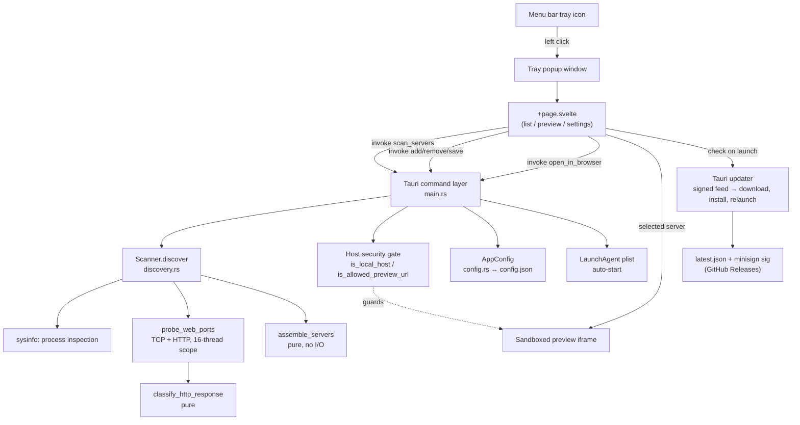

# Architecture

## System Diagram

## Component Descriptions

### Tauri command layer
- **Purpose**: The single bridge between the Svelte UI and the OS. Exposes seven commands (`scan_servers`, `add_manual_server`, `remove_manual_server`, `get_config`, `save_full_config`, `open_in_browser`, `toggle_auto_start`).
- **Location**: `src-tauri/src/main.rs`
- **Key responsibilities**: Owns `AppState` (a set of `Arc<Mutex<…>>` fields), enforces the host security policy, manages the tray icon and popup window lifecycle, and writes the auto-start `LaunchAgent` plist.

### Discovery engine
- **Purpose**: Find dev servers without any cooperation from the servers themselves.
- **Location**: `src-tauri/src/discovery.rs`
- **Key responsibilities**: Refresh the process list, match command lines against `KNOWN_SERVERS`, extract `--port`/`-p` overrides, probe the union of candidate and scan ports once, and assemble a deduplicated `Vec<DevServer>`. The scan list is generated as a ±5 range around each known default port (to catch auto-incremented instances), with platform-excluded ports (macOS AirPlay's 5000/7000) removed. A port counts as online only if it actually serves web content — the socket I/O (`port_serves_web`) and the pure response classifier (`classify_http_response`) and assembler (`assemble_servers`) are split apart so both pure halves are exhaustively unit-tested.

### Config store
- **Purpose**: Persist user settings and manually-added servers across launches.
- **Location**: `src-tauri/src/config.rs`
- **Key responsibilities**: Serialize `AppConfig` to `~/Library/Application Support/taskbar-dev/config.json`. Every field except the manual-server list and popup size uses `#[serde(default …)]` so older or hand-edited config files load forward-compatibly.

### Frontend view router
- **Purpose**: Render the three states of the popup — server list, preview, settings.
- **Location**: `ui/src/routes/+page.svelte` and `ui/src/lib/components/`
- **Key responsibilities**: Poll `scan_servers` on the configured interval, diff successive results to emit new/offline toasts, manage keyboard shortcuts (Esc, ⌘N, ⌘R), and host the sandboxed preview iframe with responsive width presets.

### Auto-updater
- **Purpose**: Keep installed copies current without manual reinstalls.
- **Location**: `ui/src/lib/updater.ts` (check/install wrapper), `src-tauri/src/main.rs` (plugin registration), `tauri.conf.json` (`plugins.updater` endpoint + public key).
- **Key responsibilities**: On launch the UI calls the Tauri updater, which fetches the signed `latest.json` feed, verifies the update archive's minisign signature against the embedded public key, and — on confirmation — downloads, installs, and relaunches. Failures (offline, or running outside Tauri) degrade silently to "no update".

## Data Flow

1. The user clicks the tray icon; `main.rs` computes the popup's screen position from the icon rect, correcting for the DPI scale factor of whichever monitor the icon sits on, then builds a borderless always-on-top webview.
2. On mount, `ServerList.svelte` calls `scan_servers` and starts an interval timer using `scan_interval_ms` from the loaded config.
3. `Scanner.discover` refreshes processes, collects candidates, and probes all relevant ports concurrently — a cheap TCP connect followed by a minimal HTTP request, so only ports that genuinely serve web content count as online; `assemble_servers` turns that result into the server list; manual servers are merged in.
4. The frontend diffs the new list against the previous one to fire "New: …" / "Offline: …" toasts, then renders grouped (auto vs. manual) rows.
5. Selecting a server transitions to preview mode and loads `http://{host}:{port}` in a sandboxed iframe — the URL having already been constrained to a local host at add/discovery time.
6. On focus loss the popup persists its current size back to `config.json` and closes.

## External Integrations

| Service | Purpose | Notes |
|---------|---------|-------|
| macOS `launchd` | Launch at login | A `LaunchAgent` plist is written to `~/Library/LaunchAgents/com.localhoster.app.plist` with `RunAtLoad`; removed when the toggle is turned off. |
| OS process table | Server discovery | Read via `sysinfo`, refreshing only command line + cwd to keep each scan cheap. |
| Local dev servers | Preview target | Probed over loopback with a minimal HTTP request to confirm they serve web content, then rendered via iframe; never contacted off-host. |
| GitHub Releases | Update feed | Hosts the signed `latest.json` and update archive; fetched by the Tauri updater on launch. |
| Apple notary service | Distribution trust | Release builds are signed with a Developer ID certificate and notarized so Gatekeeper admits them without warnings. |

## Key Architectural Decisions

### Treat the backend as the security trust boundary
- **Context**: The preview iframe will render whatever URL it's handed, and the CSP permits `frame-src http://*:*`. A permissive frame policy plus an unchecked URL is an SSRF/clickjacking hazard.
- **Decision**: Centralize a host policy in Rust (`is_local_host`) and apply it at three points — when adding a manual server, when opening in a browser, and (defensively) when *loading* stored servers from a possibly hand-edited config.
- **Rationale**: Frontend validation is advisory; the command layer is the only place an attacker-supplied config can't bypass. Re-filtering at load time (`local_manual_servers`) means the invariant holds even for servers persisted before the gate existed. The gate also strips URL userinfo so `http://[::1]@evil.com` resolves to its real authority (`evil.com`) and is rejected.

### One concurrent probe per scan, with pure assembly
- **Context**: A naive scanner probes each candidate port and each scan port separately, and might spawn one thread per port. With a 100+-port list that's wasteful and hard to test.
- **Decision**: Build the candidate set first (no I/O), probe the *union* of candidate and scan ports exactly once via a thread `scope` bounded to 16 workers, then hand the open-port set to a pure `assemble_servers` function. The fan-out is factored into a generic `scoped_probe(ports, check)` so the TCP and web checks share one threading core.
- **Rationale**: Bounding threads keeps a large port list from exhausting the scheduler; probing the union once removes redundant connects; and isolating the pure step lets a dozen unit tests cover dedup, candidate-vs-scan precedence, and offline marking with zero network mocking.

### Define "online" as "serves web", not "accepts a TCP connection"
- **Context**: A bare TCP connect can't distinguish a real dev server from any other listening service — a database, or the macOS AirPlay receiver, which holds port 5000 and answers HTTP `403` with an empty body. The original probe marked all of these "online", so they appeared as blank, unpreviewable rows.
- **Decision**: After the cheap TCP connect confirms a port is open, send a minimal HTTP request and keep the port only if the response speaks HTTP with a status `< 400`, or serves an HTML body even on an error status. Parsing lives in a pure `classify_http_response`. Known non-web ports (AirPlay's 5000/7000) are also excluded at compile time on macOS so they're never even probed.
- **Rationale**: Hardcoding individual ports only patches known cases; requiring an HTTP-like response generalizes to *any* non-web service with no per-port list. The two-phase design keeps it cheap — the HTTP round-trip runs only on the handful of ports that already passed the TCP check. The compile-time macOS exclusion is belt-and-suspenders for the one collision users hit constantly.

### Apply fallible side effects before committing state
- **Context**: Saving settings touches three sources of truth — in-memory `AppState`, `config.json`, and the `LaunchAgent` plist. A partial failure could leave them inconsistent (e.g. UI says "auto-start on" but no plist exists).
- **Decision**: In `save_full_config`, write/remove the plist *first*; only if that succeeds mutate in-memory state and persist the config file, surfacing (not swallowing) a save error.
- **Rationale**: The plist write is the only step that can fail for external reasons (permissions, missing dir). Doing it first means a failure aborts before anything diverges, so the three stores stay in agreement.

### Clamp untrusted numeric input at the boundary
- **Context**: The settings UI caps the scan-port list at 128, but a user can hand-edit `config.json` and set thousands of ports, making every scan probe far too much.
- **Decision**: Re-clamp to `MAX_SCAN_PORTS` (128) inside `Scanner.discover`, not just in the UI.
- **Rationale**: The UI cap is a convenience; the backend cap is the guarantee. The same value lives in both places, but only the backend one is authoritative.

### Static SvelteKit bundle, no client router server
- **Context**: The frontend only ever runs inside a Tauri webview pointed at bundled files.
- **Decision**: Use `@sveltejs/adapter-static` with `prerender = false` and `ssr = false`.
- **Rationale**: There's no server to render against — Tauri serves the built assets directly. A static SPA bundle is the smallest, simplest fit and avoids shipping an unused SSR runtime.

### Sign, notarize, and self-update so a download "just runs"
- **Context**: An unsigned macOS binary trips Gatekeeper ("damaged and can't be opened"), and a menu-bar utility people install once needs a way to ship fixes without nagging them to redownload.
- **Decision**: Build a universal (`aarch64` + `x86_64`) bundle in CI, sign it with a Developer ID certificate, notarize it with Apple, and ship a Tauri auto-update feed whose update archive is signed with a separate minisign key (public key embedded in the app).
- **Rationale**: Signing + notarization is what makes a first-launch download actually open for someone who isn't the author. The updater key is deliberately *separate* from the Apple cert: it proves update authenticity independently, so a compromised release host can't push a forged update that the app would trust. Doing all of it in CI keeps releases reproducible and removes the temptation to hand-sign locally.
