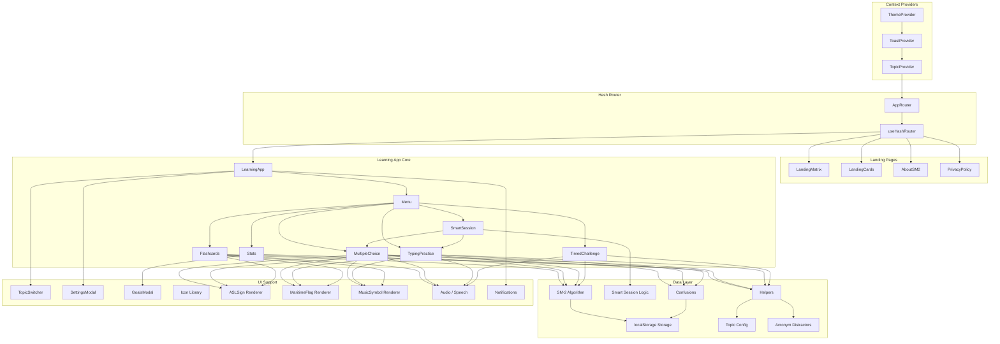

# Architecture Overview

## System Diagram

## Component Descriptions

### App.tsx (Root)
- **Purpose**: Application shell with context providers and hash-based routing
- **Location**: `src/App.tsx`
- **Key responsibilities**: Wraps the entire app in ThemeProvider > ToastProvider > TopicProvider, delegates routing to AppRouter which renders either landing pages or the LearningApp

### LearningApp (State Manager)
- **Purpose**: Central state coordinator for all study functionality
- **Location**: `src/App.tsx` (LearningApp function)
- **Key responsibilities**: Manages lifted state for progress, stats, achievements, and sessions. Handles mode transitions, session tracking, goal completion checks, and inactivity reminders. Passes state down via props and receives updates via callbacks.

### Topic Config System
- **Purpose**: Data-driven topic definitions that make the platform extensible
- **Location**: `src/config/topics.ts`
- **Key responsibilities**: Defines 19 TopicConfig objects, each specifying name, data (key-value pairs), theme colors, distractor type, render type (text/image), quiz direction, and status. New topics are added by creating a config object — no new components needed.

### Smart Session Orchestrator
- **Purpose**: A guided session that adapts the question format per item to the learner's mastery
- **Location**: `src/components/SmartSession.tsx`, logic in `src/utils/smart-session.ts`
- **Key responsibilities**: Runs a fixed-length run (15 items), re-using `MultipleChoice` and `TypingPractice` as child renderers. For each item, `chooseMode()` returns `typing` when the item is well-learned (`repetitions ≥ 3 && easinessFactor ≥ 1.8` and the topic supports typing) and `multiple-choice` otherwise — escalating from recognition to recall as mastery grows. The next item is picked only in an effect keyed on the answered counter, so an in-flight answer's `setProgress` can't trigger a mid-question re-pick. On completion it renders a top-confusions recap. `smart-session.ts` also exposes `countDue`/`countNew` and `focusOptionsForTopic` for the menu.

### Confusion Tracking
- **Purpose**: Turn wrong answers into actionable "you keep mistaking X for Y" insight
- **Location**: `src/utils/confusions.ts`, surfaced in `Stats.tsx` and the Smart Session recap
- **Key responsibilities**: When a learner picks a wrong option, `chosenKeyFromValue()` maps the chosen value back to the item it actually belongs to, and `incrementConfusion()` records the (correct item → mistaken item) pair on the item's `confusions` map in progress. `topConfusions()` ranks one worst pair per studied item and returns the top N for the Most Confused Pairs panel.

### SM-2 Spaced Repetition
- **Purpose**: Implements the SuperMemo SM-2 algorithm for optimal review scheduling
- **Location**: `src/utils/spaced-repetition.ts`
- **Key responsibilities**: Calculates quality scores (0-5) based on correctness, response time, and study mode. Updates easiness factor (EF), review interval, and next review date per item. Selects next item to practice based on overdue status, novelty, and difficulty.

### Study Mode Components
- **Purpose**: Four distinct practice interfaces, all consuming the same TopicConfig data
- **Location**: `src/components/Flashcards.tsx`, `MultipleChoice.tsx`, `TypingPractice.tsx`, `TimedChallenge.tsx`
- **Key responsibilities**: Flashcards allows passive review without affecting scores. Multiple Choice, Typing Practice, and Timed Challenge are scoring modes that update progress via SM-2. Each mode reads the current topic's data and renders appropriately (text, SVG images, or custom components for ASL/maritime/music).

### Storage Layer
- **Purpose**: localStorage persistence with per-topic namespacing
- **Location**: `src/utils/storage.ts`
- **Key responsibilities**: Saves and loads progress, stats, achievements, sessions, goals, and settings. Keys are namespaced by topic ID (e.g., `nato-trainer-progress-morse`) to keep data isolated per code system.

## Data Flow

1. User selects a topic on the landing page → TopicContext updates → hash route changes to `#/learn/{topicId}`
2. LearningApp loads topic-specific progress and stats from localStorage
3. User selects a study mode → LearningApp creates a SessionData object and renders the mode component
4. Mode component calls `getNextLetterSM2()` to select the next item based on SM-2 scheduling
5. User answers → `updateProgressSM2()` calculates quality score, updates EF/interval/repetitions, persists to localStorage; a wrong choice also records a confusion pair on the item
6. Stats update flows up to LearningApp via callbacks → achievements checked → goal progress updated
7. On mode exit → session saved to localStorage, progress history updated
8. In Smart Session, each committed answer advances the run and re-picks the next item, with `chooseMode()` selecting recognition or recall based on the item's current mastery; the run ends with a Most Confused Pairs recap

## External Integrations

| Service | Purpose | Documentation |
|---------|---------|---------------|
| Vercel | Static hosting with automatic deploys | vercel.com |
| Web Speech API | Text-to-speech for phonetic pronunciation | MDN Web Speech API |
| Web Audio API | Sound effect generation (correct/incorrect tones) | MDN Web Audio API |
| Browser Notifications API | Goal completion and inactivity reminders | MDN Notifications API |

## Key Architectural Decisions

### Data-Driven Topic System
- **Context**: The app started as a NATO alphabet trainer but expanded to 17 code systems
- **Decision**: Created a `TopicConfig` interface that all study modes consume generically
- **Rationale**: Adding a new topic requires only a config object with key-value data — no new components or routes. Distractor generation, rendering, and quiz logic all adapt based on config properties.

### SM-2 Over Custom Weighted Algorithm
- **Context**: The original spaced repetition used a simpler weight formula (`errorRate × 10 + daysSinceLastSeen`)
- **Decision**: Migrated to the SM-2 algorithm with quality scores, easiness factor, and interval growth
- **Rationale**: SM-2 is a well-researched, proven algorithm. Quality scoring accounts for response time and study mode difficulty, providing more nuanced scheduling than error rate alone.

### Hash-Based Routing
- **Context**: Needed client-side routing for landing pages, topic selection, and info pages
- **Decision**: Built a lightweight hash router (`useHashRouter`) instead of using React Router
- **Rationale**: Zero dependency overhead for a simple routing need. Hash routing works reliably on all static hosts (Vercel, GitHub Pages) without server-side configuration. Routes are: landing variants, learn/{topicId}, about, privacy.

### Lifted State in App.tsx
- **Context**: Multiple study modes need access to the same progress, stats, and achievement data
- **Decision**: Keep all learning state in LearningApp and pass via props rather than using a global store
- **Rationale**: The state tree is shallow (one level of study mode children), so prop drilling is straightforward. Avoids the complexity of Redux/Zustand for what amounts to ~5 state variables shared among sibling components.

### Per-Topic localStorage Namespacing
- **Context**: 19 topics each need independent progress tracking
- **Decision**: Namespace all localStorage keys with topic ID (e.g., `nato-trainer-progress-morse`)
- **Rationale**: Simple key prefixing keeps topics isolated without needing a database. Users can reset one topic without affecting others. The `nato-trainer-` prefix is a legacy artifact from the original project name.

### Smart Session Reuses Modes Instead of Adding a New One
- **Context**: A guided "just study" flow needs to alternate between recognition and recall, but duplicating quiz/typing UI would double the surface area to maintain
- **Decision**: Make `SmartSession` a thin orchestrator that mounts the existing `MultipleChoice` and `TypingPractice` components per item, choosing the mode from SM-2 mastery
- **Rationale**: The study components already encapsulate scoring, feedback, and rendering. The orchestrator only owns item selection, the mode decision, and a recap — so adaptive sessions inherit every fix to the underlying modes for free. The subtle part is re-picking the next item only after an answer commits (effect keyed on the answer counter) so progress updates mid-question don't cause a re-pick.

### Confusion Attribution by Value, Not Position
- **Context**: Recording "the answer was wrong" is cheap but useless; learners want to know *which* look-alike they confused it with
- **Decision**: Map the chosen distractor's value back to the item that value belongs to (`chosenKeyFromValue`) and accumulate per-item confusion counts in progress
- **Rationale**: Distractors are generated dynamically, so option position carries no meaning across questions. Resolving the picked value to a real item key produces a stable (correct → mistaken) pair that aggregates into the Most Confused Pairs panel and the session recap, directly steering future review toward genuine look-alikes.

### Split-Strategy Service Worker
- **Context**: The PWA needs reliable offline use without serving stale app code after a deploy
- **Decision**: A hand-written service worker (`public/sw.js`) that is cache-first for content-hashed `/assets/*` and `/images/*`, and network-first (with an `offline.html` fallback) for navigations and the app shell
- **Rationale**: Vite content-hashes asset filenames, so they're safe to cache immutably and serve instantly offline. HTML and the shell stay network-first so a new deploy is picked up on the next online load, while still falling back to a cached page when offline — avoiding the classic "users stuck on an old build" service-worker trap.
