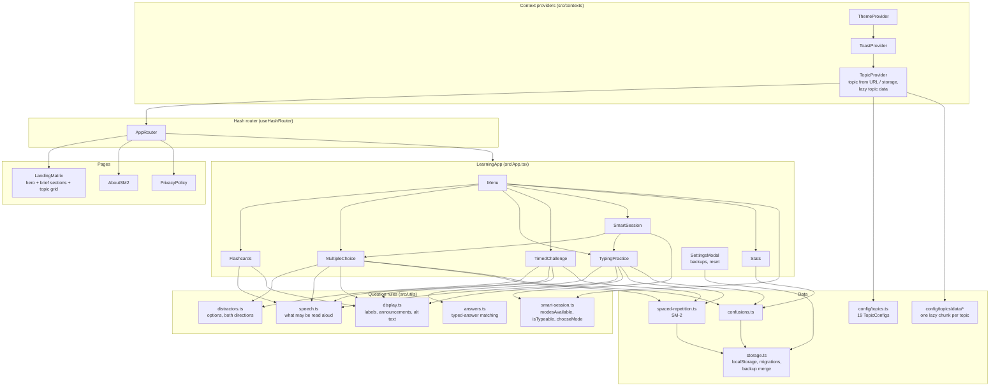

# Architecture

## System Diagram

```mermaid
flowchart TD
    subgraph Providers["Context providers (src/contexts)"]
        TH[ThemeProvider]
        TO[ToastProvider]
        TP["TopicProvider<br/>topic from URL / storage,<br/>lazy topic data"]
    end

    subgraph Routing["Hash router (useHashRouter)"]
        AR[AppRouter]
    end

    subgraph Pages["Pages"]
        LM["LandingMatrix<br/>hero + brief sections + topic grid"]
        ABT[AboutSM2]
        PP[PrivacyPolicy]
    end

    subgraph Learn["LearningApp (src/App.tsx)"]
        MN[Menu]
        FC[Flashcards]
        MC[MultipleChoice]
        TY[TypingPractice]
        TC[TimedChallenge]
        SS[SmartSession]
        ST[Stats]
        SET[SettingsModal<br/>backups, reset]
    end

    subgraph Rules["Question rules (src/utils)"]
        MODES["smart-session.ts<br/>modesAvailable, isTypeable, chooseMode"]
        DIS["distractors.ts<br/>options, both directions"]
        ANS["answers.ts<br/>typed-answer matching"]
        SPK["speech.ts<br/>what may be read aloud"]
        DSP["display.ts<br/>labels, announcements, alt text"]
    end

    subgraph Data["Data"]
        CFG["config/topics.ts<br/>19 TopicConfigs"]
        TD["config/topics/data/*<br/>one lazy chunk per topic"]
        SR["spaced-repetition.ts<br/>SM-2"]
        CNF[confusions.ts]
        STO["storage.ts<br/>localStorage, migrations,<br/>backup merge"]
    end

    TH --> TO --> TP --> AR
    TP --> CFG & TD
    AR --> LM & ABT & PP & Learn
    MN --> FC & MC & TY & TC & SS & ST
    MN --> MODES
    SS --> MC & TY
    SS --> MODES
    MC & TC --> DIS
    TY --> ANS
    MC & TY & TC & FC --> SPK & DSP
    MC & TY & TC --> SR --> STO
    MC & TY --> CNF --> STO
    ST --> CNF
    SET --> STO
```

## Component Descriptions

### Topic configuration
- **Purpose**: Describe each code system as data, so every study mode works on every topic
- **Location**: `src/config/topics.ts`, `src/config/topics/data/`, `src/config/topicData.ts`
- **Key responsibilities**: 19 `TopicConfig` objects declare how a topic behaves — distractor strategy, categories, confusable groups, which quiz directions exist and which can be typed, how keys render (text, drawn Braille, or an SVG image). The items themselves live in one module per topic and are loaded on demand, so opening Morse never downloads the acronym tables.

### TopicProvider
- **Purpose**: Decide which topic is open and load its data
- **Location**: `src/contexts/TopicContext.tsx`
- **Key responsibilities**: Resolves the topic on load from a `?topic=` shortcut, then a `#/learn/<topic>` deep link, then the last topic used, then NATO. While on a learn route the URL is the source of truth, so Back and Forward move between topics; an unknown topic id falls back to NATO and corrects the URL in place. Shows a loading state and a retry if a topic's data chunk fails to load.

### LearningApp
- **Purpose**: Own the study state and the current mode
- **Location**: `src/App.tsx`, `src/hooks/useAppState.ts`
- **Key responsibilities**: Progress, stats, achievements and sessions for the current topic. When the topic changes it returns to the menu *during render* and ends the old session, and every progress write is bound to the topic it was made for — so an answer still being scored can never be saved under a different topic.

### Mode availability
- **Purpose**: One rule for which study modes a topic offers in each direction
- **Location**: `src/utils/smart-session.ts`
- **Key responsibilities**: `modesAvailable()` is read by the Menu, Smart Session and the modes themselves. Typing is offered per direction (`isTypeable`); reverse acronyms (expansion shown, acronym asked) are typing-only because the options could otherwise be matched letter by letter. `chooseMode()` gives Smart Session recognition for newer items and recall once an item is well learned.

### Multiple-choice generation
- **Purpose**: Wrong options that can't be eliminated without knowing the answer
- **Location**: `src/utils/distractors.ts`, `src/config/acronymDistractors.ts`
- **Key responsibilities**: One scorer ranks every candidate by how confusable it is with the answer, and both directions use it (key-to-value offers values, value-to-key offers keys). Strategies are per topic: edit distance for Morse, the number of differing dots for Braille, arm angles for semaphore, confusable groups for flags, hand shapes and glyphs, pay-grade distance for military ranks, one-symbol-off numerals for Roman numerals, same-class codes for airports and HTTP statuses, and made-up abbreviations that fit an expansion's letters. Options are sampled from a small pool of the most similar candidates, so a question does not always show the same set.

### Typed-answer matching
- **Purpose**: Accept every correct way of typing an answer, and nothing else
- **Location**: `src/utils/answers.ts`
- **Key responsibilities**: Word answers are normalised (accents, case, quotes, dashes, "&", punctuation, a leading "the") and compared against the value, its "core" (the value without a description or parenthetical, only when no other item shares it) and curated alternates. Symbol answers (Morse, semaphore, Braille) are exact, with semaphore accepted in either arm order. Value-to-key answers normalise the key (`Lt Col` = `LtCol`), and maritime flags also accept the flag's name.

### Speech and display rules
- **Purpose**: Never reveal the answer through the speaker, an image description or an announcement
- **Location**: `src/utils/speech.ts`, `src/utils/display.ts`
- **Key responsibilities**: The speaker reads only the prompt and is hidden when the prompt is a picture, a Greek glyph (TTS would name it) or a rank abbreviation (TTS expands it), or when it cannot be read at all. Images get neutral alt text until answered. Every "the answer is …" message names the answer exactly as its button showed it, and Braille answers are announced by their dots.

### Braille input and cells
- **Purpose**: Make Braille answerable and readable
- **Location**: `src/components/BrailleInput.tsx`, `src/components/BrailleCell.tsx`
- **Key responsibilities**: `BrailleInput` is a six-dot grid per cell (tap, or keys 1–6, Space, Backspace, Enter) that composes Unicode Braille. `BrailleCell` draws every Braille value as a framed 2×3 cell with unraised dots shown faintly, because Unicode glyphs render ⠅, ⠒ and ⠤ as the same colon-like shape.

### SM-2 and confusions
- **Purpose**: Schedule reviews and learn from mistakes
- **Location**: `src/utils/spaced-repetition.ts`, `src/utils/confusions.ts`
- **Key responsibilities**: SM-2 with a quality score from correctness, response time and mode (typing counts for more than multiple choice). A wrong pick is mapped back to the item it belongs to and counted as a confusion pair, which feeds Most Confused Pairs and the Smart Session recap.

### Storage
- **Purpose**: Persist everything in the browser, safely
- **Location**: `src/utils/storage.ts`
- **Key responsibilities**: Per-topic keys (`mastercode-progress-<topic>`, `mastercode-stats-<topic>`, …), with the original `nato-trainer-*` names still read as fallbacks. Every load validates and clamps what it reads. A schema version gates migrations, renamed items are migrated on first load, and accuracy history keeps the most recent 30 days. Backups record their topic and are merged on import.

### Landing page
- **Purpose**: Explain the science, then offer the topics
- **Location**: `src/pages/LandingMatrix.tsx`, `src/components/landing/`
- **Key responsibilities**: An animated matrix-rain hero (static under reduced motion), then four short sections — what the app is, why spaced repetition works (a forgetting-curve sparkline), the research behind it, and how it works — followed by the topic grid.

## Data Flow

1. The visitor opens a topic from the landing grid or a `#/learn/<topic>` link; `TopicProvider` resolves it and loads that topic's data chunk.
2. `LearningApp` loads the topic's progress and stats from `localStorage`; the Menu shows the modes `modesAvailable()` allows in the current direction, with due and new counts.
3. A mode picks the next item with SM-2 (`getNextLetterSM2`), respecting the focus filter.
4. Multiple choice builds its options with `generateOptions()`; typing checks the answer with the rules in `answers.ts`.
5. The answer is scored: `updateProgressSM2()` updates the item's schedule, a wrong pick records a confusion pair, stats and achievements update, and the result is announced for screen readers.
6. Leaving a mode saves the session and today's accuracy point.
7. In Smart Session, each answered item triggers the next pick, and `chooseMode()` chooses recognition or recall for it; the run ends with a confusion recap.

## External Integrations

| Service | Purpose | Notes |
|---------|---------|-------|
| Vercel | Static hosting | Security headers and SPA rewrites in `vercel.json` |
| Web Speech API | Read the question aloud | Local to the browser; hidden where it would leak the answer |
| Web Audio API | Correct/incorrect tones | Generated oscillator sweeps, no audio files |
| Notifications API | Goal and inactivity reminders | Local notifications only |

## Key Architectural Decisions

### Configuration-driven topics, lazily loaded
- **Context**: 19 code systems with very different content — words, symbols, drawn cells, pictures — and very different "fair question" rules.
- **Decision**: One `TopicConfig` per topic that declares behaviour (strategy, groups, directions, typing eligibility), with each topic's items in its own dynamically imported module.
- **Rationale**: The study modes contain no topic-specific branches for data; a new topic is a config entry and a data file. Per-topic chunks keep the first load small. The alternative, a component per topic, would have multiplied every fix by nineteen.

### Fairness as testable invariants
- **Context**: A four-option question is worthless if the answer can be spotted by its first letter, its format or its position among numbers.
- **Decision**: All options come from one module with explicit invariants — the answer appears exactly once, no wrong option is also right, near-synonyms never share a question — plus per-topic tests for the specific tricks (odd-one-out by format, letter matching, the middle number).
- **Rationale**: The goal is that a guesser using those tricks does no better than chance, and a test is the only way to keep that true as data changes. Hand-picked distractor lists alone drift as items are added; a shared confusability scorer adapts.

### No false positives in typed answers
- **Context**: Lenient matching (ignore case, accept "Treble Clef" for the full description) risks accepting the wrong item.
- **Decision**: Short forms are accepted only when no other item shares them, and a collision test checks, for every typeable topic and direction, that no other item's answer is ever accepted.
- **Rationale**: Leniency and correctness stop being a trade-off: any new alternate that would make one answer correct for two items fails the build.

### Hash routing with the URL as the topic's source of truth
- **Context**: Topics need shareable links on a static host, and Back/Forward should move between topics without saving an answer to the wrong one.
- **Decision**: A small `useHashRouter` hook instead of React Router; `#/learn/<topic>` drives the topic, and the app drops to the menu whenever the topic changes.
- **Rationale**: No dependency and no server rewrite rules, and the topic can never disagree with the address bar.

### localStorage with per-topic keys, migrations and a rename table
- **Context**: No backend, but data must survive app updates — including items whose names were corrected (Air Force "2Lt" → "2d Lt").
- **Decision**: Per-topic `mastercode-*` keys, a schema version, and a rename table applied on load and on import; when both the old and new name have progress they are combined field by field (max counts, schedule from whichever was seen last).
- **Rationale**: Every step is a max or a pick, so re-running it changes nothing and counts are never inflated. Legacy `nato-trainer-*` keys are still read so the earliest users kept their history.

### Merge-on-import, shared with the iOS app
- **Context**: Backups are the only way to move progress between devices and to the companion iPhone & iPad app; replacing on import makes the last file win silently.
- **Decision**: Import merges — per item, the record with more attempts wins (ties go to the most recent), confusion counts combine by maximum, stats take per-field maximums. Backups carry their topic, and importing into a different topic asks first.
- **Rationale**: Transfers are lossless and order-independent. The iOS app implements the same merge, rename and answer rules, and its topic data is generated from this repository, so both apps stay in step.

### Split-strategy service worker
- **Context**: Offline use without pinning users to a stale build.
- **Decision**: Cache-first for content-hashed `/assets/*` and `/images/*`; network-first with an offline fallback for pages and the app shell.
- **Rationale**: Hashed files are immutable and safe to cache forever; HTML stays fresh so a new deploy arrives on the next online load.
