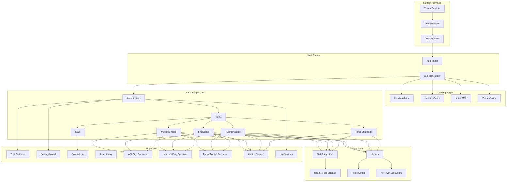

# Architecture Overview

## System Diagram

## Component Descriptions

### App.tsx (Root)
- **Purpose**: Application shell with context providers and hash-based routing
- **Location**: `src/App.tsx`
- **Key responsibilities**: Wraps the entire app in ThemeProvider > ToastProvider > TopicProvider, delegates routing to AppRouter which renders either landing pages or the LearningApp

### LearningApp (State Manager)
- **Purpose**: Central state coordinator for all study functionality
- **Location**: `src/App.tsx` (LearningApp function)
- **Key responsibilities**: Manages lifted state for progress, stats, achievements, and sessions. Handles mode transitions, session tracking, goal completion checks, and inactivity reminders. Passes state down via props and receives updates via callbacks.

### Topic Config System
- **Purpose**: Data-driven topic definitions that make the platform extensible
- **Location**: `src/config/topics.ts`
- **Key responsibilities**: Defines 17 TopicConfig objects, each specifying name, data (key-value pairs), theme colors, distractor type, render type (text/image), quiz direction, and status (available/coming-soon). New topics are added by creating a config object — no new components needed.

### SM-2 Spaced Repetition
- **Purpose**: Implements the SuperMemo SM-2 algorithm for optimal review scheduling
- **Location**: `src/utils/spaced-repetition.ts`
- **Key responsibilities**: Calculates quality scores (0-5) based on correctness, response time, and study mode. Updates easiness factor (EF), review interval, and next review date per item. Selects next item to practice based on overdue status, novelty, and difficulty.

### Study Mode Components
- **Purpose**: Four distinct practice interfaces, all consuming the same TopicConfig data
- **Location**: `src/components/Flashcards.tsx`, `MultipleChoice.tsx`, `TypingPractice.tsx`, `TimedChallenge.tsx`
- **Key responsibilities**: Flashcards allows passive review without affecting scores. Multiple Choice, Typing Practice, and Timed Challenge are scoring modes that update progress via SM-2. Each mode reads the current topic's data and renders appropriately (text, SVG images, or custom components for ASL/maritime/music).

### Storage Layer
- **Purpose**: localStorage persistence with per-topic namespacing
- **Location**: `src/utils/storage.ts`
- **Key responsibilities**: Saves and loads progress, stats, achievements, sessions, goals, and settings. Keys are namespaced by topic ID (e.g., `nato-trainer-progress-morse`) to keep data isolated per code system.

## Data Flow

1. User selects a topic on the landing page → TopicContext updates → hash route changes to `#/learn/{topicId}`
2. LearningApp loads topic-specific progress and stats from localStorage
3. User selects a study mode → LearningApp creates a SessionData object and renders the mode component
4. Mode component calls `getNextLetterSM2()` to select the next item based on SM-2 scheduling
5. User answers → `updateProgressSM2()` calculates quality score, updates EF/interval/repetitions, persists to localStorage
6. Stats update flows up to LearningApp via callbacks → achievements checked → goal progress updated
7. On mode exit → session saved to localStorage, progress history updated

## External Integrations

| Service | Purpose | Documentation |
|---------|---------|---------------|
| Vercel | Static hosting with automatic deploys | vercel.com |
| Web Speech API | Text-to-speech for phonetic pronunciation | MDN Web Speech API |
| Web Audio API | Sound effect generation (correct/incorrect tones) | MDN Web Audio API |
| Browser Notifications API | Goal completion and inactivity reminders | MDN Notifications API |

## Key Architectural Decisions

### Data-Driven Topic System
- **Context**: The app started as a NATO alphabet trainer but expanded to 17 code systems
- **Decision**: Created a `TopicConfig` interface that all study modes consume generically
- **Rationale**: Adding a new topic requires only a config object with key-value data — no new components or routes. Distractor generation, rendering, and quiz logic all adapt based on config properties.

### SM-2 Over Custom Weighted Algorithm
- **Context**: The original spaced repetition used a simpler weight formula (`errorRate × 10 + daysSinceLastSeen`)
- **Decision**: Migrated to the SM-2 algorithm with quality scores, easiness factor, and interval growth
- **Rationale**: SM-2 is a well-researched, proven algorithm. Quality scoring accounts for response time and study mode difficulty, providing more nuanced scheduling than error rate alone.

### Hash-Based Routing
- **Context**: Needed client-side routing for landing pages, topic selection, and info pages
- **Decision**: Built a lightweight hash router (`useHashRouter`) instead of using React Router
- **Rationale**: Zero dependency overhead for a simple routing need. Hash routing works reliably on all static hosts (Vercel, GitHub Pages) without server-side configuration. Routes are: landing variants, learn/{topicId}, about, privacy.

### Lifted State in App.tsx
- **Context**: Multiple study modes need access to the same progress, stats, and achievement data
- **Decision**: Keep all learning state in LearningApp and pass via props rather than using a global store
- **Rationale**: The state tree is shallow (one level of study mode children), so prop drilling is straightforward. Avoids the complexity of Redux/Zustand for what amounts to ~5 state variables shared among sibling components.

### Per-Topic localStorage Namespacing
- **Context**: 17 topics each need independent progress tracking
- **Decision**: Namespace all localStorage keys with topic ID (e.g., `nato-trainer-progress-morse`)
- **Rationale**: Simple key prefixing keeps topics isolated without needing a database. Users can reset one topic without affecting others. The `nato-trainer-` prefix is a legacy artifact from the original project name.
