# Architecture

## System Diagram

```mermaid
flowchart TB
    subgraph Browser["Browser Environment"]
        Landing["index.html<br/>(Landing / About page)"]
        HTML["app.html<br/>(Editor UI Structure)"]
        CSS["style.css<br/>(Styling/Layout)"]
        JS["script.js<br/>(DOM/UI Logic)"]
        LIB["lib.js<br/>(Pure Logic — DOM-free)"]
    end

    subgraph Tests["Test Suite (node:test)"]
        Unit["Unit tests<br/>(lib.js logic)"]
        Integration["jsdom integration<br/>(DOM handlers)"]
    end

    subgraph UserInterface["User Interface Layer"]
        InfoPanel["Info Panel"]
        Controls["Control Bar"]
        Grid["Interactive Grid"]
        Display["Coordinates Display"]
    end

    subgraph CoreLogic["Core Application Logic"]
        GridManager["Grid Management<br/>- createGrid()<br/>- updateGridSize()<br/>- updateOrientation()"]
        FrameManager["Frame Management<br/>- newFrame()<br/>- prevFrame()<br/>- nextFrame()"]
        CoordSystem["Coordinate System<br/>- indexToRowCol()<br/>- rowColToIndex()"]
    end

    subgraph Animation["Animation Engine"]
        ScrollEngine["Scrolling Logic<br/>- startScroll()<br/>- stopScroll()<br/>- buildMegaFrame()"]
        Renderer["Renderer<br/>- renderMegaCoords()<br/>- applyFrameToGrid()"]
    end

    subgraph StateManagement["State Management"]
        UndoRedo["Undo/Redo System<br/>- saveState()<br/>- undo() / redo()"]
        Autosave["LocalStorage Autosave<br/>- saveToStorage()<br/>- loadFromStorage()"]
    end

    subgraph Export["Export System"]
        JSONExport["JSON Export<br/>- copyCoordinates()<br/>- downloadJSON()"]
        CSVExport["CSV Export<br/>- downloadCSV()"]
        GIFExport["GIF Export<br/>- GifEncoder class<br/>- downloadGIF()"]
        RustExport["Rust Code Generator<br/>- downloadRustFile()<br/>- generateRustCode()"]
        ImportSystem["JSON Import<br/>- handleImport()"]
    end

    subgraph Output["Output Targets"]
        Clipboard["Clipboard<br/>(JSON)"]
        JSONFile["frames.json"]
        CSVFile["frames.csv"]
        GIFFile["animation.gif"]
        RustFile["nm_scroll_frames.rs"]
        LEDMatrix["WS2812 LED Matrix<br/>(Hardware Target)"]
    end

    HTML --> UserInterface
    CSS --> UserInterface
    JS --> CoreLogic
    JS --> Animation
    JS --> Export
    JS --> StateManagement
    JS --> LIB
    LIB --> CoordSystem
    LIB --> Unit
    JS --> Integration
    Landing -.->|"returning visitor → redirect"| HTML
    LIB --> Landing

    UserInterface --> CoreLogic
    CoreLogic --> CoordSystem
    CoordSystem --> Animation
    FrameManager --> Animation
    StateManagement --> CoreLogic

    ImportSystem --> CoreLogic
    Export --> Clipboard
    Export --> JSONFile
    Export --> CSVFile
    Export --> GIFFile
    Export --> RustFile
    RustFile -.-> LEDMatrix
```



## Architecture Overview

### Design Philosophy

I built NeoMatrix Frame Creator as a zero-dependency, client-side web application. This decision was intentional: the tool needed to be instantly accessible to hardware engineers and makers who may not have Node.js or complex build environments set up. By keeping everything in vanilla HTML, CSS, and JavaScript, users can simply open the file in a browser or access it via GitHub Pages.

### Key Architectural Decisions

#### 1. Single-Page Application Without Frameworks

I chose not to use React, Vue, or any frontend framework. For a tool this focused, vanilla JavaScript provides:
- Zero build step required
- Instant load times
- Easy deployment to GitHub Pages
- No dependency management headaches

The trade-off is more manual DOM manipulation, but for a single-purpose tool, this is acceptable.

#### 2. State Management with Autosave

All frame data lives in a simple JavaScript array structure with per-pixel color support:
```javascript
let frames = [{ coords: [{ row: 0, col: 1, color: "#00f0ff" }], name: "Frame 1" }];
```

State is automatically persisted to localStorage every 30 seconds and on page unload, so users never lose work between sessions. A 50-step undo/redo stack (Ctrl+Z/Ctrl+Y) provides full editing history. JSON import allows loading previously exported projects back into the editor.

#### 3. Coordinate System Abstraction

The `indexToRowCol()` and `rowColToIndex()` functions form a crucial abstraction layer. LED matrices can be wired with the origin in any corner, and the direction of row/column addressing varies by manufacturer. By abstracting this, users can match their physical hardware layout without mental gymnastics.

#### 4. Rust Code Generation

Rather than just exporting data, I generate complete, compilable Rust code. This was a deliberate choice for the target audience (University of Florida Computer Engineering students working with embedded Rust). The generated code includes:
- Proper struct definitions with `NmScroll` struct
- Per-pixel RGB color data in static arrays (each pixel stores its own color)
- A working scrolling animation loop with configurable delay
- `clear()`, `set()`, `draw_frame()`, and `next()` methods
- `Default` trait implementation

This reduces the barrier from "I have coordinate data" to "I have working code."

#### 5. Animation Preview System

The scrolling preview uses a "megaframe" approach where all frames are concatenated horizontally. This mirrors how text/graphics actually scroll across physical LED matrices, giving users accurate visual feedback before deploying to hardware.

#### 6. Pure-Logic Library Split for Testability

A zero-build, browser-only app is hard to test if every function touches the DOM. I split the non-trivial logic — coordinate geometry, import validation/clamping, GIF palette and LZW encoding, megaframe layout, and the pixel-preserving reorient/resize transforms — into `lib.js`, which has **no DOM dependency**. It attaches to `window` in the browser via a `<script>` tag and is `require()`-d directly by the Node test suite. The DOM/UI glue stays in `script.js`.

This lets the geometry be exhaustively round-trip tested (every orientation maps back to itself), and the GIF/import edge cases (palette overflow past 256 colors, malformed autosave, out-of-bounds imported coordinates) get unit coverage without a browser. The suite (`node:test`, run via `npm test`) is 82 tests across 14 files: pure-logic units plus jsdom integration tests that exercise the real DOM handlers. Test-only dev dependencies are `jsdom` and `canvas`; the shipped app still has zero runtime dependencies.

#### 7. Two-Page Split: Landing Page With a No-Flash First-Visit Redirect

The editor lives at `app.html`; the root (`index.html`) is a short about/landing page that tells the project's origin story before handing off to the tool. The requirement was that *first-time* visitors see the story while *returning* visitors go straight to work — with no router, no server, and no flash of the wrong page.

The redirect decision is a pure function, `shouldRedirectHome(hasVisited, search)`, in `lib.js`. Keeping it DOM-free means the navigation rule is unit-tested in isolation (first visit, returning visitor, the `?home` bypass, and `null`/`undefined`-safety) rather than buried in an inline `<script>`. The bypass uses `URLSearchParams.has('home')` rather than a naive `includes('home')` substring check, so an unrelated query like `?homepage=1` can't accidentally suppress the redirect. The landing page calls the helper from a script in `<head>`, *before* the body paints, so a returning visitor is `location.replace`-d to the editor with no story flicker. A deliberate `index.html?home=1` link (in the editor header) sets the `home` param so the story can always be revisited. The "have they visited" signal is a single `neomatrix-visited` localStorage flag the editor sets on load; both the read and write are wrapped in `try/catch` so a blocked localStorage degrades to simply showing the story. All asset and cross-page links are relative, so the split works unchanged under the `/NeoMatrix-FrameCreator/` GitHub Pages subpath.

### Data Flow

1. **User Input**: Click-and-drag paints (or erases) a stroke of cells in the active frame; the first cell in the stroke sets the mode and each cell is touched at most once (each pixel stores its own color)
2. **State Snapshot**: `saveState()` pushes a deep copy to the undo stack once per stroke, so a drag collapses into a single undo step
3. **State Update**: The `frames` array is modified directly
4. **Visual Feedback**: `applyFrameToGrid()` syncs UI with state, applying per-pixel `--pixel-color` CSS custom properties
5. **Autosave**: State is periodically serialized to localStorage
6. **Export**: Frame data is serialized to JSON, CSV, animated GIF, or transformed into Rust code

### Limitations

- The animation model is a single continuous horizontal **scroll** — frames are concatenated into a megaframe, so there is no per-frame "hold"/flipbook timing (one global speed)
- Mobile drag-and-drop for frame reordering may be less intuitive than desktop
- GIF export can be slow for very large grids or many frames due to client-side LZW encoding; `planGifExport()` in `lib.js` shrinks per-cell resolution for large grids and refuses exports whose buffered pixels would exceed a memory budget

> Note: earlier versions cleared all frames on a grid resize. Resizing now preserves pixels that still fit and trims only out-of-bounds ones (`clampFramesToGrid`), and changing the origin/orientation keeps the drawing in place by transforming every pixel to the new corner (`reorientFrames`) — both in `lib.js`.
