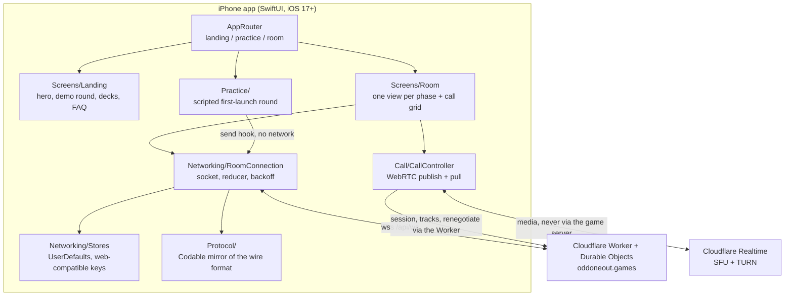

# Architecture

Odd One Out for iOS is the native iPhone client for [oddoneout.games](https://oddoneout.games),
a real-time party game where everyone is asked the same question except one
player, and nobody is told who. The app speaks the production server's existing
WebSocket protocol and HTTP endpoints; the backend was not changed at all, so
iOS and web players share the same rooms.

## System Diagram

## Component Descriptions

### RoomConnection
- **Purpose**: Owns the room socket and the client-visible slice of game state,
  one instance per joined room.
- **Location**: `OddOneOut/Networking/RoomConnection.swift`
- **Key responsibilities**: join with the stored seat token, a 25-second
  heartbeat, exponential backoff from 500 ms to an 8-second cap, an immediate
  reconnect when the app returns to the foreground, and a message reducer that
  tests drive directly without a network.

### CallController
- **Purpose**: In-app voice and video against the Cloudflare Realtime SFU.
- **Location**: `OddOneOut/Call/CallController.swift`
- **Key responsibilities**: capture and publish over sendonly transceivers, pull
  remote tracks as the roster changes, attribute inbound tracks to players by the
  `mid` the SFU reports, renegotiate on demand, and sequence camera shutdown
  before peer-connection close because frames delivered into a closing connection
  crash libwebrtc.

### Wire protocol mirror
- **Purpose**: Swift's version of the server's message schemas.
- **Location**: `OddOneOut/Protocol/`
- **Key responsibilities**: Codable models for every frame, deliberately tolerant
  of a newer server: unknown score reasons decode to a safe fallback instead of
  failing the frame, and new optional fields are additive.

### Practice engine
- **Purpose**: The first-launch tutorial round, played against three bots.
- **Location**: `OddOneOut/Practice/PracticeScript.swift`
- **Key responsibilities**: intercepts outbound messages through a hook on the
  socket layer and answers them with scripted server frames, so the real phase
  screens run a complete round with zero network and no test-only UI.

### Theme and components
- **Purpose**: The same brutalist design system as the site: hard borders,
  offset shadows, one loud accent that re-tints the whole room per phase.
- **Location**: `OddOneOut/Theme/`, `OddOneOut/Components/`

## Data Flow

1. The player joins by code, or starts a room over the same HTTP endpoint the
   web client uses. The socket opens and sends the stored per-room seat token,
   which restores seat, score and a locked answer after any disconnection.
2. Server frames arrive as JSON, decode through the protocol mirror, and reduce
   into observable state; each phase screen renders from that state alone.
3. During a call, media flows directly between the phone and Cloudflare's SFU.
   The game server only ever brokers session and track identifiers.
4. When iOS suspends the app and kills the socket, foregrounding reconnects
   immediately rather than waiting out the backoff, and the server replays the
   current phase.

## Key Architectural Decisions

### A native SwiftUI port rather than a wrapped web view
- **Context**: The web client already worked in Safari, so the cheap option was
  a WebView shell.
- **Decision**: A full native port: SwiftUI views, Swift networking, native
  WebRTC.
- **Rationale**: The call is the difference. A wrapped page re-prompts for
  camera permission in ways users read as broken, and backgrounding kills a
  WebView's socket and media harder than a native app's. Native also means the
  practice round, haptics and phase transitions feel like an app rather than a
  site in a frame.

### The wire protocol mirrored by hand, tolerant by construction
- **Context**: The server's schemas are TypeScript. Swift needs the same shapes,
  and the two clients will not always update in lockstep.
- **Decision**: A hand-written Codable mirror with explicit tolerance rules:
  enums carry a fallback case, new fields are optional, and an unknown value can
  never discard a whole frame.
- **Rationale**: Code generation from the schemas would guarantee freshness but
  produce brittle strictness; a strict enum once meant a new server-side score
  reason silently dropped the entire result frame. Tolerance is the property
  that actually matters for a client that ships through app review on a delay.

### The practice round runs the real screens, not a copy
- **Context**: A tutorial that reimplements the game UI goes stale the moment
  the game changes.
- **Decision**: A scripted engine feeds the standard room screens through the
  socket layer's send hook, swallowing outbound messages and replying with
  scripted frames.
- **Rationale**: The tutorial is the game, so it cannot drift. The alternative,
  a bespoke onboarding flow, doubles every future phase-screen change.

### One third-party dependency
- **Context**: The app needs WebRTC, which Apple does not ship as SDK.
- **Decision**: Exactly one package, a maintained build of libwebrtc; everything
  else is system frameworks.
- **Rationale**: Every dependency in an App Store binary is a review surface, a
  size cost and a supply-chain exposure. URLSession's WebSocket support and
  SwiftUI's Observation framework cover the rest natively.

### The project file is generated
- **Context**: Xcode project files merge badly and drift invisibly.
- **Decision**: `project.yml` is the source of truth; `xcodegen generate`
  produces the project.
- **Rationale**: Target settings, entitlements and the dependency are reviewable
  in one small YAML file instead of a pbxproj diff.
